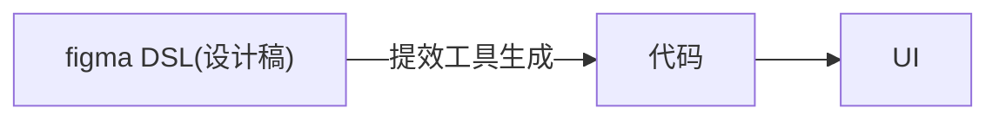
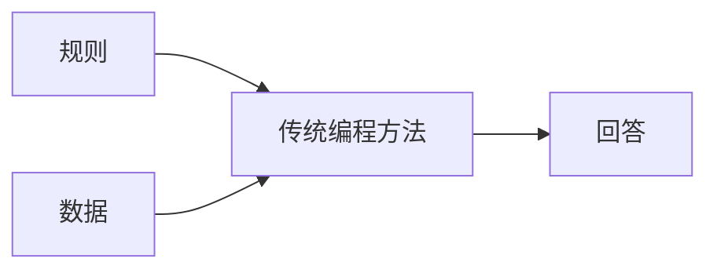
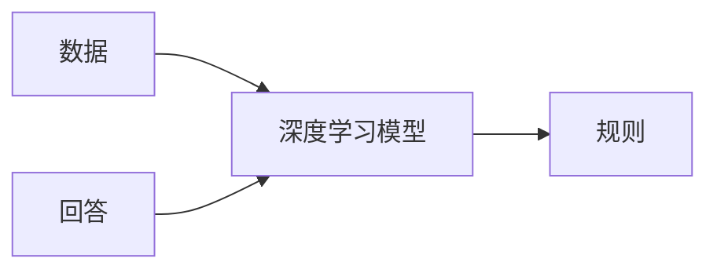
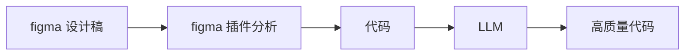
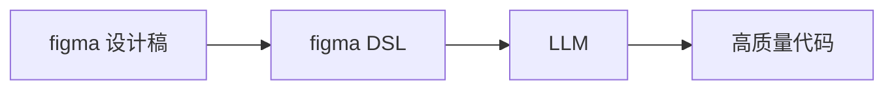
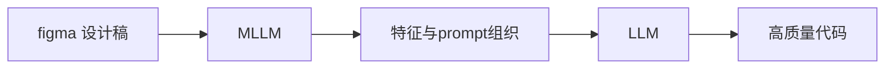
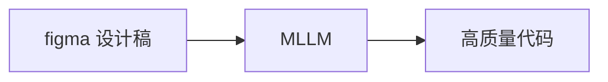

# D2C 背景

> D2C：Design to Code

## 历史

人类发展的历史，实际上也是生产力提升的历史。在工作生产中，人类总会想方设法提升工作效率，一些工具的创新会导致革命，而革命之后也会有一大批的工具相继产生。

在代码还原设计图这个领域，最开始的设计工具无疑是 ps，sketch 之类，当时前端框架也还在初期萌芽阶段，业界并没有过多 D2C 的想法与尝试。

### figma 插件时代

在 figma（2015） 崛起之后，D2C 的想象空间忽然变大了。figma 实际上从生产工具层面对设计进行了一定约束，其底层是规范的 DSL，有了规范，就可以基于规范进行提效。而 figma 的厉害之处在于，只要是使用 figma 进行设计，就等于将设计的入口收窄为这套 DSL。从同构的角度来考虑设计稿还原，实际上是这样的过程：

前端追求的还原效果，实际上是通过“代码”，建立起“设计稿”与“UI”之间的同构关系。而 figma 底层的 DSL 实际上就是设计稿的同构，所以可以通过在中间层插入工具来加速这个过程。

从这个时代（2015）开始，就陆续出现一些将 figma DSL 转化为组件代码的插件，这些插件的机制基本上采用确定式的方式，针对 DSL 进行具体解释，然后分情况处理，生成对应的组件代码。

### 图像识别时代

随着深度学习的横空出世，以及其在图像识别领域的大放异彩，基于图像识别的 D2C 也成为人们探索的方向。通过图像识别的方法识别设计稿的元素，位置，样式，再通过命令式的方式将识别出来的内容转化为代码。当时的 imgcook 也是一个较为优秀的例子，不过效果比较一般。

### 低代码方向

低代码其实严格来说不等同于 D2C 范畴，但由于经常有人将两者相提并论，还是有必要说明一下对应的概念。低代码的本质是通过元数据与产物的同构，来提升效率。

从这个角度来看，figma 通过插件转代码也算是低代码的一种。不过我们常说的低代码，更倾向于描述组合使用既定组件的这种方式，另外这些组件会包含或者内置了部分既定逻辑，这些都是 D2C 领域一般不会描述的。

## 现状

### 过去 D2C 方法的一些弊端

如前所述，过去的 D2C 思路基本上还是传统的编程思路，使用确定的方式解决问题。该如何转换代码，都是通过显式的规则进行。对 DSL 进行规则匹配，然后使用对应的代码片段，这类做法的缺点是

- 需要枚举很多规则
- 生成的代码主要通过拼接与变量插入生成，可读性一般较差
- 遇到特殊情况需要逐一修正

### AI 技术带来的启示

在深度学习在图像识别与处理领域大放异彩之后，人们认识到通过隐式的方式解决问题，可以适当减少问题的复杂度，对于不一定可以通过显式描述规则的问题来说（比如图片分类），使用深度学习方法可以把人类认识问题，解决问题的范式交由深度学习，变成收集数据，学习规律的问题。

传统的建模方法

深度学习的建模方法

在大语言模型出现之后，生成高可读的代码甚至变成了一件容易的事情，在这种种能力进步的加持下，让 D2C 朝着一个更为可行并实用的方向进发。

### 现有产品

在这样的大背景下，市面上涌现出一大批 D2C 工具，公司内部也有不少。这些 D2C 工具围绕着下面几种方式实现。虽然本质还是通过 AI 方式加速设计稿与 UI 同构，但不同方式做出了不同的取舍。

1. 传统方式 + LLM 代码润色

2. LLM 基于元数据直接生成代码

3. 使用多模态提取设计图特征，再交给 LLM 生成代码

  
4. 使用多模态模型直接生成代码

下面是各种方式的优劣对比。

| D2C 方式 | 还原效果 | 代码质量 | 自研难度 | 产品 |
| ------- | ------- | ------ | ------- | ---- |
| LLM润色代码 | ⭐    | ⭐    | 容易 | |
| LLM        | ⭐⭐  | ⭐⭐⭐ | 适中 |  |
| MLLM + LLM | ⭐⭐⭐ | ⭐⭐⭐ | 困难 | Grok, Gemini |
| MLLM       | ⭐⭐   | ⭐⭐⭐ | 困难 |  |

## 预期收益

- 知识与技术层面紧跟这一波浪潮。
- 为日常生产提供一定程度的提效。
- D2C 流程中的中间产物也可以为其他方向服务。
