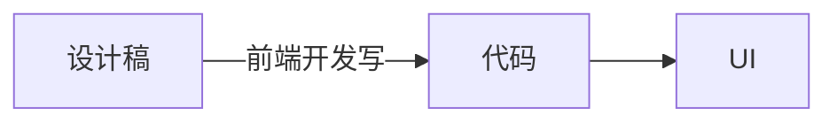
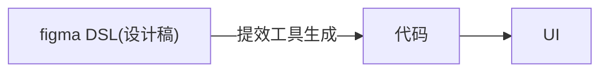
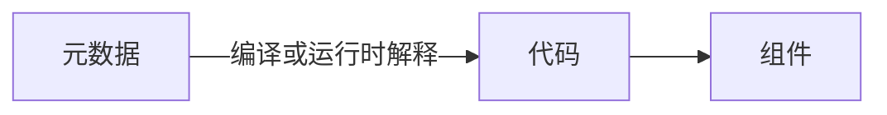
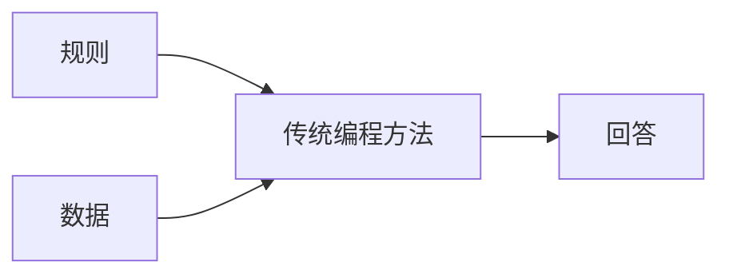
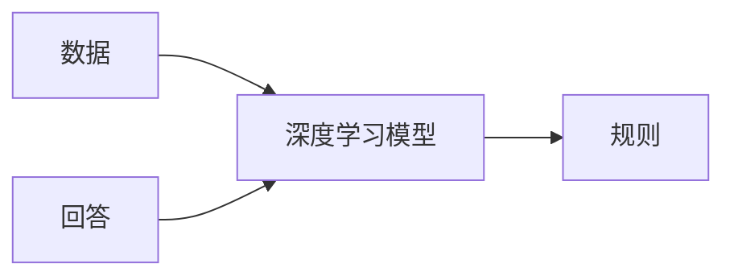
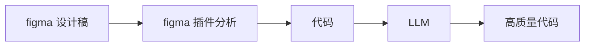
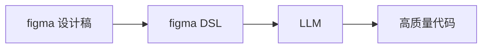
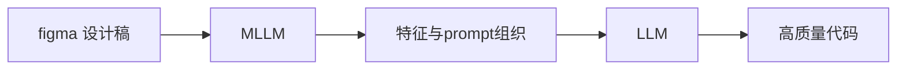
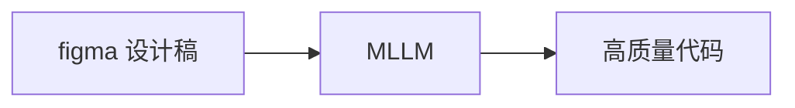

# D2C 背景

> D2C：Design to Code

## 历史

人类发展的历史，实际上也是生产力提升的历史。在工作生产中，人类总会想方设法提升工作效率，一些工具的创新会导致革命，而革命之后也会有一大批的工具相继产生。

在代码还原设计图这个领域，最开始的设计工具无疑是 ps，sketch 之类，当时前端框架也还在初期萌芽阶段，业界并没有过多 D2C 的想法与尝试。

### figma 插件时代

在 figma（2015） 崛起之后，D2C 的想象空间忽然变大了。figma 实际上从生产工具层面对设计进行了一定约束，其底层是规范的 DSL，有了规范，就可以基于规范进行提效。而 figma 的厉害之处在于，只要是使用 figma 进行设计，就等于将设计的入口收窄为这套 DSL。从同构的角度来考虑设计稿还原，实际上是这样的过程：



前端追求的还原效果，实际上是通过“代码”，建立起“设计稿”与“UI”之间的同构关系。而 figma 底层的 DSL 实际上就是设计稿的同构，所以可以通过在中间层插入工具来加速这个过程。



从这个时代（2015）开始，就陆续出现一些将 figma DSL 转化为组件代码的插件，这些插件的机制基本上采用确定式的方式，针对 DSL 进行具体解释，然后分情况处理，生成对应的组件代码。

### 图像识别时代

随着深度学习的横空出世，以及其在图像识别领域的大放异彩，基于图像识别的 D2C 也成为人们探索的方向。通过图像识别的方法识别设计稿的元素，位置，样式，再通过命令式的方式将识别出来的内容转化为代码。当时的 imgcook 也是一个较为优秀的例子，不过效果比较一般。

### 低代码方向

低代码其实严格来说不等同于 D2C 范畴，但由于经常有人将两者相提并论，还是有必要说明一下对应的概念。低代码的本质是通过元数据与产物的同构，来提升效率。



从这个角度来看，figma 通过插件转代码也算是低代码的一种。不过我们常说的低代码，更倾向于描述组合使用既定组件的这种方式，另外这些组件会包含或者内置了部分既定逻辑，这些都是 D2C 领域一般不会描述的。

## 现状

### 过去 D2C 方法的一些弊端

如前所述，过去的 D2C 思路基本上还是传统的编程思路，使用确定的方式解决问题。该如何转换代码，都是通过显式的规则进行。对 DSL 进行规则匹配，然后使用对应的代码片段，这类做法的缺点是

- 需要枚举很多规则
- 生成的代码主要通过拼接与变量插入生成，可读性一般较差
- 遇到特殊情况需要逐一修正

### AI 技术带来的启示

在深度学习在图像识别与处理领域大放异彩之后，人们认识到通过隐式的方式解决问题，可以适当减少问题的复杂度，对于不一定可以通过显式描述规则的问题来说（比如图片分类），使用深度学习方法可以把人类认识问题，解决问题的范式交由深度学习，变成收集数据，学习规律的问题。

传统的建模方法



深度学习的建模方法



在大语言模型出现之后，生成高可读的代码甚至变成了一件容易的事情，在这种种能力进步的加持下，让 D2C 朝着一个更为可行并实用的方向进发。

### 现有产品

在这样的大背景下，市面上涌现出一大批 D2C 工具，公司内部也有不少。这些 D2C 工具围绕着下面几种方式实现。虽然本质还是通过 AI 方式加速设计稿与 UI 同构，但不同方式做出了不同的取舍。

1. 传统方式 + LLM 代码润色



2. LLM 基于元数据直接生成代码



3. 使用多模态提取设计图特征，再交给 LLM 生成代码


  
4. 使用多模态模型直接生成代码



下面是各种方式的优劣对比。

| D2C 方式 | 还原效果 | 代码质量 | 自研难度 | 产品 |
| ------- | ------- | ------ | ------- | ---- |
| LLM润色代码 | ⭐    | ⭐    | 容易 | |
| LLM        | ⭐⭐  | ⭐⭐⭐ | 适中 |  |
| MLLM + LLM | ⭐⭐⭐ | ⭐⭐⭐ | 困难 | Grok, Gemini |
| MLLM       | ⭐⭐   | ⭐⭐⭐ | 困难 |  |

# 架构介绍

## 主流程原理

下面是整体架构图，简单表述各组件之间的交互以及通讯内容。


**XXX 补充更准确的架构图**

- **figma plugin**：在 figma app 内部，获取设计稿的 dom 以及 style，通过请求的方式传到 D2C server 作进一步处理。
- **D2C server**：一个承接 D2C 主要工作流的服务器，用于接收 figma plugin 传出来的数据，构造合适的 prompt，然后与 LLM server 进行交互，获得代码。
- **LLM server**：大语言模型的服务器，用于将 prompt 转化为组件代码。
- **vscode plugin**：在 vscode（或者其他代码编辑器）内部，用于接收代码，并且将代码应用到对应的项目目录里。
- **renderer**：对生成代码进行可视化，是一个带有可执行环境的小型前端 sandbox 环境。

按主流程各功能模块的所在位置，将其分为插件，本地服务，远程服务，本地可视化管理台四个部分。下面将分别描述这四个部分的架构以及职能范畴。

## 插件

figma 插件的职责是获取 dom 结构以及 style 样式，然后将数据通过接口调用的方式传到 D2C server。

下面是 figma 插件具体需要的能力：

- 【基础功能】支持选择节点
- 【基础功能】支持多选节点
- 【基础功能】显示节点 dom 结构以及样式
- 【基础功能】调用 D2C server 接口发送节点结构及样式数据
- 【进阶功能】支持人为划分组件
- 【进阶功能】支持对划分的组件进行标注
- 【进阶功能】发送数据的时候包含结构化的组件划分与标注

因为 figma 插件相对封闭，所以功能应该尽量简单，对数据不做过多处理，直接传出来交给 D2C server 处理，下面是 figma 插件架构图。


figma sdk 提供能力监听当前选择的节点。

```ts
window.onmessage = event => {
  const message = event.data.pluginMessage;
  if (message.type === 'node-info') {
    currentNodeData = message.data;
  }
}
```

## 本地服务

本地服务主要是指 FOCO 的应用层，这层服务提供了插件，以及本地可视化管理台的服务接口。主要包括：

- 【基础功能】接收 figma 插件的数据
- 【基础功能】组件管理
- 【基础能力】模型接入与管理能力
- 【基础功能】基础大模型调用能力
- 【基础功能】基础组件渲染能力
- 【基础功能】命令行能力
- 【进阶功能】多轮对话能力
- 【进阶功能】组件生成问题自修复能力
- 【进阶功能】使用数据统计

单独拆分本地服务有几点考虑：

- 用户使用与安装零成本，一键启动
- 提供模型接入的灵活性，可以选择本地模型，也可以选择远程模型
- 与模型隔离，也能一定程度保证模型调用的安全性（在远程服务中会对 prompt 进行校验与检查）
- 运行速度更快，体验更好，接口调用几乎没有网络延时

## 远程服务

远程服务主要是指与 LLM 

## 本地可视化管理台

可视化管理台的主要作用在于承载本地服务的功能，与一般的智能代码编辑不同，D2C 最终产物是一个可以呈现的组件，这要求一个沙箱环境对其进行渲染。

## Prompt设计

# 问题与解决

## 上下文过长问题
## 模型速度问题
## 回答错误处理问题
## 回答一致性问题
