# D2C 背景

> D2C：Design to Code

## 历史

人类发展的历史，实际上也是生产力提升的历史。在工作生产中，人类总会想方设法提升工作效率，一些工具的创新会导致革命，而革命之后也会有一大批的工具相继产生。

在代码还原设计图这个领域，最开始的设计工具无疑是 ps，sketch 之类，当时前端框架也还在初期萌芽阶段，业界并没有过多 D2C 的想法与尝试。

### figma 插件时代

在 figma（2015） 崛起之后，D2C 的想象空间忽然变大了。figma 实际上从生产工具层面对设计进行了一定约束，其底层是规范的 DSL，有了规范，就可以基于规范进行提效。而 figma 的厉害之处在于，只要是使用 figma 进行设计，就等于将设计的入口收窄为这套 DSL。从同构的角度来考虑设计稿还原，实际上是这样的过程：

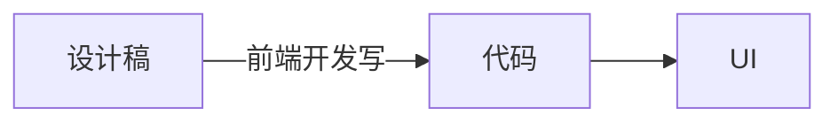

前端追求的还原效果，实际上是通过“代码”，建立起“设计稿”与“UI”之间的同构关系。而 figma 底层的 DSL 实际上就是设计稿的同构，所以可以通过在中间层插入工具来加速这个过程。

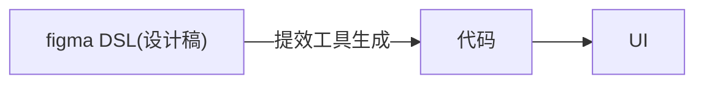

从这个时代（2015）开始，就陆续出现一些将 figma DSL 转化为组件代码的插件，这些插件的机制基本上采用确定式的方式，针对 DSL 进行具体解释，然后分情况处理，生成对应的组件代码。

### 图像识别时代

随着深度学习的横空出世，以及其在图像识别领域的大放异彩，基于图像识别的 D2C 也成为人们探索的方向。通过图像识别的方法识别设计稿的元素，位置，样式，再通过命令式的方式将识别出来的内容转化为代码。当时的 imgcook 也是一个较为优秀的例子，不过效果比较一般。

### 低代码方向

低代码其实严格来说不等同于 D2C 范畴，但由于经常有人将两者相提并论，还是有必要说明一下对应的概念。低代码的本质是通过元数据与产物的同构，来提升效率。


从这个角度来看，figma 通过插件转代码也算是低代码的一种。不过我们常说的低代码，更倾向于描述组合使用既定组件的这种方式，另外这些组件会包含或者内置了部分既定逻辑，这些都是 D2C 领域一般不会描述的。

## 现状

### 过去 D2C 方法的一些弊端

如前所述，过去的 D2C 思路基本上还是传统的编程思路，使用确定的方式解决问题。该如何转换代码，都是通过显式的规则进行。对 DSL 进行规则匹配，然后使用对应的代码片段，这类做法的缺点是

- 需要枚举很多规则
- 生成的代码主要通过拼接与变量插入生成，可读性一般较差
- 遇到特殊情况需要逐一修正

### AI 技术带来的启示

在深度学习在图像识别与处理领域大放异彩之后，人们认识到通过隐式的方式解决问题，可以适当减少问题的复杂度，对于不一定可以通过显式描述规则的问题来说（比如图片分类），使用深度学习方法可以把人类认识问题，解决问题的范式交由深度学习，变成收集数据，学习规律的问题。

传统的建模方法

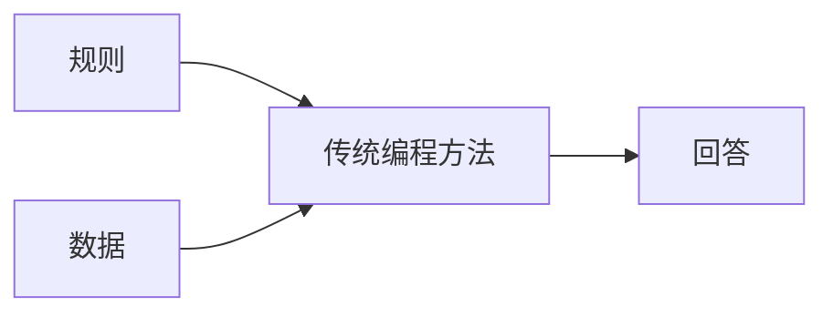

深度学习的建模方法

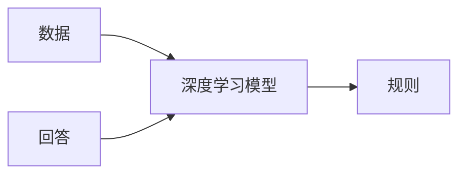

在大语言模型出现之后，生成高可读的代码甚至变成了一件容易的事情，在这种种能力进步的加持下，让 D2C 朝着一个更为可行并实用的方向进发。

### 现有产品的思路

在这样的大背景下，市面上涌现出一大批 D2C 工具，公司内部也有不少。这些 D2C 工具围绕着下面几种方式实现。虽然本质还是通过 AI 方式加速设计稿与 UI 同构，但不同方式做出了不同的取舍。

1. 传统方式 + LLM 代码润色

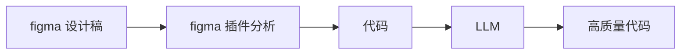

2. LLM 基于元数据直接生成代码

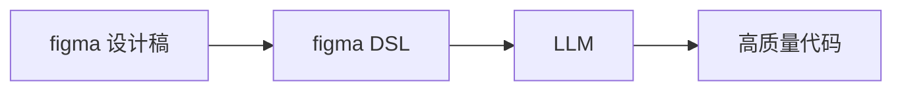

3. 使用多模态提取设计图特征，再交给 LLM 生成代码

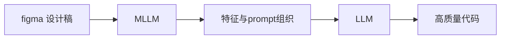
  
4. 使用多模态模型直接生成代码

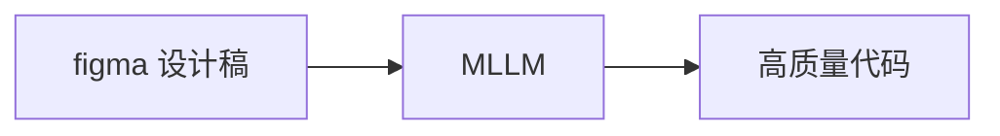

下面是各种方式的优劣对比。

| D2C 方式 | 还原效果 | 代码质量 | 自研难度 | 产品 |
| ------- | ------- | ------ | ------- | ---- |
| LLM润色代码 | ⭐    | ⭐    | 容易 | |
| LLM        | ⭐⭐  | ⭐⭐⭐ | 适中 |  |
| MLLM + LLM | ⭐⭐⭐ | ⭐⭐⭐ | 困难 | Grok, Gemini |
| MLLM       | ⭐⭐   | ⭐⭐⭐ | 困难 |  |

### 自研的优势

D2C 工具一般具备如下结构。

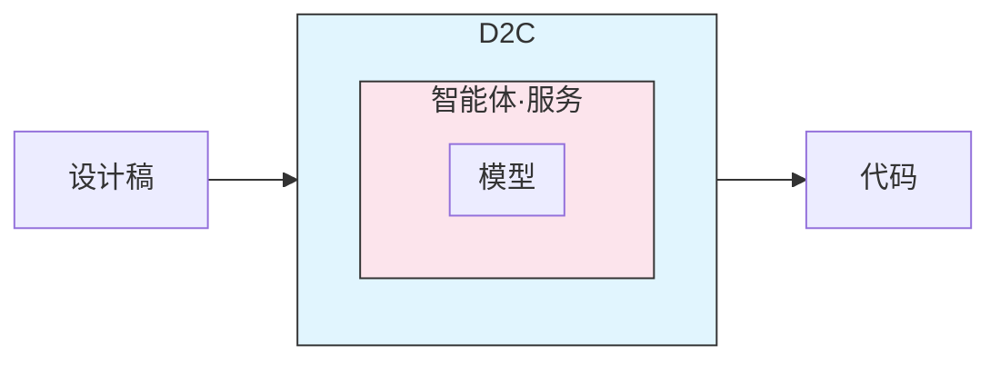

其实通过上面的分析可以看到，目前对于这些现有工具，我们是不具备控制力的。这种控制力包括“模型控制力”与“应用层控制力”。

虽然模型对生成效果起到决定性作用，但是我们并不具备模型能力，想通过模型层面提升生成效果对我们来说 ROI 很低，并且可行性也很低。

但是应用层包含元数据的获取与处理，agent 逻辑，以及生成时候的各种灵活的选择，如果对应用层有所控制，也可以对生成结果也能起到一定的控制作用。基于这样的考虑，我们决定自研 D2C 工具。**FOCO（Figma Output to Code Orchestrate）**便是这个探索过程的产物。

# 架构介绍

## 主流程原理

下面是整体架构图，简单表述各组件之间的交互以及通讯内容。


- **figma plugin**：在 figma app 内部，获取设计稿的 dom 以及 style，通过请求的方式传到 D2C server 作进一步处理。
- **D2C server**：一个承接 D2C 主要工作流的服务器，用于接收 figma plugin 传出来的数据，构造合适的 prompt，然后与 LLM server 进行交互，获得代码。
- **LLM server**：大语言模型的服务器，用于将 prompt 转化为组件代码。
- **vscode plugin**：在 vscode（或者其他代码编辑器）内部，用于接收代码，并且将代码应用到对应的项目目录里。
- **renderer**：对生成代码进行可视化，是一个带有可执行环境的小型前端 sandbox 环境。

按主流程各功能模块的所在位置，将其分为插件，本地服务，远程服务，本地可视化管理台四个部分。下面将分别描述这四个部分的架构以及职能范畴。

## 插件

figma 插件的职责是获取 dom 结构以及 style 样式，然后将数据通过接口调用的方式传到 D2C server。

下面是 figma 插件具体需要的能力：

- 【基础功能】支持选择节点
- 【基础功能】支持多选节点
- 【基础功能】显示节点 dom 结构以及样式
- 【基础功能】调用 D2C server 接口发送节点结构及样式数据
- 【进阶功能】支持人为划分组件
- 【进阶功能】支持对划分的组件进行标注
- 【进阶功能】发送数据的时候包含结构化的组件划分与标注

因为 figma 插件相对封闭，所以功能应该尽量简单，对数据不做过多处理，直接传出来交给 D2C server 处理，下面是 figma 插件架构图。


figma sdk 提供能力监听当前选择的节点。

```ts
window.onmessage = event => {
  const message = event.data.pluginMessage;
  if (message.type === 'node-info') {
    currentNodeData = message.data;
  }
}
```

### 多选能力

部分 D2C 工具并不具备多选能力，这要求设计在使用 figma 画图的时候，需要按照一定的“组件划分”思路进行设计。因为所有 DOM 都是树状结构，一个组件就是一个 DOM 树。这意味着目前市面上的 D2C 工具只能通过选取 figma 里的一个树节点进行生成。

但事实上我们在实际生产中发现，我们能拿到的设计稿并不是所有组件都满足这个条件，有时候组件内部的各个局部都是分散在不同树里的。


上面是一个设计稿的例子。常理来说，前端开发会把右侧的一个“封面图+标题”作为一个小组件，但设计实际在设计的时候，整个模块下的所有图片和标题都是平铺在一棵树（左侧的那个 Group）里的。传统 D2C 工具不具备多选能力，只能直接选择整个 Group，但很明显这并不符合我们的实际需要。

为此我们做了一个细微但是重要的改进，那便是增加多选的能力，这样我们便可以直接选择“封面图+标题”作为一个小组件直接生成了。


## 本地服务

本地服务主要是指 FOCO 的应用层，这层服务提供了插件，以及本地可视化管理台的服务接口。主要包括：

- 【基础功能】接收 figma 插件的数据
- 【基础功能】组件管理
- 【基础能力】模型接入与管理能力
- 【基础功能】基础大模型调用能力
- 【基础功能】基础组件渲染能力
- 【基础功能】命令行能力
- 【进阶功能】多轮对话能力
- 【进阶功能】组件生成问题自修复能力
- 【进阶功能】使用数据统计

单独拆分本地服务有几点考虑：

- 用户使用与安装零成本，一键启动
- 提供模型接入的灵活性，可以选择本地模型，也可以选择远程模型
- 与模型隔离，也能一定程度保证模型调用的安全性（在远程服务中会对 prompt 进行校验与检查）
- 运行速度更快，体验更好，接口调用几乎没有网络延时

## 远程服务

远程服务主要是指与 LLM 交互部分的服务。本部分对用户的对话内容进行 prompt 组织，根据不同场景，使用不同的预置 prompt 对用户的输入进行组织构建，形成最终交给 LLM 的 prompt。同时也会对用户对话进行一定程度的校验，防止部分套取项目信息的提示词，确保系统安全性。

在 LLM 返回结果的时候，也需要对结果进行适度处理。如果使用深度思考模型，需要根据实际设置决定是否去掉思维链再进行输出。由于 D2C 场景里大部分都是界面生成任务，所以回答会包含代码。远程服务层同时也会对此部分进行一定程度的校验与修饰，确保返回到终端的代码是合法并且可执行。

LLM 调用带有一定的不确定性，远程服务层同时承担各种 LLM 的错误处理以及超时重试，后面也会提到调用的并行化。

总的来说，远程服务负责以下职责：

- 根据场景使用对应的 prompt 模板，与用户对话内容结合构成最终的 prompt
- 对用户对话进行一定程度的校验，维护系统安全性
- 对 LLM 的返回内容进行一定程度的处理
- 处理 LLM 调用的错误，以及进行一定的重试策略
- 模型调用与应用逻辑隔离，实现模型选择可插拔

## 本地可视化管理台

可视化管理台的主要作用在于承载本地服务的功能，与一般的智能代码编辑不同，D2C 最终产物是一个可以呈现的组件，这要求一个沙箱环境对其进行渲染。不过本地可视化管理台要做的不仅仅只是把组件显示出来，还需要支持一系列的组件生成流程相关的功能。

- 组件管理
- 组件渲染
- 多轮对话修正
- 对话管理
- 代码实时调整
- 使用代码

本地可视化管理台其实也只是目前的一种“选择”，要完成这个环节的工作，可视化管理台依然可以以局部部署，或者线上部署的方式实现。但考虑到 D2C 生成的组件一般需要二次编辑，不太可能直接给他人复用，所以还是本地较为合理。

## Prompt设计

prompt 的设计直接影响最终生成效果，prompt 工程已经成为了一个学问。对于 prompt 的设计我们有几种选择。

1. 直接抓包观察目前优秀的设计，比如 cline 的 D2C 插件，这种 prompt 基本上流程是现有一个基础描述“你是一个优秀的前端开发”，然后调用一些工具，比如通过 figma mcp 获取对应节点的 figma 元数据，然后再交给大模型生成。
2. 通过自研尝试的方式寻找更合适的 prompt，其好处是在不同阶段，或者面对不同任务的时候，可以使用不同的专门设计的 prompt。

当然，我们在实现的时候已经参考了业界的 prompt，并且我们在实践中发现，添加适当的明确指令，可以增强最终还原的效果。比如加上“请注意设计稿的圆角以及阴影”。

# 问题与解决

## 回答质量保证与一致性问题

由于大模型是概率模型，所以回答不可能每次都一样，即使经过微调的 prompt 能大概率给出不错的回答，但不能保证用户每次使用的时候都能获得比较优质的界面实现。

首先最基础的做法是将模型调用的参数进行调整。

```ts
{
  temperature: 0.0,
  top_p: 1,
  n: 1,
}
```

不过这些参数依然无法百分之一百确保模型会基于同样的问题返回同样的结果。下面提供两种进一步的策略，这两种策略相辅相成。

### 自动并行问答择优

自动并行问答择优是指对于同一个问题进行并行提问，然后从不同回答里选择质量较好的一个作为返回。

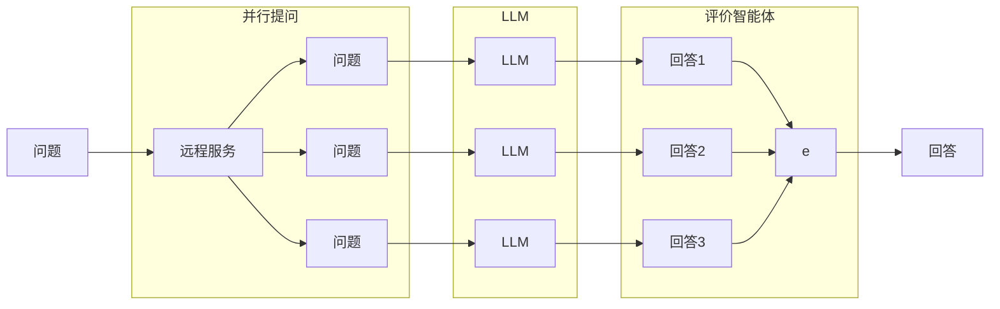

其中通过评价智能体对回答进行评判，一开始是不太可能有很好的效果的，因为单纯以类似的文本作为 LLM 输入，它无法评判好坏，这需要人工择优进行数据收集。

### 人工并行问答择优

这种方式是较为容易实现的方式，其不仅仅可以作为前期数据收集，从长期来看也非常有益。同时提供多个设计稿实现让用户选择，这约等于通过图片验证码类似的方式收集“基于人类认识”的标注数据，这些数据有助于后面评价智能体的训练。

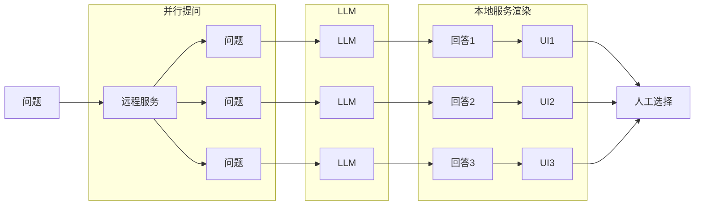

## 多轮问答

由于 LLM 的注意力机制，如果在 prompt 中加入明确的需求，LLM 是可以更有针对性地实现需求，如果我们人工（另一种方式是智能规划）把 UI 还原拆分为多步，那是有望得到更好的实现效果的。

在多轮框架下，假设我们预置了一些 prompt，整个问答过程如下所示。

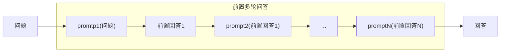

每个预置 prompt 只做一件事情，比如“使用 flex 布局，不要使用绝对定位”或者“帮我把代码重复部分通过 for 实现，并抽出合适的数据结构”等，而每次经过预置 prompt 处理之后，就交给 LLM 进行回答。回答内容作为新的上下文被下一个 prompt 处理合并，重复此过程，直至所有预置 prompt 均执行完毕。理论上最后得到的回答便是经过多轮前置问答优化的结果了。

## 上下文过长

每个模型都有其上下文长度限制，这个限制是模型本身的限制，这要求我们在提供上下文的时候，保证上下文完整性的基础上，也不超出最长限制。通常有几种策略。

1. 上下文裁剪：通过一定策略对上下文进行直接裁剪，对于日常问答来说，其实正常裁剪问题不大，毕竟 LLM 本身具备补全下文的能力。一些常用的代码智能体都采用这种方式，比如 cline。
2. 上下文总结：通过 LLM 对 prompt 进行总结，从而将 prompt 限制在一定长度内，然后再把总结之后的 prompt 进行提问。

对于 D2C 场景来说，上下文最长的部分是 figma 元数据，figma 元数据默认通过 json 格式提供，事实上 json 格式有非常大的压缩空间。对于 LLM 来说，需要的只是格式化的描述数据，另外只要信息足够并且有一定的关联性，LLM 也能够进行处理，下面列出一些用于压缩上下文的方式：

1. 使用 yaml 格式代替 json：通过这种方式可以省去大量双引号以及花括号。
2. 使用公共变量表示值：有些值比如默认颜色，可以使用一个更简短的变量来表示。
3. 预处理去掉无用属性：figma 元数据是一个树状 json 结构，里面其实包含了不少无意义的空字段，那些都是默认矩形节点的默认字段，可以忽略。

**补充元数据大小**

## 问答速度

模型速度分两部分，如果使用第三方服务，涉及到：

1. 调度时间：API 请求服务的时候，会在服务内被调度，或者排队，这个大家在使用 trae 之类的智能代码助手的时候会碰到排队的情况，使用 openrouter 也会，只不过并不是明确展示而已。
2. 推理时间：这部分时间是模型接收到 prompt 之后产生输出所需的时间，与上下文长度，模型部署的机器性能都有关系。

问答速度的限制直接影响了以下几个层面：

1. 使用体验：包括单轮对话的等待，以及多轮对话的等待。对于D2C来说，经实测是不太可能使用小模型的，满血版的模型生成效果比小模型实在好太多。另外目前智能代码 agent 所使用的基本上是 7b 小模型，所以体验是非常好的。
2. 前置多轮问答：如果希望通过前置多轮问答来提升首次用户回答的质量，在回答速度缓慢的前提下，约等于变相拖慢了首次用户回答的时间。

# 一些效果

<div style="border: solid 1px black; border-radius: 8px; overflow: hidden; box-shadow: 0 0 5px #ddd; margin-bottom: 10px;">

</div>

<div style="border: solid 1px black; border-radius: 8px; overflow: hidden; box-shadow: 0 0 5px #ddd;">

</div>

# 探讨与展望

- D2C 已经逐渐变成一个狭窄的赛道，后续基于开发流程全 AI 化的尝试与产品将会越来越多，甚至从需求出发到代码也能 AI 一条龙提速，但是否因为这样我们就没必要 D2C 了？

- D2C 整合逻辑生成的可能性究竟有多大？