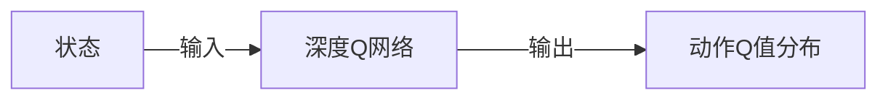
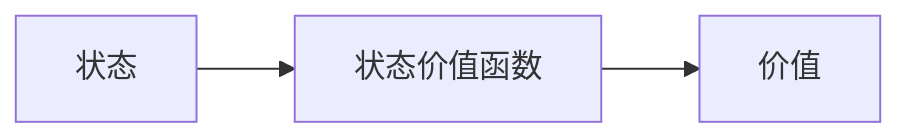
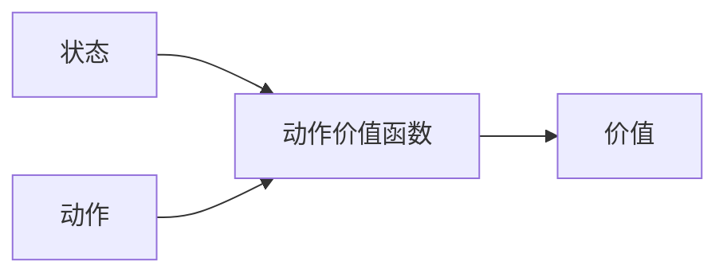

# 小结

- 为了让智能体“真正学会”奖励点与惩罚点，需要
  - 通过**叠加状态的编码**方式传递环境信息
  - 通过**经验重放**来避免灾难性遗忘
- **Q 学习** 使用”巨大的 Q 值表“来维护与更新 Q 值
- **深度 Q 学习** 是使用深度网络来预测 Q 值

# GridWorld 里的强化学习思路整理

之前我们一直在基于 GridWorld 谈论强化学习，在 GridWorld 这个例子里，如果我们希望训练一个智能体能学到不同类型的格子，能努力走到奖励点，训练过程如下

1. 开始一次尝试
2. 状态叠加编码，交给深度 Q 网络预测动作 Q 值分布
3. 通过 $\varepsilon$-贪心策略选择一个动作
4. 执行这个动作，环境给与反馈（是否终止）
5. 如果没终止就回到 2，终止的话
    - 到达惩罚点，削弱这次尝试所选择的动作概率
    - 到达奖励点，增强这次尝试所选择的动作概率

当然在 4 我们还会收集这条经验信息，将其放到经验回放器里，然后通过小批量的方式训练深度 Q 网络。不过从这个训练过程我们看到一个问题，那就是 **每次尝试，都需要到达终点（惩罚点或者奖励点），我们才能强化这条路径上的动作**。

这种方法对于下棋，或者 GridWorld 这类环境来说是没问题的，因为在这些环境里，环境都有一种离散的明确的规则：

- 下一步棋，走一步，环境发生确定性变化
- 有一个终止
- 终止有明确奖励（或惩罚）

这样才能满足上面的训练流程。

## 连续状态，连续动作

在大多数真实环境里，环境是连续的，动作可能也是连续的，这样在尝试过后，很难对“具体”的环境状态及动作进行强化。比如我们要使用强化学习对火箭回收进行训练与学习，在火箭降落的过程中，整个过程中火箭的位置是连续的，在每个位置，需要根据当时的风向，气压，温度等综合条件（环境），进行不同方向的喷射（动作）而调整火箭的方向与角度，最终安全降落（奖励），整个降落过程中的任意失误，比如火箭角度出问题，下降速度过快等，都会造成火箭爆炸或者降落失败（惩罚）。在这个场景下，每两次（模拟）尝试都不会有相同的环境与动作序列，在这种情况下，应该如何进行强化学习呢？

在强化学习之后，火箭是需要在真实环境中进行回收操作的，而在真实环境中又是一个连续多变的场景，这要求我们对学习训练进行如下的改变：

- 指导动作选择的 Q 值是一个概率分布，而不是一些枚举动作的 Q 值，因为动作也是连续的，无法枚举。
- 任何过程中的惩罚都是灾难性的，不能等到有最后结果才加强过程中的动作，而是在选择之后就需要尽快得到合适的强化手段。比如某次喷射会导致火箭失衡（到一定程度），那就需要减少该喷射的参数。

对于第一点来说比较容易做到，我们之前使用深度 Q 网络来预测 Q 值，先在只需要将深度 Q 网络改为预测 Q 值分布即可。在计算机里，其实分布也是一个离散函数，只是用更多的值来模拟而已。

而对于第二点来说，我们希望在每一次动作之后就能有一个即时反馈（而不是等到整个试验结束），此时需要引入一个**动作优势（action advantage）**概念。

# 动作优势

回顾我们之前提到的两个价值函数，**状态价值函数**与**动作价值函数**。状态价值函数对状态进行评价，将当前状态量化为一个评分数值。

而动作价值函数是在某一状态下，执行某一个动作的价值。

而动作优势函数是，计算在当前状态下执行这个动作，能给我带来多少增益？从公式上来看非常简单，它是动作价值函数与状态价值函数之差。

$$
Q_a(s, a) = Q_a(s, a) - Q_s(s)
$$

其中 $s$ 为状态，$a$ 为动作。从公式上来看很容易理解，当我在状态 $s$ 下执行 $a$ 动作之后得到的价值是 $Q_a(s, a)$，而原本状态 $s$ 的价值为 $Q_s(s)$，那么做这个动作带来的增益，就是两者之差了。

将对动作价值的估计，改为对动作优势估计的一类方法，被称为 **Actor-Critic** 方法。从命名也可以看出，Actor 实际上是智能体遵循一定的策略执行动作，然后这个动作会被进行评判 Critic，这样就能在动作执行之后立刻被评判（评判的是动作的优势），解决了上面提到的第二个问题。

# Actor-Critic 方法

下面是整个 Actor-Critic 方法的流程图。

既然计算动作优势需要动作价值函数与状态价值函数之差，这里可以很形象地引入两个角色，一个是**执行者（Actor）**，一个是**批判者（Critic）**。

- 执行者自己内部有一套决策机制（策略网络），用于决定执行什么动作。
- 批判者内部也有一套决策机制（价值网络），用于判断执行者执行的动作究竟是好是坏。

这套架构和生成对抗网络（后面课程会讲述）有异曲同工之妙，可以更抽象地看为一套很基础的方法论。
