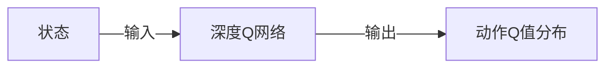
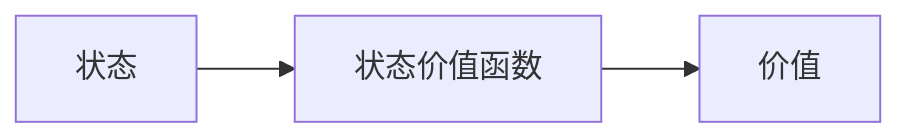
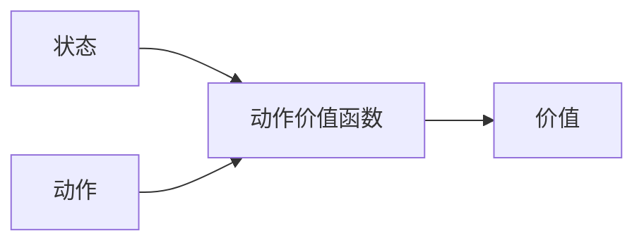
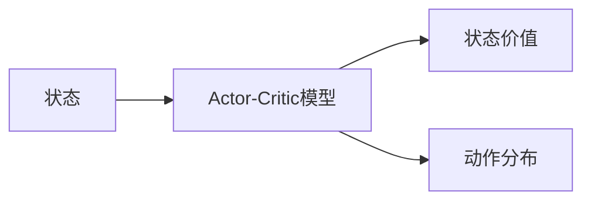
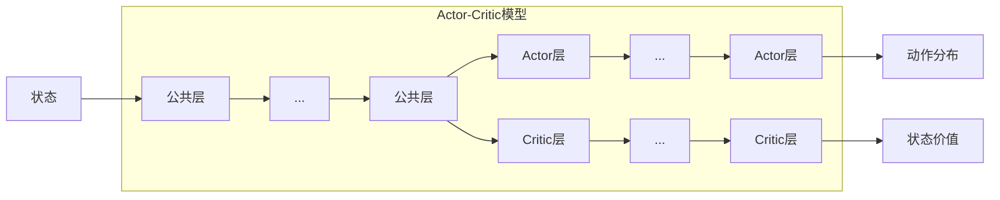

`#强化学习` `#Actor-Critic` `#动作优势` `#在线学习`

# 复习

- 为了让智能体“真正学会”奖励点与惩罚点，需要
  - 通过**叠加状态的编码**方式传递环境信息
  - 通过**经验重放**来避免灾难性遗忘
- **Q 学习** 使用“巨大的 Q 值表”来维护与更新 Q 值
- **深度 Q 学习** 是使用深度网络来预测 Q 值

# GridWorld 里的强化学习思路整理

之前我们一直在基于 GridWorld 谈论强化学习，在 GridWorld 这个例子里，如果我们希望训练一个智能体能学到不同类型的格子，能努力走到奖励点，训练过程如下

1. 开始一次尝试
2. 状态叠加编码，交给深度 Q 网络预测动作 Q 值分布
3. 通过 $\varepsilon$-贪心策略选择一个动作
4. 执行这个动作，环境给与反馈（是否终止）
5. 如果没终止就回到 2，终止的话
    - 到达惩罚点，削弱这次尝试所选择的动作概率
    - 到达奖励点，增强这次尝试所选择的动作概率

当然在 4 我们还会收集这条经验信息，将其放到经验回放器里，然后通过小批量的方式训练深度 Q 网络。不过从这个训练过程我们看到一个问题，那就是 **每次尝试，都需要到达终点（惩罚点或者奖励点），我们才能强化这条路径上的动作**。

这种方法对于下棋，或者 GridWorld 这类环境来说是没问题的，因为在这些环境里，环境都有一种离散的明确的规则：

- 下一步棋，走一步，环境发生确定性变化
- 有一个终止
- 终止有明确奖励（或惩罚）

这样才能满足上面的训练流程。

## 连续状态，连续动作

在大多数真实环境里，环境是连续的，动作可能也是连续的，这样在尝试过后，很难对“具体”的环境状态及动作进行强化。比如我们要使用强化学习对火箭回收进行训练与学习，在火箭降落的过程中，整个过程中火箭的位置是连续的，在每个位置，需要根据当时的风向，气压，温度等综合条件（环境），进行不同方向的喷射（动作）而调整火箭的方向与角度，最终安全降落（奖励），整个降落过程中的任意失误，比如火箭角度出问题，下降速度过快等，都会造成火箭爆炸或者降落失败（惩罚）。在这个场景下，每两次（模拟）尝试都不会有相同的环境与动作序列，在这种情况下，应该如何进行强化学习呢？

在强化学习之后，火箭是需要在真实环境中进行回收操作的，而在真实环境中又是一个连续多变的场景，这要求我们对学习训练进行如下的改变：

- 指导动作选择的 Q 值是一个概率分布，而不是一些枚举动作的 Q 值，因为动作也是连续的，无法枚举。
- 任何过程中的惩罚都是灾难性的，不能等到有最后结果才加强过程中的动作，而是在选择之后就需要尽快得到合适的强化手段。比如某次喷射会导致火箭失衡（到一定程度），那就需要减少该喷射的参数。

对于第一点来说比较容易做到，我们之前使用深度 Q 网络来预测 Q 值，先在只需要将深度 Q 网络改为预测 Q 值分布即可。在计算机里，其实分布也是一个离散函数，只是用更多的值来模拟而已。

而对于第二点来说，我们希望在每一次动作之后就能有一个即时反馈（而不是等到整个试验结束），此时需要引入一个**动作优势（action advantage）**概念。

# 动作优势

回顾我们之前提到的两个价值函数，**状态价值函数**与**动作价值函数**。状态价值函数对状态进行评价，将当前状态量化为一个评分数值。

而动作价值函数是在某一状态下，执行某一个动作的价值。

而动作优势函数是，计算在当前状态下执行这个动作，能给我带来多少增益？从公式上来看非常简单，它是动作价值函数与状态价值函数之差。

$$
\text{Q}_\text{advantage}(s, a) = \text{Q}_\text{action}(s, a) - \text{Q}_\text{state}(s)
$$

其中 $s$ 为状态，$a$ 为动作。从公式上来看很容易理解，当我在状态 $s$ 下执行 $a$ 动作之后得到的价值是 $\text{Q}_\text{action}(s, a)$，而原本状态 $s$ 的价值为 $\text{Q}_\text{state}(s)$，那么做这个动作带来的增益，就是两者之差了。

将对动作价值的估计，改为对动作优势估计的一类方法，被称为 **Actor-Critic** 方法。从命名也可以看出，Actor 实际上是智能体遵循一定的策略执行动作，然后这个动作会被进行评判 Critic，这样就能在动作执行之后立刻被评判（评判的是动作的优势），解决了上面提到的第二个问题。

# Actor-Critic 方法

下面是整个 Actor-Critic 方法的流程图。

既然计算动作优势需要动作价值函数与状态价值函数之差，这里可以很形象地引入两个角色，一个是**执行者（Actor）**，一个是**批判者（Critic）**。

- 执行者自己内部有一套决策机制（策略网络），用于决定执行什么动作。
- 批判者内部也有一套决策机制（价值网络），用于判断执行者执行的动作究竟是好是坏。

这套架构和生成对抗网络（后面课程会讲述）有异曲同工之妙，可以更抽象地看为一套很基础的方法论。

从上面的流程图我们看到的两个角色，执行者以及批判者都有自己的网络，但实际训练的过程中，训练一个网络是比训练两个网络要方便很多的，所以在 Actor-Critic 方法在实现的时候，会将两个网络合并为一个。

由于策略网络主要用来选择动作，并通过动作优势来加强，而价值网络则主要用来预测状态的价值，那将两者合二为一之后，我们便希望网络可以同时输出这两个值。从动作优势的公式 $\text{Q}_\text{advantage}(s, a) = \text{Q}_\text{action}(s, a) - \text{Q}_\text{state}(s)$ 来看，它需要两个值，这两个值正是模型预测出来的两个值，然后最后使用动作优势的误差进行训练。

## 多头模型

多头模型是指一个模型有多个输出。我们之前提到的模型基本上都是一个输入一个输出，输入输出都是张量。但其实认真想一下会发现，模型本身只是一个函数，模型内的层只是一系列的函数嵌套，每个函数有其自身的参数。如果我们希望一个模型有多个输出，那实际上只需要在中间某一层的输出之后分成两条路，再分别经过多层输出即可。

从上面的 Actor-Critic 方法里可以看到，如果我们希望统一训练 Actor-Critic 模型，我们要求它有双头输出，也就是同时输出状态价值以及动作分布，其流程图如下所示。

下面的示意图稍微将这个流程图扩展为模型架构。

## 模型训练

在强化学习模型训练里有一个很重要的概念，称为**在线学习（Online Training）**与**离线学习（Offline Training）**。

从上面的训练主流程来看，注意到蓝色高亮部分是一个闭环，在强化学习的场景里，每一次尝试都是多步的，每一步都能获得奖励，通过这些奖励对某些动作进行强化。这意味着，在做下一次动作选择之前，动作选择的分布就已经被上一个动作所获得的奖励强化了。这种在训练的同时使用模型，在使用中训练模型的方式，称为在线学习。而离线学习可以简单地以分类学习来理解，分类学习里都是明确区分训练与使用环节的。

在线学习一个最大的问题就是“踩着空气上升”，因为无法确保学习过程中学到的经验就是有效的，进一步基于这些经验进行决策，可能会向着错误的方向越走越远，而学习本质是参数更新，为了解决这个问题，一些模型训练的变种会采取一种通用的策略，那便是“在适当的时候更新参数”。这个“适当的时候”催生出很多优化方法。比如：

- 使用两个网络，一个网络进行决策，一个网络进行学习，然后周期性将学习网络同步至决策网络。
- 延时更新参数，在学到一定程度，再进行参数更新。
- 使用多个网络，同步进行学习，然后将多个网络进行均值处理，这种方式称为**分布式学习**。

下面是整个训练的示意图，其中的 Actor-Critic 模型使用的架构就是上面的双头模型架构，每个循环里同时计算状态值以及动作概率，从而计算动作优势，用动作优势对 Actor-Critic 模型进行训练。

上面的流程图展示的是延时更新参数的方式，“单组训练”既可以是小批量经验学习，也可以是一次尝试里的所有经验。

# 场景学习与应用

强化学习相关知识比较难直接应用在生产，因为现实环境比较复杂，需要有足够的建模知识，训练技巧，甚至硬件设施才有可能真正使用强化学习解决问题。为了解决这种学习与生产的巨大落差感，业界也有不少工具方便与帮助学习的。

[Gymnasium](https://gymnasium.farama.org/) 是其中一个很优秀的例子，这个工具对强化学习的常见环境进行了封装，提供环境相关的接口以及可视化方法，使用者只需要自己实现强化学习智能体即可。

上面是 Cart-Pole 例子的文档截图，在这个简单的环境可以看到，Gymnasium 将环境抽象为 `ActionSpace` 以及 `ObservationSpace`。

- `ActionSpace`：我们一直提到的动作空间，也就是智能体可以选择什么动作，在 Cart-Pole 环境中，智能体只能向左或者向右，所以 `ActionSpace` 是一个两个元素的数组。
- `ObservationSpace`：观察空间实际上是环境的状态，也就是我们能从环境中获取到的对状态的描述向量。在 Cart-Pole 例子里，环境是车子和棍子，车子有位置以及速度两个状态，棍子有竖直角度以及旋转角速度两个状态，所以在这个例子里，`ObservationSpace` 就是一个四个元素的数组。

通过 Gymnasium 可以尝试强化学习算法在不同环境中的效果，也可以在同一个环境中对比不同强化学习算法的效果，为强化学习提供了非常好的帮助与支持。

# 小结

- **连续性**：在连续性环境中，动作以及状态都是连续的，需要将动作转换为动作分布，并且使用动作优势进行训练，因为单纯靠试验结果作为奖励会较弱。
- **动作优势**：动作价值与状态价值之差。
- **Actor-Critic方法**：基于动作优势进行学习，Actor网络预测动作分布，Critic网络预测状态价值。
- **Actor-Critic训练**：使用**多头网络**同时预测策略（动作分布）与状态价值，结合各种延时学习的策略提高稳定性与准确性。
- **Gymnasium**：一个强化学习的工具，提供一些基础环境的封装与可视化，方便强化学习的实验。