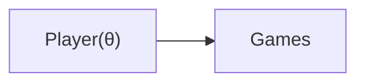
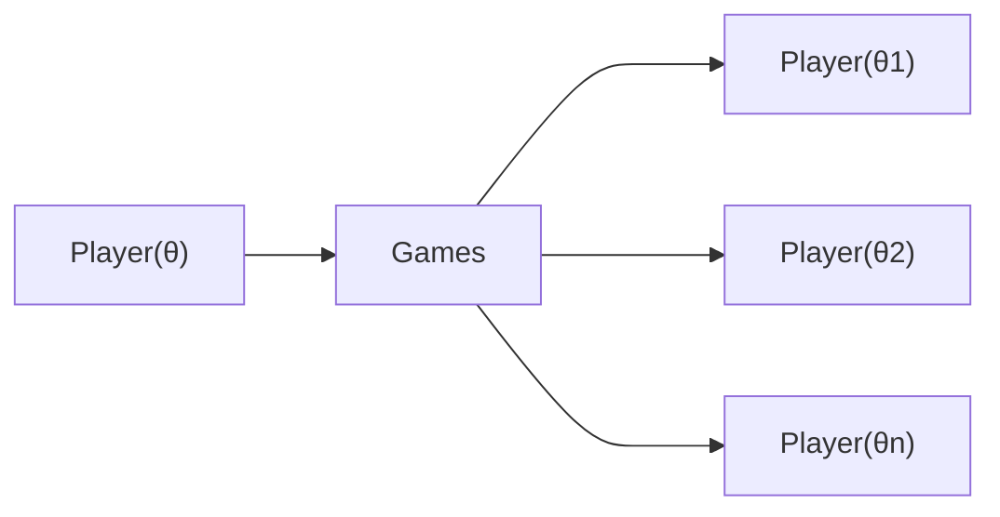
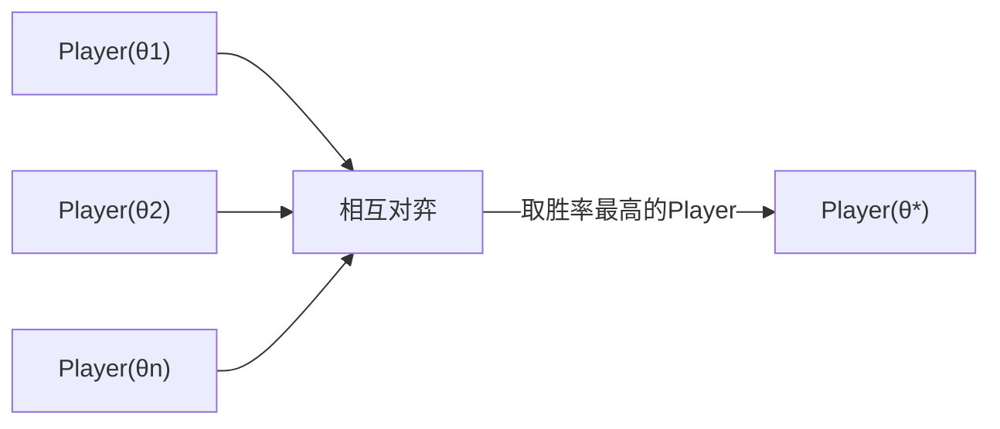
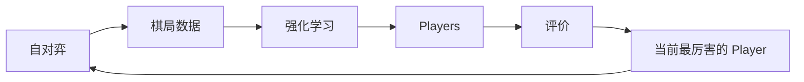

# 复习

- **MCT**：蒙地卡罗树是一种随机状态树，可以通用地表征一个问题随着时间不断发展所产生的各种状态及其关系。
- **MCT搜索**：MCT搜索涉及两个选择的平衡，**利用**与**探索**。
  - **利用**：选择分数最高的节点深入扩展。
  - **探索**：在同一层进行展开，选择没走过的路进行扩展。
- **棋盘编码**：采用各种围棋特征组成一个多维张量。
- **AlphaGo架构**：AlphaGo 主要由三个网络构成
  - **快速策略网络**：用于基于当前状态往后进行推演。
  - **增强策略网络**：在当前状态下给出下一步的先验概率估算。
  - **价值网络**：给出下一步的价值估算。

# AlphaGo 的不足

- 需要人类棋局数据，但这个数据量是有限的，而且增长缓慢。
- AlphaGo 的设计上依然带有命令式的部分，比如：
  - 叠加状态里面使用了不少人为定义的特征，比如有状态专门描述劫，棋子的气等
  - 使用了多于一个神经网络，而这些神经网络都是人为根据算法的不同步骤而设计的

按照我们一贯以来的观点，越是简洁完美的算法，就越应该避免通过命令式的设计。AlphaGo Zero至少从思路上来说，在围棋领域到达一个非常纯净的设计，也就是完全不依赖人类棋局数据（完全无监督），以及只使用一个神经网络，状态叠加也仅包含棋子位置信息。

# AlphaGo Zero整体框架

AlphaGo Zero通过三个主要部分并行训练。

## 自对弈

通过自对弈生成棋局数据。AlphaGo Zero最终产物是一个会下棋的智能体，其内部参数统称为 $\theta$，下棋规则蕴含在这个智能体里。

每一个 Game 是一局棋，每一局棋里是一系列的状态，每走一步就是一个状态。

## 优化

优化过程实际上是使用自对弈数据进行训练，让 Player 变得更厉害。其中使用到的方法是蒙地卡罗树搜索与强化学习。在学习的迭代过程中，每 1000（AlphaGo Zero训练设定） 个循环会产生一个检查点，保存此时的 Player，为后面的评估做准备。

## 评估

在一段时间内通过学习检查点得到的 Player 会在一起评判。在 AGZ 的设定中，这些 Player 会相互对局，从中选出最厉害的 Player（胜率最高），作为下一轮生成自对弈数据的 Player。

下面是这三个环节相互之间的关系。

