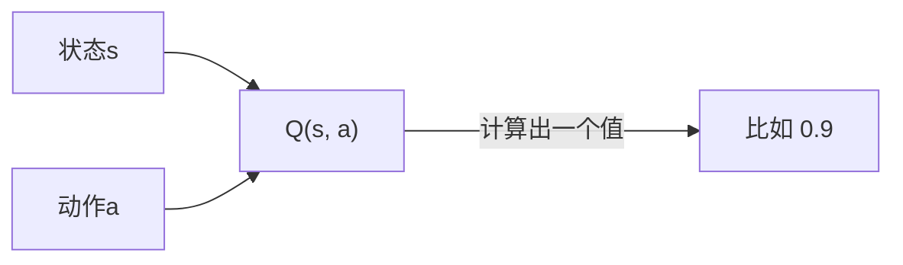
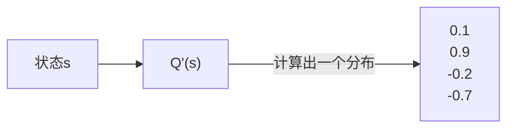
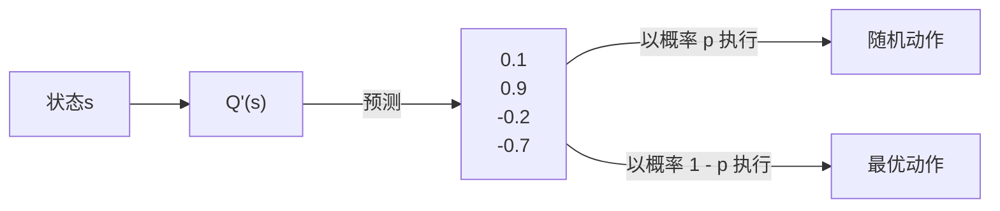
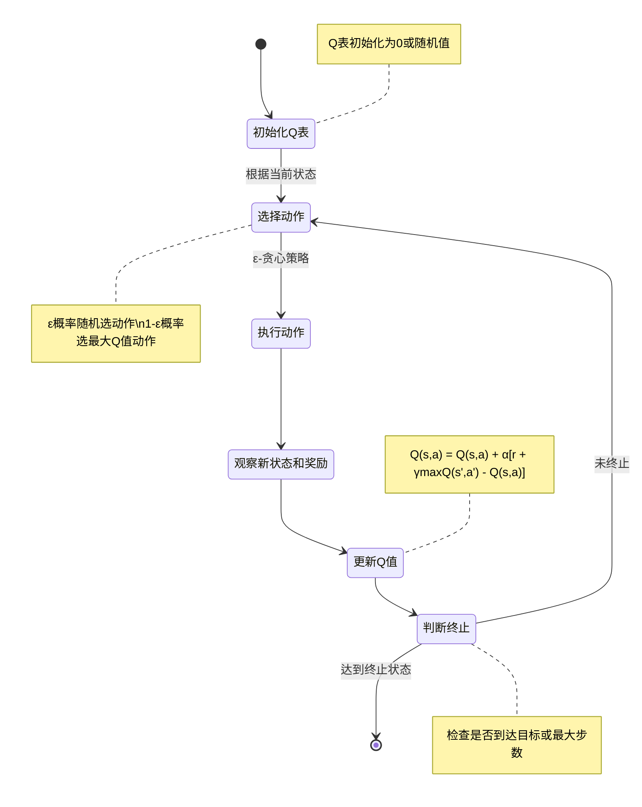

<script src="/assets/lib/gridworld.js"></script>

<style>
.gridworld {
  display: block;
  margin: auto;
  margin-bottom: 20px;
  font-family: sans-serif;
  color: black;
}
.button {
  font-family: sans-serif;
  border: solid 1px black;
  padding: 2px 10px;
  border-radius: 5px;
  cursor: pointer;
}
</style>

<div class="theme-color-blue" markdown=1>
`#强化学习` `#Q函数` `#Q学习`
</div>

# 复习

- **强化学习四要素**
    - **智能体**：是强化学习的核心，它可以根据当前的环境状态，选择最优的行动。
    - **环境**：是智能体的外部世界，它可以提供奖励信号，也可以提供惩罚信号。
    - **状态**：是环境的一个快照，它可以用来描述当前的环境状态。
    - **动作**：是智能体的一个决策，它可以改变环境的状态。
- **价值函数**：可以将状态，或者动作映射为一个数值（价值）。
- **选择策略**：可以根据价值函数计算出来的价值，通过 **探索** 或者 **利用** 来选择一个动作。

# GridWorld

大多数强化学习都会使用 GridWorld 场景进行描述，这是一个非常通用的，简单的强化学习问题场景。可以衍生出很多复杂的问题与概念。我们也会以这个场景贯穿整个课程。

<div id="g1" class="gridworld" style="width: 400px; height: 400px;"></div>

<script>
  const c1 = document.getElementById('g1');
  const g1 = new GridWorld('g1', c1, 6, {
    showTriangles: false,
  });
  
  // 设置奖励点和惩罚点
  g1.setRewards([[5, 5]], 1);  // 两个奖励点，值为1
  g1.setPenalties([[1, 1], [2, 2], [5, 0], [2, 4]], -1); // 两个惩罚点，值为-1
</script>

在这个简单的 GridWorld 里，规则很简单。

- 智能体的起点是左上角的格子。
- 只有三种格子，普通格子，有惩罚的格子“-1”，有奖励的格子“+1”。
- 在普通格子里可以随便上下左右走动，当然走到边缘不能再走。
- 当走到有惩罚或者有奖励的格子的时候，本次“尝试”就结束了。

下面是其中一次尝试成功的例子。

<div id="g2" class="gridworld" style="width: 400px; height: 400px;"></div>

<script>
  const c2 = document.getElementById('g2');
  const g2 = new GridWorld('g2', c2, 6, {
    showTriangles: false,
    pathColor: 'rgba(0, 0, 0, 0.3)',
    pathWidth: 8,
  });
  
  // 设置奖励点和惩罚点
  g2.setRewards([[5, 5]], 1);  // 两个奖励点，值为1
  g2.setPenalties([[1, 1], [2, 2], [5, 0], [2, 4]], -1); // 两个惩罚点，值为-1
  g2.showPath([
    [0, 0],
    [1, 0],
    [2, 0],
    [3, 0],
    [3, 1],
    [3, 2],
    [3, 3],
    [4, 3],
    [5, 3],
    [5, 4],
    [5, 5],
  ]);
</script>

下面是其中一次尝试失败的例子。

<div id="g22" class="gridworld" style="width: 400px; height: 400px;"></div>

<script>
  const c22 = document.getElementById('g22');
  const g22 = new GridWorld('g22', c22, 6, {
    showTriangles: false,
    pathColor: 'rgba(0, 0, 0, 0.3)',
    pathWidth: 8,
  });
  
  // 设置奖励点和惩罚点
  g22.setRewards([[5, 5]], 1);  // 两个奖励点，值为1
  g22.setPenalties([[1, 1], [2, 2], [5, 0], [2, 4]], -1); // 两个惩罚点，值为-1
  g22.showPath([
    [0, 0],
    [1, 0],
    [2, 0],
    [3, 0],
    [3, 1],
    [3, 2],
    [2, 2],
  ]);
</script>

在这样的环境下，我们提出以下的问题：

> 问题：训练出一个能大概率走到奖励终点的智能体，尽量避免走到惩罚点。

# Q 函数

## 未来加权收益

上次提到 **状态价值函数**，以及 **动作价值函数**，都可以被称为 Q 函数。Q 是 Quality 的缩写，代表当前状态，或者在当前状态下执行一个动作的**质量**。Q 函数是强化学习中常用的一种价值函数，它可以将状态和动作映射为一个数值（价值）。

Q 函数通过衡量未来的加权收益，来衡量当前状态或者动作的好坏。回到我们熟悉的加权平均，可以看如下公式：

$$
Q(s, a) = w_1 R_1 + w_2 R_2 + \dots + w_t R_t = \sum_{i=1}^t w_i R_i
$$

这个加权平均公式是一个通用的公式，在每一步都有不同收益的时候可以这样使用。但对于一些奖励很稀疏的场景，比如下棋，只有下到最后才会有一个收益，那么在当前时刻到最后之间的每一步，则会采用一个固定的折扣因子来衰减未来的收益。

$$
Q(s, a) = R + \gamma R + \gamma^2 R + \dots + \gamma^{t-1} R
$$

其中 $\gamma$ 是折扣因子，$R$ 是最后的收益。

<div id="g23" class="gridworld" style="width: 400px; height: 400px;"></div>

<script>
  const c23 = document.getElementById('g23');
  const g23 = new GridWorld('g23', c23, 6, {
    showTriangles: false,
    pathColor: 'rgba(0, 0, 0, 0.3)',
    pathWidth: 8,
  });
  
  // 设置奖励点和惩罚点
  g23.setRewards([[5, 5]], 1);  // 两个奖励点，值为1
  g23.setPenalties([[1, 1], [2, 2], [5, 0], [2, 4]], -1); // 两个惩罚点，值为-1
  const p23 = [
    [0, 0],
    [1, 0],
    [2, 0],
    [3, 0],
    [3, 1],
    [3, 2],
    [3, 3],
    [4, 3],
    [5, 3],
    [5, 4],
    [5, 5],
  ];
  g23.showPath(p23);
  g23.showText([5, 4], `A = 右 \n R = ${1 * Math.pow(0.9, 1).toFixed(2)}`);
  g23.showText([5, 3], `A = 右 \n R = ${1 * Math.pow(0.9, 2).toFixed(2)}`);
  g23.showText([4, 3], `A = 下 \n R = ${1 * Math.pow(0.9, 3).toFixed(2)}`);
  g23.showText([3, 3], `A = 下 \n R = ${1 * Math.pow(0.9, 4).toFixed(2)}`);
  g23.showText([3, 2], `A = 右 \n R = ${1 * Math.pow(0.9, 5).toFixed(2)}`);
  g23.showText([3, 1], `A = 右 \n R = ${1 * Math.pow(0.9, 6).toFixed(2)}`);
  g23.showText([3, 0], `A = 右 \n R = ${1 * Math.pow(0.9, 7).toFixed(2)}`);
  g23.showText([2, 0], `A = 下 \n R = ${1 * Math.pow(0.9, 8).toFixed(2)}`);
  g23.showText([1, 0], `A = 下 \n R = ${1 * Math.pow(0.9, 9).toFixed(2)}`);
  g23.showText([0, 0], `A = 下 \n R = ${1 * Math.pow(0.9, 10).toFixed(2)}`);
</script>

而期望值本身是一个加权平均，所以上面的加权平均可以简写为 $Q(s, a) = \mathbb{E}[R | \pi, s, a]$，其中 $\pi$ 代表策略，$s$ 代表状态，$a$ 代表动作。这个简洁的表示可以理解为 **当前的智能体策略为 $\pi$，当前状态 $s$ 下执行动作 $a$ 后，得到奖励 $R$ 的期望**。

$$
Q(s, a) = \mathbb{E}[R_{t+1} + \gamma R_{t+2} + \cdots | S_t = s, A_t = a]
$$

其中，$R_{t+1}$ 是智能体在状态 $s$ 采取动作 $a$ 后得到的奖励，$\gamma$ 是折扣因子，它可以用来平衡未来奖励和当前奖励的重要性。

## 改进的 Q 函数

原始的 Q 函数用来衡量状态或者动作的价值，是将状态和动作映射为一个值。



使用中我们需要为每个动作计算一个 Q 值，然后再进行决策。比如在 GridWorld 里，有上下左右四个动作。

```ts
upQ = getQ(state, ACTION.UP)
leftQ = getQ(state, ACTION.LEFT)
rightQ = getQ(state, ACTION.RIGHT)
downQ = getQ(state, ACTION.DOWN)
```

但后面我们会知道，计算一个 Q 值消耗是很大的，如果使用深度学习，Q 值需要使用神经网络进行计算，计算量巨大，如果我们可选动作非常多，那么在某一个状态下，需要计算非常多的 Q 值。一个更为合理的改进版是，使用 Q 函数一次过计算所有动作的 Q 值，也就是计算当前状态下所有动作的 Q 值分布。



这样在使用中我们可以根据当前状态一次过计算所有的 Q 值，减少了计算量，同时也很符合直觉。

```ts
actionsQ = getActionsQ(state)
```

一旦有了这些 Q 值，我们就可以采用上次提到的 **$\varepsilon$-贪心策略** 来进行决策。



# Q 学习

**Q 学习**是一种强化学习的方法，它可以通过与环境的交互来学习如何采取行动，从而最大化预期的累积奖励。在 Q 学习中，智能体通过观察环境的状态并采取行动来影响环境的状态转移和奖励。目标是让智能体在与环境的交互中逐渐学习到一个最优的策略，使得累积奖励最大化。

## Q 值的更新

在学习的过程中，Q 学习使用 Q 函数来估计当前状态下执行每个动作的价值，然后根据这个价值来选择最优的动作。

$$
\overbrace{Q(S_t, A_t)}^\text{更新的 Q 值} 
= 
\overbrace{Q(S_t, A_t)}^\text{当前的 Q 值} +
\alpha[
\underbrace{R_{t+1}}_\text{奖励} + 
\gamma \underbrace{\max Q(S_{t+1}, a)}_\text{所有动作里的最大 Q 值} -
Q(S_t, A_t)
]
$$

其中 $\alpha$ 是学习率，$\gamma$ 是折扣因子。

要理解这个公式，可以简单将 Q 值看成是一个巨大的表格，而查表则通过状态与动作进行。整个学习过程，就是对这个表的更新的过程，而更新的依据是奖励以及下一个状态的最大 Q 值。在 GridWorld 例子里，每个状态下有四个动作可以执行，上下左右，公式里的 $\max Q(S_{t+1}, a)$ 就是下一个状态下所有动作里的最大 Q 值。也就是从

$$
\begin{align*}
Q(S_{t+1}, A_\text{上}) \\
Q(S_{t+1}, A_\text{下}) \\
Q(S_{t+1}, A_\text{左}) \\
Q(S_{t+1}, A_\text{右}) \\
\end{align*}
$$

中选出最大的 Q 值。也就是说，如果当前状态下往上走，能达到下一个最大值，那就增大往上走的概率。另外关注公式里的 $R_{t+1}$，这个值代表下一步的奖励，这个是折扣奖励。如果这个值是正的，那证明下一步会导向一个更好的结果，所以整体会增加 Q 值。如果这个值是负的，那证明下一步会导向一个更坏的结果，所以整体会减小 Q 值。

通过下面代码可能可以更简单地加深理解。

```ts
const updateQValue = (state, action, reward, nextState) => {
    // 当前状态的 Q 值
    const currentQ = this.qTable[state][action];

    // 计算下一个状态的最大Q值
    let maxNextQ = 0;
    if (!done) {
        maxNextQ = Math.max(...Object.values(this.qTable[nextState]));
    }
    
    // 更新公式: Q(s,a) = Q(s,a) + α * [r + γ * max(Q(s',a')) - Q(s,a)]
    const newQ = currentQ + learningRate * 
                (reward + discountFactor * maxNextQ - currentQ);
    
    // 更新 Q 表
    this.qTable[state][action] = newQ;
}
```

## 训练过程

训练过程就是让智能体自由探索，不断更新 Q 值的过程。在每一个探索循环中：

1. 获取当前状态
2. 选择一个动作
3. 执行动作
4. 更新 Q 值

下面的伪代码展示了每一步需要做的事情。

```ts
const step = () => {
    // 当前状态
    const state = this.getState()
    // 选择动作
    const action = this.selectAction(state)
    // 执行动作
    const { state: nextState, reward, done } = this.step(action)
    // 更新Q值
    this.updateQValue(state, action, reward, nextState, done)
  
    return { state, action, reward, nextState, done }
}
```

终止条件有两个

1. 到达奖励点，或者惩罚点
2. Q 值已经够好了

对于第一点来说很容易判断，因为那是游戏规则，只要判断智能体在目的地了，就可以结束“当前一个循环”，而将智能体至于起点，重新开始。这个属于小循环结束的终止条件。

但对于第二点来说，Q 值何为之“够好”呢？在 GridWorld 例子里，我们的 Q 值实际上是存放在一个巨大的表里的，由于 GridWorld 是一个有限的世界，路径其实也是可以枚举的，所以我们可以知道在这个世界里，是有一个最优的解的，而尝试并不会使策略停留在一个“局部最优”的状态，因为在局部最优的时候，依然存在朝向最优解的方向，所以到达最优解之后，不能再进一步优化了。所以结束条件是 Q 值表没有发生任何变化了。

```ts
const train = (episodes = 100, maxSteps = 100) => {
    for (let episode = 0; episode < episodes; episode++) {
        // 重置环境
        this.reset()

        // 获取当前 Q 值表
        const qTable = this.getQTable()
      
        for (let step = 0; step < maxSteps; step++) {
            // 执行一步Q学习
            const result = this.step()
            // 如果到达终止状态，结束当前回合
            if (result.done) break
        }

        // 获取更新后的 Q 值表
        const updatedQTable = this.getQTable()

        // 检查 Q 值表是否发生变化，Q 值表没有发生变化，结束当前回合
        if (diff(qTable, updatedQTable) < EPSILON) break
    }
}
```

下面是整个训练过程的流程图。



# GridWorld 例子

下面是一个使用 Q 学习训练 GridWorld 智能体的例子。每个格子里面的三角形表示向每个方向走动的倾向性，蓝色表示分数越高，灰色表示分数越低。

例子的训练参数很简单

- episode（总尝试次数）：200
- maxSteps（每次尝试的最大步数）：20
- learningRate（学习率）：0.1
- discountFactor（折扣因子）：0.9
- explorationRate（探索率）：0.1

<div style="display: flex;flex-direction: column; justify-content: center;">
<div id="g3" class="gridworld" style="width: 400px; height: 400px;"></div>
<div style="display: flex;flex-direction: row; justify-content: center;">
<div id="train-button" class="button" style="margin-right: 10px">训练</div>
<div id="reset-button" class="button">重置</div>
</div>
</div>

<script>
  // 创建GridWorld实例
  const c3 = document.getElementById('g3');
  const g3 = new GridWorld('g3', c3, 6);
  
  // 设置奖励点和惩罚点
  g3.setRewards([[5, 5]], 1);  // 两个奖励点，值为1
  g3.setPenalties([[1, 1], [2, 2], [5, 0], [2, 4]], -1); // 两个惩罚点，值为-1
  
  document.getElementById('train-button').addEventListener('click', async () => {
    await g3.train(200, 20, (episode, step, result) => {
      console.log(`Episode ${episode}, Step ${step}:`, result);
    });
  });
  document.getElementById('reset-button').addEventListener('click', () => {
    g3.resetTraining();
  });
</script>

从训练结果可以看到

- 靠近奖励点“+1”的格子，动作都比较明确，证明智能体是知道奖励点的方位了。
- 靠近惩罚点“-1”的格子，动作都是倾向于远离的，证明智能体知道需要避免走到惩罚点。
- 边缘格子往边缘方向的倾向性不高，证明智能体也知道 GridWorld 是有边界的。

# 小结

- **Q 函数**：价值函数，计算状态或在在某个状态下的执行某个动作的价值。
- **改进的 Q 函数**：通过状态计算出动作的 Q 值分布。
- **Q 学习**：一种强化学习方法。在学习过程中，使用 Q 函数辅助决策，通过未来收益不断调整 Q 值，最终形成一个最优策略。