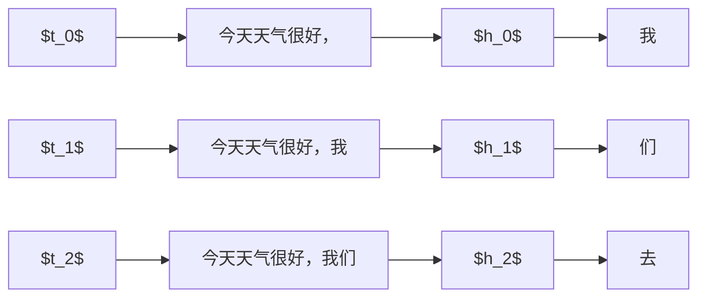
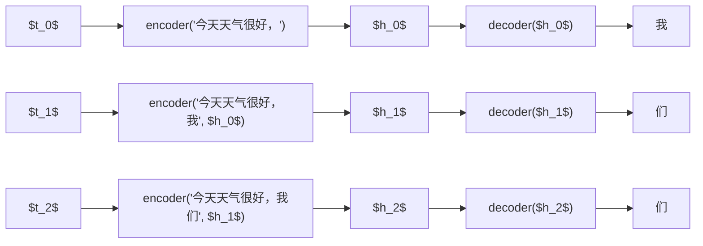

<div class="theme-color-blue" markdown=1>
`#大语言模型` `#时序数据` `#Transformer` `#自注意力机制`
</div>

# 书籍推荐

- **《Grokking Deep Learning》** - Andrew W. Trask ⭐⭐⭐⭐⭐
  - Grokking 系列的书都非常易懂
  - 例子，图解，严格定义表述，代码实现四合一
- **《大语言模型》** - 赵鑫等 ⭐⭐⭐⭐
  - 非常详尽的大语言模型介绍
  - 内容非常精炼，信息量巨大，不过比较严肃严谨，公式原理较多
- **《Build a Large Language Model》** - Sebastian Raschka ⭐⭐⭐⭐⭐
  - 从零开始实现一个 LLM
  - 原理讲述非常清晰，由浅入深

# Transformer 架构

之前提到大语言模型本质是一个函数，输入一个文本，输出一个文本，而文本本身是序列信息，输出的时候是一个个字输出的，所以这个函数的本质是输入一个序列，输出一个字。大语言模型在预训练的时候已经学习了语言模型，也就是给定上文，预测下文的概率，再根据一定的解码策略生成这个具体的下文。

那这个函数的结构是怎样的呢？如何对这个根据序列生成下文概率分布的问题建模？

## 时序数据

之前提到的例子里，基本上都不是时序数据。比如根据当前棋局生成下一步棋，或者根据图片分析类别，对于“当前棋局”，或者“图片”来说，都是一个静态的输入，和时序没有关系。

```ts
// 选择下一步棋
const nextMove: Number[] = ChessModel(currentState: Number[][])

// 图片分类
const category: Number[] = ClassifierModel(image: Number[][][])
```
但是考虑大语言模型的基本问题，输入上文，生成下文，下文是一个句子，但是大模型一次只能生成一个字，所以内部必然存在一个循环，需要输出到结束符或者长度限制为止。

```ts
const answer = (input: Number[]): Number[] => {
    let output = ''
    while (_.last(output !== 'END')) {
        // 模型一次生成一个字
        const nextToken = Model(input)
        // 将下一个单词添加到输入中作为新的上下文
        input += next_token
        // 将下一个单词添加到输出中
        output += next_token
    }
    return output
}
```

所以在模型内部，只要生成的下文还没有结束，它就必须保持一个内部状态（为什么？）。之前提到，语言模型是一个上下文概率模型，每一个字，都和他的上文有关系。在图片分类任务里，对一个图片分类了，就结束了。在给下一个图片分类的时候，上一个图片是什么类别已经毫无关系了。在下棋的例子中，由于每次生成最佳位置之后，是需要“执行”这一步下棋的，一旦棋子下了，也就确定了。但是在大语言模型例子里，只要回答的句子还没生成完，句子的每一个字，都和其上文有关，所以这个中间状态必须持续累积下去，直到句子生成完毕。

考虑以下例子：

> 上文：今天天气很好，

> 下文：我们去散步吧

假设我们给定上面的上文，大语言模型生成了下文，那么我们可以得到以下的生成序列，每一行是一个时刻的快照。

| 时刻 | 上文 | 下文 |
| --- | --- | --- |
| $t_0$ | 今天天气很好， | 我 |
| $t_1$ | 今天天气很好，我 | 们 |
| $t_2$ | 今天天气很好，我们 | 去 |
| $t_3$ | 今天天气很好，我们去 | 散 |
| $t_4$ | 今天天气很好，我们去散 | 步 |
| $t_5$ | 今天天气很好，我们去散步 | 吧 |
| $t_6$ | 今天天气很好，我们去散步吧 | END |

此时我们可以非常抽象地直接引入一个变量“当前状态”，用于描述模型处于该时刻的状态，那么可以得到下面的序列数据。

| 时刻($t$) | 上文($x$) | 状态($h$) | 下文($y$) |
| --- | --- | --- | --- |
| $t_0$ | 今天天气很好， | $h_0$ | 我 |
| $t_1$ | 今天天气很好，我 | $h_1$  | 们 |
| $t_2$ | 今天天气很好，我们 | $h_2$  | 去 |
| $t_3$ | 今天天气很好，我们去 | $h_3$  | 散 |
| $t_4$ | 今天天气很好，我们去散 | $h_4$  | 步 |
| $t_5$ | 今天天气很好，我们去散步 | $h_5$  | 吧 |
| $t_6$ | 今天天气很好，我们去散步吧 | $h_6$  | END |

这个“状态”，虽然是一个抽象的概念，但是它却是一个实质的东西，具体表示在 $t_i$ 时刻模型的状态，其具体内容我们会在下面看到。（为了术语统一，这里使用 $h$ 表示这个状态，在其他语料中，这个状态被称为**隐藏状态（hidden state）**）

从上面的例子可以看出，整个时序的模型，被抽象为以下的流程。

$$
\text{Model}(x_t) \to (y_t, h_t)
$$

而实际上，状态之间也存在依赖关系，所以每个时刻的输入，不仅仅只有该时刻的 $x_t$，还需要以上一个时刻的状态作为参考。

$$
\text{Model}(x_t, h_{t-1}) \to (y_t, h_t)
$$

这个将作为模型建模的重要基础之一。

(其实更精确的表达应该是$\text{Model}_{h_t}(x_t, h_{t-1}) \to y_t$)

## 编码器-解码器架构

有了上面的基本关系，目标是如何得到 $h_t$，以及 $y_t$？在基本模型看来，$h_t$ 和 $y_t$ 是同时产生的，他们是不是并列关系呢？其实还可以从另一个角度来看这个问题。我们把上面的时序数据表，看成以下的形式。



如此类推。实际上图上的箭头表示一个“变换”，而一个变换无非就是一个函数，既然如此，我们也可以往里面插入一个抽象的函数来实现这个变换。



也就是说，我们通过对当前输入编码的方式，得到当前的一个隐藏状态，然后再通过解码的方式，把这个隐藏状态转化为输出。

$$
\begin{align*}
&\text{encoder}(x_t, h_{t-1}) \to h_t \\
&\text{decoder}(h_t) \to y_t
\end{align*}
$$

上面的公式也可以直接整合为一个公式。

$$
\text{decoder}(\text{encoder}(x_t, h_{t-1})) \to y_t
$$

而这个编码器解码器架构，一般就被称为 **Transformer 架构**。

$$
\begin{align*}
&\text{transformer} = \text{decoder}.\text{encoder} \\
&\text{transformer}(x_t, h_{t-1}) \to y_t
\end{align*}
$$

其实从形式上说，上面的所有函数名，都是“抽象的”，而复合函数，本身也是一个函数，所以在这个架构里，我们可以只使用 `encoder`，也可以只使用 `decoder`，也可以同时使用。

$$
\begin{align*}
&\text{encoder}(x_t, h_{t-1}) \to y_t \\
&\text{decoder}(x_t, h_{t-1}) \to y_t \\
&\text{transformer}(x_t, h_{t-1}) \to y_t
\end{align*}
$$

这里举一个例子方便理解编码器与解码器。

> 比如我们看到一个苹果，然后说出来“这是一个苹果”，这个过程实际上也是“编码-解码”的过程。

我们眼睛看到一个苹果，其实是看到很多维度的东西，比如这是一个类似于球体的东西，它的大小比我们手掌稍小，它是红色的，表面较为光滑。这些离散的信息进入大脑之后，会被整合（编码）为一个“隐含表示（隐藏状态）”，至于这个状态具体是什么，估计无人能说清楚，但必然会有这一个状态。然后我们通过知识对这个状态进行解码，我们就知道这个红红的表面光滑，比我们手掌稍微小一点的球体，是一个苹果。

另外还有一点可以注意到的是，这些隐藏状态是连续的。一个很好的例子是我们会认错人，我们通过人的特征进行编码，内化为一个隐藏状态，比如看到现在网红脸，她们特点都很类似，在我们心智里无法精确定位到某一个状态，所以我们看到的时候，无法立刻叫出那具体是谁，通常需要更多的额外信息帮助定位。

# 自注意力机制

从上面的讨论来看，在大语言模型的语境下，我们有了两个基本工具，一个是处理时序数据，一个是 Transformer 架构。但人们很早就发现上面的架构是有问题的，关键点在于隐藏状态，变相淹没了部分时序特征。

## 一个简单的数字例子

从一个简单的例子开始，假设我们有一个时序数据序列

```ts
[0, 3, 4, 2, 1]
```

假设我们的隐藏空间大小是 $1$，编码器是求和函数，那么我们有以下的时序数据表。

| 时刻($t$) | 上文($x$) | 状态($h$) | 下文($y$) |
| --- | --- | --- | --- |
| $t_0$ | [0] | 0 | 3 |
| $t_1$ | [0, 3] | 3 | 4 |
| $t_2$ | [0, 3, 4] | 7 | 2 |
| $t_3$ | [0, 3, 4, 2] | 9 | 1 |
| $t_4$ | [0, 3, 4, 2, 1] | 10 | END |

从这个表来看，这个状态是一个数字，在任意时刻，这个数字表示前面出现过的数字之和，如果数字的出现顺序非常重要，那么这个”求和“动作实际上隐藏了数字顺序信息。

## 一个翻译例子

下面再来看一个稍微复杂一点点的例子。假设我们目前希望模型执行翻译任务（输入输出都是字符串）。

> 输入：Kannst du mir helfen diesen Satz zu übersetzen

> 输出：Can you help me to translate this sentence

由于英语是标准的 SVO 语言，而德语使用习惯中大部分时候用 SOV 语序，所以两种语言的语序是不同的。


如果按照上面提到的方式直接对输入句子进行编码解码，那将丢失语序信息。


其实从对应关系中我们也可以看到，每个输入词，对于每个输出词来说，“重要程度”是不同的。如果我们不希望隐藏状态丢失信息，那么最暴力的解决办法就是“保留所有信息”。而保留所有信息的意思是，在每一个下文生成的时候，每一个上文都要参与到计算中。


从上图可以看到，当生成“you”的时候，对于整个输入句子的单词都会参与计算，只是输入句子的不同单词影响程度会有所不同，而影响力最大的，肯定是“du”这个单词。

通过这个例子，我们可以感受到输入的时序信息对输出是有非常大的影响的。而**自注意力机制**，就是指这种每一个输出都需要每一个输入参与计算的机制。

# 小结

- **时序数据**：对于大语言模型来说，输入的句子，是一个时序输入。
- **隐藏状态**：隐藏状态是大语言模型在处理完一次输入之前，任意时刻的内部状态。
- **Transformer架构**：编码-解码架构，将输入编码成隐藏状态，然后再从隐藏状态解码为输出。
- **自注意力机制**：由于隐藏状态会丢失时序信息，所以自注意力机制让输出的每一个单词都注意输入的每一个单词。