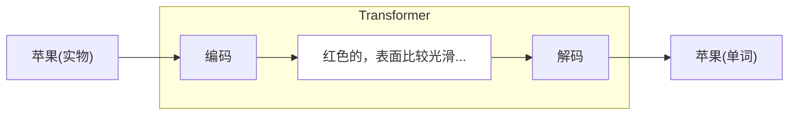
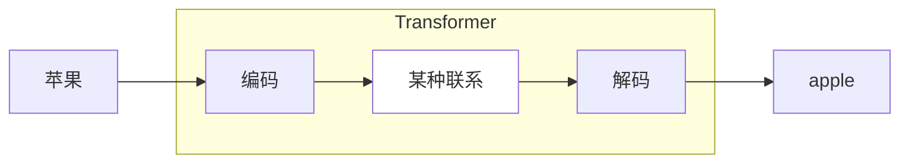
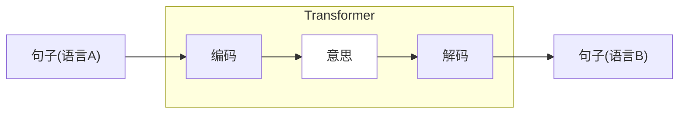
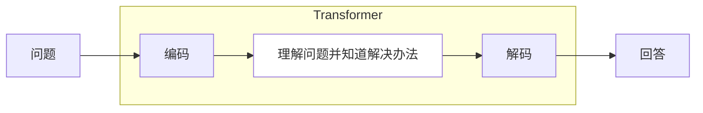
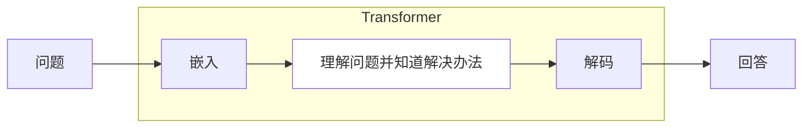
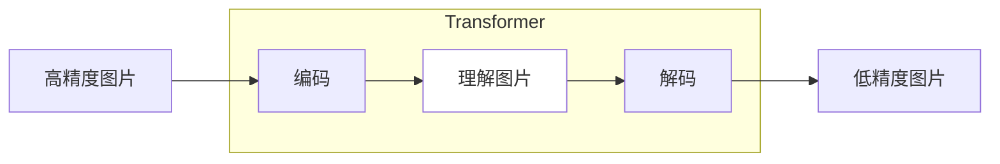
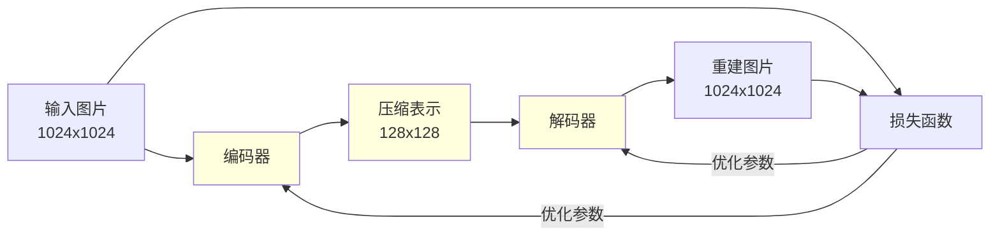
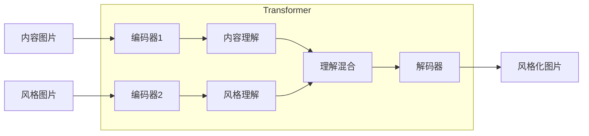
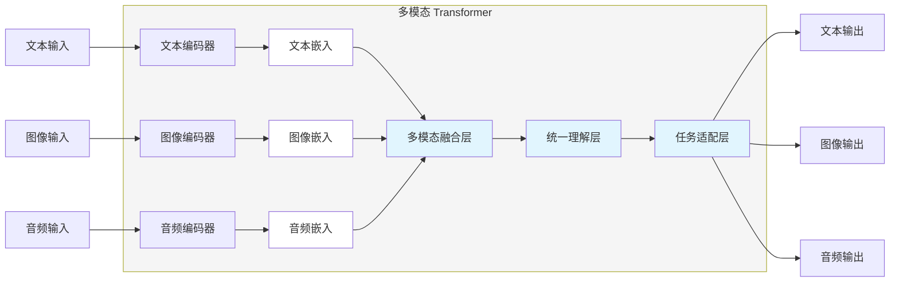

`#大语言模型` `#时序数据` `#Transformer` `#自注意力机制`

# 复习

- **时序数据**：对于大语言模型来说，输入的句子，是一个时序输入。
- **隐藏状态**：隐藏状态是大语言模型在处理完一次输入之前，任意时刻的内部状态。
- **Transformer架构**：编码-解码架构，将输入编码成隐藏状态，然后再从隐藏状态解码为输出。
- **自注意力机制**：由于隐藏状态会丢失时序信息，所以自注意力机制让输出的每一个单词都注意输入的每一个单词。

# 再谈 transformer

上次提到 transformer 架构实际上是“编码-解码”架构，它的核心思想是将输入编码成隐藏状态，然后再从隐藏状态解码为输出。而精妙之处在于，这个玄乎的“隐藏状态”，可以是任何东西，它只是一个抽象的名词。

## 苹果的例子

上次提到苹果的例子，当你看到一个苹果，然后说出来“这是一个苹果”，这个过程实际上也是“编码-解码”的过程。当你看到苹果的时候，你其实“不知道”你的大脑将苹果看作是什么，如果硬要你解释出来，那可能是一个“红色的，摸起来比较硬，表面比较光滑，手能握住的大小”的东西，这实际上是你大脑给苹果赋予的一个多维度描述，也就是一个隐藏表示，实际上你也不用关心它具体是什么，因为这些关键词触发了你的神经，从你过往的学识中知道这个是“苹果”，于是你便脱口而出。

## 翻译的例子

再考虑一下翻译的例子。我们以前学习外语的时候，碰到不懂的单词，我们需要查字典。比如我希望知道“苹果”的英语的时候，我们通过查字典知道是“apple”。

此时其实有两种可能：

1. 我们单纯把“苹果”这两个字与“apple”这五个字母组成的序列建立了一个很稳固的条件映射。
2. 我们在想到“苹果”的时候，先是想到那个“红色的，摸起来比较硬...”的东西，然后再将这个东西与英语“apple”建立了关系。

但抽象的好处在于，我们其实不用关心究竟是哪种可能，我能只需要知道“苹果”与“apple”之间有着“某种联系”。

上次给出的翻译例子是一整个句子。

> 输入：Kannst du mir helfen diesen Satz zu übersetzen

> 输出：Can you help me to translate this sentence

对于一个句子来说，这个隐藏状态更为玄乎，当你对一个德国人说"Kannst du mir helfen diesen Satz zu übersetzen"这个句子的时候，他明白“你要他翻译这个句子”，这个“意思”本身变成了一个隐藏状态，而这个意思在他脑里是一个抽象的东西，是一个复杂的东西，然后他通过同样熟悉的英语，将这个意思用英语表达了出来。

这个图意味着什么？Transformer 理解了句子背后的意思？

## 问答的例子

再回到我们日常使用大语言模型的例子，我们问它一个问题，它给出回答。直接使用上面画了几次的图画出来。

从这个角度来看，Transformer 理解了输入，内化成一个隐藏状态，然后根据自己的知识，遵循输入的意思，给出了一个回答。一个更直观的简单理解是：**Transformer 将输入“转化（transform）”成了输出。**

$$
\begin{align}
&\text{encode}(\textbf{X}) \to \textbf{H} \\
&\text{decode}(\textbf{H}) \to \textbf{Y} \\
&\text{transformer} = \text{decoder}.\text{encoder} \\
&\text{transformer}(\textbf{X}) = \textbf{Y}
\end{align}
$$

再感受一下上次提到的公式。

对于 GPT 类型的模型来说，它的 Transformer 架构没有编码器，其实从上面理解的角度来看，它也是存在编码器的，其中的嵌入层（embedding）正是其“编码器”。

而 GPT 的全称为 Generative Pre-trained Transformer（生成式预训练 Transformer），此时应该已经可以很好地理解这个含义了。

# Transformer 应用

## 自编码器

编码-解码架构其实是一个很通用的结构，可以在很多场景中应用。从上面的讨论中可以看到，这个隐藏状态实际上是对输入的“理解”，而解码过程是对这个“理解”的重新表达，基于这个模型，我们可以使用一种称为**自编码器（autoencoder）**的技术对数据进行压缩。

> 问题：对一张高精度图片进行压缩

如果我们要解决这个问题，传统的一些方法，比如各种图片压缩算法，会用确定性的方式进行处理，比如对冗余像素，或者近似像素进行压缩，或者将图片转化为信号场，然后对低频信号进行过滤等。而 Transformer 架构则给这个课题带来了一个新思路。

首先通过编码器，将高精度图片转化为一个隐藏空间的表示，这个隐藏空间可以看成是对图片的“理解”，这个理解是比图片本身更为简洁的。然后再通过一个解码器，将图片从这个“理解”中重新表述出来。如果这个重新表述的图片与原图很像，那这个“理解”就比较正确了。因为这个“理解”比图片更为简洁，所以这个“理解”实际上就是原图的一个压缩版本。

Transformer 本质是一个函数，编码器解码器都是一个函数，而函数由参数定义行为，所以回忆之前的训练过程，我们可以通过训练的方式来得到这样的编码器和解码器，下面是训练的过程，其中高亮部分是 Transformer。

训练基本循环里，通过对输入图片进行编码解码，然后用解码得到的图片与原图计算损失，通过损失不断优化编码器与解码器，从而得到一个损失在要求范围内的自编码压缩器。

## 神经风格迁移

**神经风格迁移（neural style transfer）**是一个基于深度神经网络而进行图片风格迁移的方法，本质也可以通过 Transformer 架构对其进行理解。

对于这个问题，输入是两张图片，一张是希望风格化的原图，另一张是风格化图片，如上图所示，我们希望把这种立体主义风格“迁移”到蒙娜丽莎上。

在这个问题的 Transformer 架构中，从黑盒的角度来看，与之前提到的 Transformer 无异，无非是将输入转化为输出而已，但由于输入是两张图，所以需要两个编码器分别对其进行理解，在理解之后，通过一个混合函数对其进行混合。一般的混合函数具有以下的形式

$$
\textbf{Mix} = \alpha \textbf{H}_1 + \beta \textbf{H}_2
$$

如果我们想风格化后的图片更像原图，那 $\alpha$ 就大一点，如果我们想风格化后的图片更抽象一点，那 $\beta$ 就大一点。

这样的 Transformer 该如何通过训练得到呢？关键还是在于损失函数的定义。

$$
\begin{align}
& \text{Transformer}(\textbf{Content}, \textbf{Style}) \to \textbf{Output} \\
& \text{Loss}_\text{content} = \text{Loss}(\textbf{Content}, \textbf{Output}) \\
& \text{Loss}_\text{style} = \text{Loss}(\textbf{Style}, \textbf{Output}) \\
& \text{Loss}_\text{total} = \text{Loss}_\text{content} + \text{Loss}_\text{style}
\end{align}
$$

通过对比生成图片与原图得到基于原图的损失，通过对比生成图片与风格图片得到基于风格的图片损失，然后目标是让总损失最小。从上面的例图也可以想象，因为总损失需要最小，所以生成的图片应该具备输入图片的特征，所以生成的图片，至少能看出是一个蒙娜丽莎，至于颜色，实际上对风格图片与原图进行了混合。

## 多模态大模型

既然 Transformer 架构本质是“理解”输入，那实际上无论输入是什么形式，那应该都能被理解。即使输入是混合形式，也可以通过“编码器”这个步骤转化为一个通用表示，然后再进行统一理解。

有了上面的神经风格迁移作为例子，可以更好地理解**多模态大语言模型（Multimodal Large Language Models, MLLMs）**的工作原理。针对不同类型的输入，Transformer 内部会有对应的编码器，经过编码器之后同意转化为一个高维内部隐藏空间表示（也就是对输入的“理解”），然后将不同类型的这些输入理解进行融合，理论上这个融合的结果，才是 Transformer 的内部输入。通过统一理解层对任务进行处理，得到一个隐藏空间的输出，然后任务适配层相当于解码器，将隐藏空间的输出转化为不同类型的输出。

那多模态大模型是如何训练的呢？其实从语言的角度来说，语言本身已经是一个非常通用，并且格式非常统一的一种表述，最简单是思路是将图片，声音等多媒体类型转化为语言表述，从而交由大语言模型进行统一处理。

从模型结构中可以看到，多模态大语言模型可以以一个预训练的大语言模型基座作为基础，通过增加“多媒体”链接模块，将对应的多媒体类型转化为统一的隐藏空间表示（图中的“嵌入向量”），与文本输入拼接作为统一输入，交给大语言模型进行处理。以图片为例，训练数据通常是一些图文对，旨在让大语言模型理解图片与文本之间的关系。

# 小结

- **Transformer 架构**：对输入进行了理解（编码），再把理解转化为输出（解码）。
- **理解**：所谓的“理解”，实际上是一个高维稠密的向量空间。
- **自编码器**：通过编码器理解自己，得到一个更简洁的表示，然后再通过解码器重新表达。
- **神经风格迁移**：通过编码器分别理解内容与风格，然后将两者按照一定比例混合，通过解码器把这个混合后的理解表示成风格化图片。
- **多模态大模型**：通过不同类型的编码器将多媒体输入转化为统一的语言隐藏空间表示，然后通过大语言模型进行推理，最后由不同的任务适配器转化为对应类型的多媒体输出。