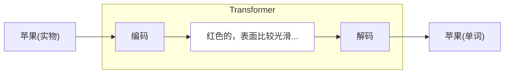
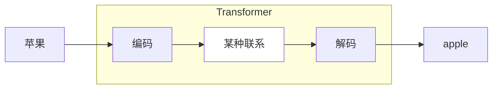
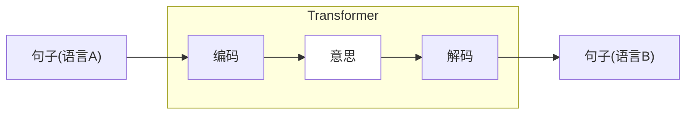
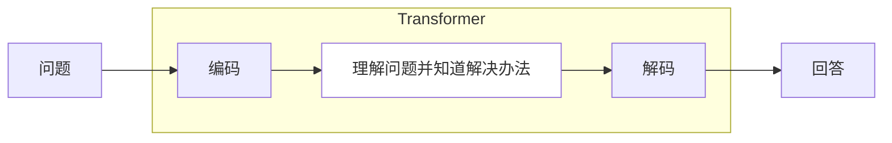

`#大语言模型` `#时序数据` `#Transformer` `#自注意力机制`

# 复习

- **时序数据**：对于大语言模型来说，输入的句子，是一个时序输入。
- **隐藏状态**：隐藏状态是大语言模型在处理完一次输入之前，任意时刻的内部状态。
- **Transformer架构**：编码-解码架构，将输入编码成隐藏状态，然后再从隐藏状态解码为输出。
- **自注意力机制**：由于隐藏状态会丢失时序信息，所以自注意力机制让输出的每一个单词都注意输入的每一个单词。

# 再谈 transformer

上次提到 transformer 架构实际上是“编码-解码”架构，它的核心思想是将输入编码成隐藏状态，然后再从隐藏状态解码为输出。而精妙之处在于，这个玄乎的“隐藏状态”，可以是任何东西，它只是一个抽象的名词。

## 苹果的例子

上次提到苹果的例子，当你看到一个苹果，然后说出来“这是一个苹果”，这个过程实际上也是“编码-解码”的过程。当你看到苹果的时候，你其实“不知道”你的大脑将苹果看作是什么，如果硬要你解释出来，那可能是一个“红色的，摸起来比较硬，表面比较光滑，手能握住的大小”的东西，这实际上是你大脑给苹果赋予的一个多维度描述，也就是一个隐藏表示，实际上你也不用关心它具体是什么，因为这些关键词触发了你的神经，从你过往的学识中知道这个是“苹果”，于是你便脱口而出。

## 翻译的例子

再考虑一下翻译的例子。我们以前学习外语的时候，碰到不懂的单词，我们需要查字典。比如我希望知道“苹果”的英语的时候，我们通过查字典知道是“apple”。

此时其实有两种可能：

1. 我们单纯把“苹果”这两个字与“apple”这五个字母组成的序列建立了一个很稳固的条件映射。
2. 我们在想到“苹果”的时候，先是想到那个“红色的，摸起来比较硬...”的东西，然后再将这个东西与英语“apple”建立了关系。

但抽象的好处在于，我们其实不用关心究竟是哪种可能，我能只需要知道“苹果”与“apple”之间有着“某种联系”。

上次给出的翻译例子是一整个句子。

> 输入：Kannst du mir helfen diesen Satz zu übersetzen

> 输出：Can you help me to translate this sentence

对于一个句子来说，这个隐藏状态更为玄乎，当你对一个德国人说"Kannst du mir helfen diesen Satz zu übersetzen"这个句子的时候，他明白“你要他翻译这个句子”，这个“意思”本身变成了一个隐藏状态，而这个意思在他脑里是一个抽象的东西，是一个复杂的东西，然后他通过同样熟悉的英语，将这个意思用英语表达了出来。

这个图意味着什么？Transformer 理解了句子背后的意思？

## 问答的例子

再回到我们日常使用大语言模型的例子，我们问它一个问题，它给出回答。直接使用上面画了几次的图画出来。

从这个角度来看，Transformer 理解了输入，内化成一个隐藏状态，然后根据自己的知识，遵循输入的意思，给出了一个回答。一个更直观的简单理解是：**Transformer 将输入“转化（transform）”成了输出。**

$$
\begin{align}
&\text{encode}(\textbf{X}) \to \textbf{H} \\
&\text{decode}(\textbf{H}) \to \textbf{Y} \\
&\text{transformer} = \text{decoder}.\text{encoder} \\
&\text{transformer}(\textbf{X}) = \textbf{Y}
\end{align}
$$

再感受一下上次提到的公式。

# 自注意力机制深入

虽然上面我们把 Transformer 高度抽象为一个黑盒，一个万能的可以把“输入”**变为**“输出”的黑盒，但是我们也不能对这个黑盒过度依赖，在实践中发现，如果采用朴素的函数变换，隐藏空间过于浓缩，而丢失时间序列输入的时间信息。比如

> 小明今天去小陈家里玩，**他**家在河边。

注意到这个“他”，我们当然知道这个“他”是指“小陈”，因为小明去的是小陈的家，而后面提到的“家”只能是小陈的家，所以这个“他”就只能是小陈。但是对于大语言模型来说，句子是逐字输入的，每次输入变换之际，都会将信息叠加在隐藏空间里，以至于“小明”和“小陈”再隐藏空间里成为了并列关系。

