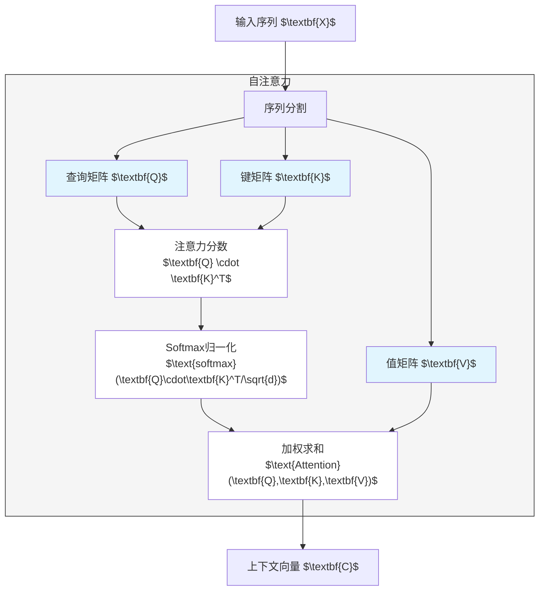
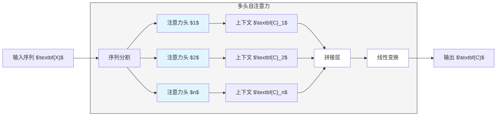

<script src="/assets/lib/plot.js" /></script>

<div class="theme-color-blue" markdown=1>
`#大语言模型` `#Transformer` `#自注意力机制`
</div>

<style>
canvas {
  display: block;
  margin: auto;
  margin-bottom: 20px;
  border:1px solid #ddd;
  width:400px;
  height:400px;
}
</style>

# 复习

- **Transformer 架构**：对输入进行了理解（编码），再把理解转化为输出（解码）。
- **理解**：所谓的“理解”，实际上是一个高维稠密的向量空间。

# 稠密向量空间

把字符转化为向量可以说是一个很天才的设计，通过这样的方式，离散的字符转化为连续的向量。这种设计有几个重要考虑，回忆之前提到过的概念：

- 大模型的输入输出是向量（张量）
- Transformer 架构本质是一个函数，函数内部是向量与矩阵的运算
- 连续变量才能求导，进行反向传播，进行学习训练
- 连续变量可以构成一个度量空间，可以进行距离计算

大语言模型通过嵌入层将输入转化为向量，后续 Transformer 使用这些向量进行运算。

<canvas id="vector-space"></canvas>

<script>
const p1 = new Plot('vector-space');
const d = () => Math.random() * 0.5;
const texts = [
    { p: [1, 1], text: '红' },
    { p: [1, 2], text: '蓝' },
    { p: [2, 1], text: '绿' },
    { p: [2, 2], text: '黄' },

    { p: [-1, -1], text: '快' },
    { p: [-2, -1], text: '慢' },
    { p: [-2, -2], text: '香' },

    { p: [-2, 1], text: '桌' },
    { p: [-1, 1], text: '椅' },

    { p: [1, -1], text: '狗' },
    { p: [2, -1], text: '猫' },
    { p: [3, -1], text: '豹' },
    { p: [2, -2], text: '鹿' },
    { p: [1, -2], text: '马' },
]
texts.forEach(({ p, text }) => {
    const [x, y] = p
    const [x1, y1] = [x + d(), y + d()]
    p1.drawPoints([[x1 - 0.3, y1 - 0.3]], { color: '#ddd' })
    p1.drawText([x1, y1], text);
})
</script>

## 使用点积衡量相关性

最初等的衡量距离方式是勾股定理，对于两个向量 $\textbf{a} = [x_1, y_1]$ 与 $\textbf{b} = [x_2, y_2]$，它们之间的距离是：

$$
d = \sqrt{(x_1 - x_2)^2 + (y_1 - y_2)^2}
$$

但这种方式有个缺点，就是计算量很大，因为要开根号。而且这个开根号是一个非线性函数，是不能随便去掉的。所以对于大语言模型来说，嵌入维度一般很大，所以用这种方式的计算量也很大。

而两个向量的点积可以表示它们之间的“距离”（相关性），即：

$$
\textbf{a} \cdot \textbf{b} = x_1 x_2 + y_1 y_2 = |\textbf{a}||\textbf{b}| \cos \theta
$$

从一个极端的例子可以感受到这个相关性的概念，假设两个向量相互垂直，那么夹角余弦值就为 $\cos (\pi / 2) = 0$，整个点积为 $0$ 意味着两者毫无关联。点积的计算量很小，所以在大语言模型中，使用点积来衡量两个向量之间的**相关性**。

# 再谈自注意力

Transformer 只是一个架构，只是一个函数，而自注意力，是 Transformer 内部最重要的一个机制，也就是函数的定义。之前提到朴素的网络处理时序数据有一个问题，那就是丢失了时序信息，因为每次处理一个输入字符的时候，就会对这个字符进行运算，然后叠加到一个隐藏态上，到最后整个输入结束的时候，就只有一个隐藏态，字符的先后顺序已经淹没在隐藏态里了。

上次提到的一个及其简单的例子，假设输入为 $\textbf{X} = [x_1, x_2, \dots, x_T]$（注意，这里的 $x_t$ 已经是经过嵌入层转化的向量），如果在编码器部分使用求和算法，那么整个时间序列处理结束之后得到的隐藏状态就是所有输入之和。

$$
\textbf{H} = \sum_{t=1}^T x_t
$$

所有 $x_t$ 的顺序淹没在隐藏状态中。

## 黑盒抽象的魅力

前几次课均提到黑盒抽象，比如将 Transformer 看成是一个将输入转化为输出的黑盒，从而把抽象的“理解”看成是黑盒里面实现的内容。我们平时进行的函数提取，其实也是一种黑盒抽象。既然上面单纯叠加的方式丢失了很多信息，那我们假设有一个黑盒，能保留这种信息。

$$
\text{getContext}(x_t) = c_t
$$

代入到上面的公式，我们得到

$$
\textbf{H} = \sum_{t=1}^T \text{getContext}(x_t) = \sum_{t=1}^T c_t
$$

这个 $\text{getContext}$ 函数做了几件事情

- 将单纯的字符 $x_t$ 转化为了一个“带有上下文信息”的向量 $c_t$（自注意力机制）
- 保留了字符的时序信息，因为下标 $t$ 其实也可以作为一个计算上下文的参数（掩码）
- 转为上下文向量进行叠加，就是“理解的叠加”，而不是单纯“输入的叠加”了

由此可见，我们通过引入黑盒抽象，直接赋予了上面那个简单的求和公式一个新的含义，而从形式上来说，只是多套了一个函数而已。

## 上下文是什么?

既然 $\text{getContext}$ “提取了” 某个字符 $x_t$ 的上下文信息，那么上下文信息是什么呢？对于当前的某个 $x_t$ 来说，它只有上文，因为它的下文还没出现，所以对于 $x_t$ 来说，它的上下文信息就是它前面的所有字符。

而要衡量这些字符对 $x_t$ 的整体相关性，最简单的办法就是做一个加权平均。

$$
c_t = \sum_{i=1}^t w_{ti} x_i
$$

其中 $w_i$ 是一个权重，它表示 $x_i$ 对 $x_t$ 的重要性。举个简单的例子，对于句子“今天天气很好”来说，我们可以构建像下面这样的权重矩阵。

|   | 今 ($x_0$) | 天 ($x_1$) | 天 ($x_2$) | 气 ($x_3$) | 很 ($x_4$) | 好 ($x_5$) |
|---|----|----|----|----|----|----|
| 今 ($x_0$) | 1  | 0  | 0  | 0  | 0  | 0  |
| 天 ($x_1$) | 0.5  | 0.5  | 0  | 0  | 0  | 0  |
| 天 ($x_2$) | 0.25  | 0.25  | 0.5  | 0  | 0  | 0  |
| 气 ($x_3$) | 0.1  | 0.2  | 0.3  | 0.4  | 0  | 0  |
| 很 ($x_4$) | 0.05  | 0.1  | 0.25  | 0.27  | 0.33  | 0  |
| 好 ($x_5$) | 0.05  | 0.05  | 0.1  | 0.2  | 0.3  | 0.5  |

那么对于对于第二个“天”来说，它的上下文可以通过下面的方式计算。

$$
c_2 = 0.25 \cdot x_0 + 0.25 \cdot x_1 + 0.5 \cdot x_2
$$

但从上面的例子也能感受到，这些所谓的“权重”应该如何得来呢？

## 自注意力机制

回到上面的计算公式，进一步进行黑盒抽象。

$$
c_t = \sum_{i=1}^t w_{ti} x_i
$$

假如此时我们不关注如何具体地计算“权重”，而是单纯假设有一个函数能做到这件事情，令这个函数为 $\text{getWeight}$，同时我们也不直接使用 $x_i$ 的值，而是同样地包裹一个函数进行抽象，这个函数“单纯”用来获取 $x_i$ 的**值（value）**，将其称为 $\text{getValue}$，那么我们有

$$
c_t = \sum_{i=1}^t \text{getWeight}(x_t, x_i) \cdot \text{getValue}(x_i)
$$

注意到，这个函数必须接受两个参数的，因为这个权重是当前字符 $x_t$ 与它之前的某个字符 $x_i$ 的权重（回想上面的查权重表的过程）。但这依然非常抽象，这个 $\text{getWeight}$ 里面做了什么事情呢？考虑到之前提到的点积，我们可以用点积来表示两个向量之间的相关性。借用一下信息检索领域的词汇：“我们现在有一个向量 $x_t$，我们想查它跟向量 $x_i$ 之间的相关性”，那么我们可以通过以下步骤实现。

1. 我们在查找信息的时候，需要有一个“**查询（query）**”，继续使用黑盒抽象，假设我们有一个函数 $\text{getQuery}$，它能将 $x_t$ 转化为一个“查询”，那么我们有
    $$
    q_t = \text{getQuery}(x_t)
    $$
2. 我们需要有一个“**键（key）**”，继续使用黑盒抽象，假设我们有一个函数 $\text{getKey}$，它能将 $x_i$ 转化为一个“键”，那么我们有
    $$
    k_i = \text{getKey}(x_i)
    $$
3. 有了这两个值，我们就可以通过点积算其相关性了，即
    $$
    \text{getWeight}(x_t, x_i) = q_t \cdot k_i = \text{getQuery}(x_t) \cdot \text{getKey}(x_i)
    $$

再把这一切抽象放回到原来的公式里，我们有

$$
c_t = \sum_{i=1}^T \text{getQuery}(x_t) \cdot \text{getKey}(x_i) \cdot \text{getValue}(x_i)
$$

结合之前提到的“函数无非是矩阵运算”，我们可以将上面的 $\text{get*}$ 函数定义为一个矩阵运算（忽略偏置），所以是实际上 $\text{get*}(\textbf{X}) = \textbf{W} \cdot \textbf{X}$，用对应的字母大写表示，就有整个上下文变量是通过如下方式得到的 **（这里忽略了一些细节，但不影响理解，忽略的部分包括矩阵形状，维度缩放，以及掩码机制）**。

$$
\textbf{C} = \textbf{Q} \cdot \textbf{K} \cdot \textbf{V} \cdot \textbf{X}
$$

真正的公式为

$$
\text{Attention}(\textbf{Q}, \textbf{K}, \textbf{V}) 
= \text{softmax}\bigg( \frac{\textbf{Q}\textbf{K}^\intercal}{\sqrt{D}}\bigg)\textbf{V}
$$

下面是这个计算过程的流程图



这个“上下文抽象”的机制，就成为**自注意力机制**。在此稍作提点的是，$\textbf{Q} \cdot \textbf{K}$ 是权重，权重需要归一化，也就是和必须为 $1$，所以需要使用 $\text{softmax}$ 函数。而除以维度是基于训练稳定性的考虑。为了后面描述方便，我们将自注意力机制表示为一个黑盒。

$$
\textbf{C} = \text{Attention}_{\textbf{Q}, \textbf{K}, \textbf{V}}(\textbf{X})
$$

## 多头自注意力

在上面的阐述中，针对某个输入，我们只有一个上下文变量，但对于语言来说，上下文信息其实非常丰富，对于同一个字有很多意思，对于同一个字在不同的上下文里，也有很多意思。对于上面形式化的自注意力机制表示，我们可以直接通过增加下标的方式来增加上下文信息。

$$
\begin{align*}
\textbf{C}_1 &= \text{Attention}_{\textbf{Q}_1, \textbf{K}_1, \textbf{V}_1}(\textbf{X}) \\
\textbf{C}_2 &= \text{Attention}_{\textbf{Q}_2, \textbf{K}_2, \textbf{V}_1}(\textbf{X}) \\
& \vdots \\
\textbf{C}_n &= \text{Attention}_{\textbf{Q}_n, \textbf{K}_n, \textbf{V}_1}(\textbf{X}) \\
\end{align*}
$$

通过并行计算，我们同时从 $\textbf{X}$ 中计算 $n$ 个上下文变量。比如对于句子“今天天气很好”来说，这些上下文可能是

- 这句话描述的是“今天”
- 这句话在谈论“天气”
- 对于今天的天气来说“很好”

对于我们来说很容易理解这些上下文，而对于自注意力机制来说，这些上下文信息就是一个稠密向量，这些“理解”内化在了 $\textbf{Q}, \textbf{K}, \textbf{V}$ 中。**多头自注意力（Multi-head self-attention，MHA）**就是指这种通过多上下文的方式来理解输入的机制。将上面的下标重新拼接在一起，便得到了多头自注意力模块。在文献里这里提到的上下文向量会被称为头（head）。

$$
\text{MHA}(\textbf{X}) = \text{concat}(\textbf{C}_1, \textbf{C}_2, \dots, \textbf{C}_n)
$$

下面是多头注意力机制的架构图，实际上是并行执行 $n$ 个自注意力，然后再把各自的上下文向量拼接起来，作为统一的上下文输出。


可以通过一个可视化工具（[BertViz](https://colab.research.google.com/drive/1hXIQ77A4TYS4y3UthWF-Ci7V7vVUoxmQ?usp=sharing#scrollTo=-QnRteSLP0Hm)）来感受多头自注意力机制。不过实际机制层数很多，而且隐藏层很难解释，所以只能看看。

## 多特征学习

其实多头自注意力的机制，本质是一个多特征学习的机制，在图像识别领域很早就应用上了，所以从这个角度来看，多头自注意力机制实际上是将这种方法迁移到大语言模型里了。我们再从抽象的方式来看看这个思路。

> 设计一个识别图片是否为一只猫的模型。

从最顶层的抽象来看，我们有

```ts
const Model = (input: Image): boolean
```

作为人类，我们如何识别一张图片是不是一只猫呢？在我们的“知识”里，我们对猫的认知，实际上也是特征的集合，比如

- 猫是有毛的
- 猫是有四只脚的
- 猫是有尾巴的
- 猫有胡子
- 猫的脸相对较圆
- 等等...

假设我们有一堆函数做这些事情，那 `Model` 的实现就变成了

```ts
const Model = (image: Image): boolean => {
  const fur = getFur(image)
  const legs = getLegs(image)
  const tail = getTail(image)
  const head = getHead(image)
  // ...
}
```

但其实我们有时候也说不清这些特征，为了避免进行精确的建模，我们可以把这个工作交给一个“黑盒”，这个黑盒会帮我们把这些特征提取出来。同样地，我们使用形式化符号来替换上面的具体方法。

```ts
const Model = (image: Image): boolean => {
  const feature1 = getFeature1(image)
  const feature2 = getFeature2(image)
  // ...
  const featureN = getFeatureN(image)
}
```

通过这种方式，我们只需要设置获取多少个特征就好了，而不是对这些特征分别具体地实现。

```ts
const Model = (image: Image): boolean => {
  const features = getFeatures(image, N)
}
```

而下一步，可能是更为抽象的一些，比如我们对猫会有一些抽象的印象，比如

- 猫是可爱的
- 猫比狗体型小一点
- 猫的五官比较集中，而马，鹿会比较分散
- 等等...

我们可以再对第一层抽象进行二次抽象，得到

```ts
const Model = (image: Image): boolean => {
  const features = getFeatures(image, N)

  const lovely = getLovely(features)
  const size = getSize(features)
  const face = getFace(features)
  // ...
}
```

使用同样的方法，我们不想关注具体特征，于是我们再次把这些特证交给一个黑盒，不过这次需要给 `getFeatures` 增加一个层数作为下标了，刚才的是第一层，现在到了第二层。同理我们可以进行 `L` 层。

```ts
const Model = (image: Image): boolean => {
  let features
  features = getFeatures1(image, N)
  features = getFeatures2(features)
  // ...
  features = getFeaturesL(features)
}
```

通过这种方式我们根据“经验和需要”，设置需要特征抽取的层数。最后的特征足够明确之后，我们便可以通过查表，或者一个简单的线性映射直接得到对应的类别。

```ts
const Model = (image: Image): boolean => {
  const features = getFeatures(image, N, L)
  const isCat = getType(features) === 'cat'

  return isCat
}
```

下面是这个过程的一个直观的图。


而这个而是卷积神经网络的一个类比过程。再次对比上面多头自注意力机制可以发现，对于猫的特征提取这个黑盒过程，与对输入进行上下文提取的黑盒过程思路是一样的，只是对于上下文提取，仅仅抽象了一层，也就是 `getQuery`，`getKey`，`getValue`，对于猫来说，我们多了很多层的特征提取而已。

# 小结

- **稠密向量空间**：输入通过嵌入层转化之后得到高维向量，这些高维向量构成一个稠密的向量空间，而 Transformer 在这个空间里进行计算。
- **点积**：用于描述两个向量的相关性，计算量比一般的距离函数要少。
- **自注意力机制**：自注意力机制本质是对每一个输入符号都产生一个上下文向量。
- **上下文向量**：一个符号的上下文向量是这个符号前面符号的加权平均。
- **多头自注意力**：通过多个上下文向量来理解输入。