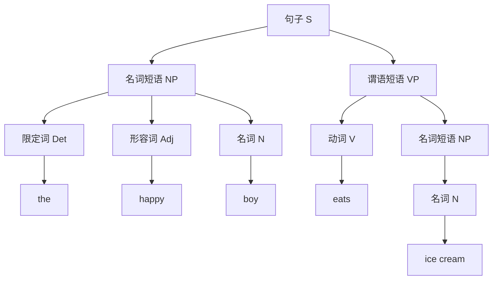

<div class="theme-color-blue" markdown=1>
`#大语言模型` `#概率模型` `#嵌入` `#大语言模型能力` `#大语言模型关键技术`
</div>

# 复习

- **大模型**：一个将输入转换为输出的函数，本质是一系列向量变换的组合

    ```ts
    const output = Model(input)
    ```

- **层**：大模型的基本计算单元，包含权重矩阵（$\textbf{W}$）和偏置（$\textbf{b}$），然后通过激活函数处理输出

    ```ts
    const Layer = (X) => {
        const Y = activate(W * X + b)
        return Y
    }
    ```

- **参数**：大模型的参数就是权重矩阵（$\textbf{W}$）和偏置（$\textbf{b}$），参数量决定了模型的规模和能力

# 大语言模型

大语言模型也是一个大模型，所以本质也是一个函数，之所以叫**大语言模型（Large Language Model，LLM）**，那是因为这个函数是给语言建模的。

```ts
// 大模型
const output = Model(input)

// 大语言模型
const answer = LLM(ask)
```

那大语言模型是如何给语言建模的呢？

## 语言结构

在此不打算谈论过多语言学的定义，大家每天都是用语言进行沟通，想必大家对语言并不陌生，不过要是问大家“语言究竟是什么？”，恐怕还是不好回答。

回想大家学外语（英语）的时候，都必须学习语音，单词，语法等，而大语言模型的输入输出都是文本序列，所以我们暂且不谈论语音。对于单词与语法来说，实际上我们可以这样看

- 单词：一个单词是有意义的**字母序列**，比如 `cat` 就是一个（英语）单词，`xxyy` 就不是一个单词。
- 语法：一个语法是有意义的**单词序列**，比如 SVO 语言里，`He likes movie.` 就是一个合乎语法的（英语）句子，而 `He movie likes.` 就不是。

而我们学习单词和语法的目的，就是为了说出“合乎规范”的语言。而语言建模的目的，也是让 `LLM` 能生成合乎规范的语言。

## 显式建模

语言学家做的事情，实际上是对语言进行**显式建模**。比如大家看到的各种语法书，实际上是人为整理的一条条规则，我们学习一门语言，实际上是学习这些规则。

不过这些规则都是显式的，也就是明确表达了一种清晰的序列关系，或者树状关系。比如对于句子 `The happy boy eats ice cream.`，其树状结构如下所示。



> 一个更通俗的例子是编程语言，由于需要计算机理解，所以编程语言都是符合规则的，而大家最初学习编程语言的时候，学习的也是这些规则。一个 statement 必须符合编程语法，而整个程序本身，则可以表达为一棵抽象语法树。

显式建模的问题

- 规则非常多，无法穷尽。
- 语言非常灵活，很多规则之外的例子。
- 不同语言规则不一样。
- ...

## 隐式建模

在深度学习横空出世之后，隐式建模成了大道至简的方式，将复杂问题直接通过一系列自主学习的隐藏层来解决。对于大语言模型来说，核心是概率模型。

规则实际上是对大量现象的总结，而大量现象则为概率模型提供了数量基础。从概率角度重新看“单词”和“语法”，我们可以这样来看：

- 单词：`cat` 是一个（英语）单词的概率，比 `xxyy` 更高。
- 语法：`He likes movie.` 是一个合乎语法的（英语）句子的概率，比 `He movie likes.` 更高。

从上下文填充的角度来看，`He likes (?).` 跟的单词，具有更大概率的是一些名词，比如 `movie`，`flower` 等，而不是动词，比如 `eats`，`likes` 等。所以学习语法的目的也可以看成帮助我们造出正确率更高的句子。

通过隐式建模，我们将语法的复杂度隐藏了，统一通过概率来定义语言模型。考虑由 $m$ 个单词 $w_1, \dots, w_m$ 构成的句子，将单词按 $w_1, \dots, w_m$ 的顺序出现的概率记为 $P(w_1, \dots, w_m)$。使用后验概率可以将这个联合概率分解为

$$
p(w_1, \dots, w_m) = \prod^m_{t = 1} P(w_t | w_1, \dots, w_{t - 1})
$$

这个模型有时候也称为**条件语言模型（conditional language model）**。简单来说，**大语言模型，就是在寻找下一个词**。

## 生成

我们现在使用的大语言模型基于问题生成回答，但其实大语言模型在预训练结束之后，只会具备上下文填充的能力，也就是提供上文，补充下文。考虑以下句子“今天天气很”，当这个作为输入的时候，大模型就会计算出一堆可能的输出，而每个输出，有不同的概率

- $p(\text{好}|\text{今天天气很}) = 0.99$
- $p(\text{差}|\text{今天天气很}) = 0.98$
- $p(\text{热}|\text{今天天气很}) = 0.95$
- ...
- $p(\text{白}|\text{今天天气很}) = 0.05$

此时大模型可以有多种选择的策略，通常模型有一个参数叫**温度（temperature）**来控制生成结果的确定性程度。当温度越高的时候，随机性越大。

> 这个可以通过分子运动来类比，温度越高的时候，运动越剧烈，越不稳定，温度越低，越稳定。

从这个角度来看，概率模型对于语言建模来说简直完美，它为语言提供了灵活性，不确定性，但同时具备了大概率的稳定性，当学习的语料越多，语言模型就有更大的概率学会所有语言的语法，同时不失灵活性。

# 嵌入（embedding）

前面提到，大模型的运算是向量的运算，所以我们需要将输入转化为向量。而对于文本来说，本身是一个字符序列，如何转化为向量呢？

下面不区分使用“字”和“词”，在英文文献中一般使用 word。

## 一个简单的例子

我们其实是有办法将一个“事物”转化为向量的，方法是对这个事物进行多维度的描述。比如“人”这个事物，我们可以从很多维度描述，，比如身高，体重，性别，年龄，种族，肤色，等等。而每一个维度有其对应的取值范围。通过这样，我们可以把人转化为向量，下面通过一个表的形式给出一个例子。

| 名字 | 身高 | 体重 | 性别 | 年龄 | 种族 | 肤色 |
| --- | --- | --- | --- | --- | --- | --- |
| 小明 | 170 | 60 | 男 | 20 | 白人 | 黄色 |
| 小红 | 160 | 50 | 女 | 25 | 白人 | 黑色 |
| 小陈 | 180 | 70 | 男 | 30 | 黑人 | 棕色 |

将事物转化为向量，有助于我们建立事物之间的关系，寻找其相似性。比如对于小明和小陈来说，他们都是男性，在这个维度上来看，他们比较相似。而对于小明和小红来说，他们的相似性可能在于他们都是白人。

世间上的事物都有多个维度，各自之间的相似性也非常复杂，语言也是如此。比如“神”这个字，从构词法的角度，它和“奇”（神奇），“大”（大神）这些字会有一定的关联性；从类别的角度，它和“人”，“妖”又会有一定关联性，这两个关联性是两个维度上的关联性。

假设我们对字（词）向量定义为 $(\text{构词法}, \text{类别}, \text{词性})$，那么上面提到的几个字，可能会有以下的向量表示（为了方便观察，还是使用表格的方式）。

| 字 | 构词法 | 类别 | 词性 |
| --- | --- | --- | --- |
| 神 | 0.6 | 0.9 | 0.1 |
| 奇 | 0.5 | 0.5 | 0.8 |
| 大 | 0.3 | 0.2 | 0.8 |
| 人 | 0.4 | 0.9 | 0.1 |
| 妖 | 0.4 | 0.9 | 0.1 |

## 嵌入的作用

从上面可以看到将词转化为向量的优势:

- 让一个词有了多维的描述
- 让一个词有了连续性的描述
- 让词之间有了逻辑关系

嵌入的作用，就是将一个词转化为一个稠密的向量。**嵌入维度（embedding dimension）**是指将一个词转化为多少维的向量。

```ts
const embedding = (word: string): Vector => {
    return EMBEDDING_TABLE[word]
}
```

这个转化的过程，可以先简单看成是一个查表的过程。

输入也可以是一个句子，这样返回就是一个 embedding 行向量构成的矩阵。

```ts
const embedding = (sentence: Matrix): Matrix => {
    const embeddingMatrix = Matrix(_.map(sentence, word => {
        return EMBEDDING_TABLE[word]
    }))
    return embeddingMatrix
}
```

## 嵌入在 LLM 中的作用

输入需要通过嵌入转化为向量，才能交由 LLM 进行计算，这个步骤可以放在 LLM 里作为一个前置步骤。

```ts
class LLM {
    constructor(layers) {
        this.layers = layers
    }
    chat(ask: string[]) {
        // 将输入转化为向量
        X = embedding(X)
        return this.forward(X)
    }
    forward(X) {
        let Y = X
        // 每一层往前计算
        for (const layer of this.layers) {
            Y = layer.forward(Y)
        }
        return Y
    }
}
```

# 能力特点

- **具有较为丰富的世界知识**：大语言模型通过超大规模文本数据的预训练后能够学习到较为丰富的世界知识。而传统方法是基于逻辑，规则，以及初期的机器学习算法，系统能力比较局限。
- **具有较强的通用任务解决能力**：大语言模型主要通过预测下一个词元的预训练任务进行学习，虽然并没有针对特定的下游任务进行优化，却能够建立远强于传统模型的通用任务求解能力。很多传统任务（摘要，翻译等）都可以采用基于大语言模型的提示学习方法进行解决，并且能获得更好的任务效果。
- **具有较好的复杂任务推理能力**：大语言模型能够回答知识关系复杂的推理问题，还可以解决涉及复杂数学推理过程的数学题目。
- **具有较强的人类指令遵循能力**：大语言模型建立了自然语言形式的统一任务解决模式：任务输入与执行结果均通过自然语言进行表达。
- **具有较好的人类对齐能力**：通过强化学习使得模型进行正确行为的加强以及错误行为的规避，进而建立较好的人类对齐能力。
- **具有可扩展的工具使用能力**：由于大语言模型具有较为通用的任务求解形式，可以通过微调，上下文学习等方式掌握外部工具的使用，如搜索引擎与计算器。

# 关键技术

- **规模扩展**：研究人员发现，超大规模语言模型能够展现出一些小型语言模型不具备的能力特点，如上下文学习能力，思维练能力等。
- **数据工程**：通过在海量文本上进行下一个词预测的优化，使得模型能够学习到丰富的语义知识信息，进而通过文本补全的方式解决各种下游任务。这种方式的好处是，极大简化了模型的设计和优化过程，使得模型训练与使用都是基于自然语言生成的模式进行的。
- **高效预训练**：由于参数规模巨大，需要使用大规模分布式训练算法优化大语言模型的神经网络参数。在训练过程中，需要联合使用各种并行策略以及效率优化方法，包括3D 并行（数据并行、流水线并行、张量并行）、ZeRO（内存冗余消除技术）等。
- **能力激发**：经过预训练后，大语言模型的能力仍然是通过通用的下一个词预测任务建立的。为了提升模型的任务求解能力，需要设计合适的指令微调以及提示策略进行激发和诱导。通常来说，现有的研究认为指令微调无法向大模型注入新的知识，而是训练大模型学会利用自身所掌握的知识与信息进行任务的求解。为此，研究人员提出了多种高级提示策略，包括上下文学习、思维链提示等，通过构建特殊的提示模板或者表述形式来提升大语言模型对于复杂任务的求解能力。提示工程已经成为利用大语言模型能力的一个重要技术途径。
- **人类对齐**：在实践应用中，需要保证大语言模型能够较好地符合人类的价值观。目前，比较具有代表性的对齐标准是“**3H 对齐标准**”，即Helpfulness（有用性）、Honesty（诚实性）和Harmlessness（无害性）。
- **工具使用**：由于大语言模型的能力主要是通过大规模文本数据的语义学习所建立的，因此在非自然语言形式的任务重能力较为受限。所以，工具学习成为一种扩展大语言模型能力的关键技术，通过让大语言模型学会使用各种工具的调用方式，进而利用合适的工具去实现特定的功能需求。

# 小结

- **大语言模型**：是概率模型，预测给定上下文的下一个词，条件概率表示为 $p(w_1, \dots, w_m) = \prod^m_{t = 1} P(w_t | w_1, \dots, w_{t - 1})$。
- **嵌入**：将一个词转化为一个多维的向量。
- **大语言模型的能力**：具有丰富的世界知识，通用的任务解决能力，能较好遵循人类指令，可以使用工具扩展。
- **关键技术**：规模扩展，数据工程，高效预训练，能力激发，人类对齐，工具使用。

# 实践时刻

- 给定一个固定的问题，最好是有相对固定答案的问题，调整 temperature 观察大语言模型的输出。
- 在 [huggingface](https://huggingface.co/) 上找一个开源的 embedding 模型，然后看看一些常用词的向量是什么。