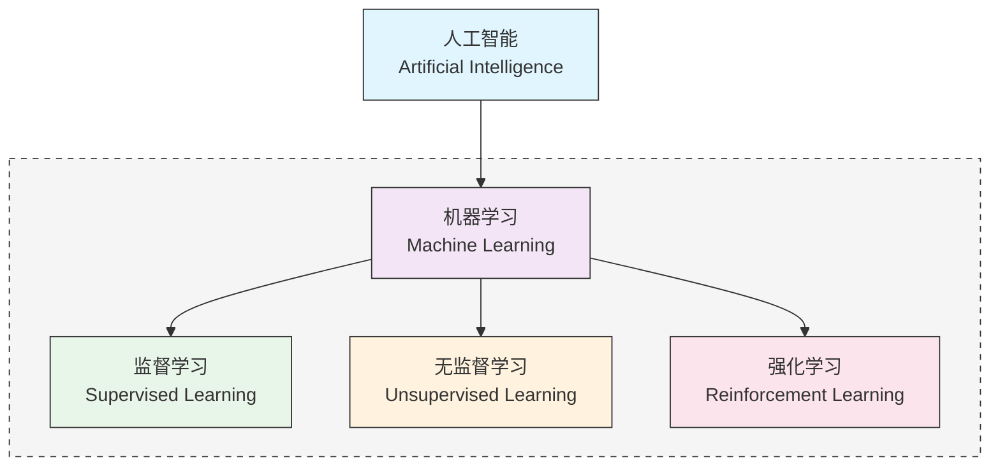
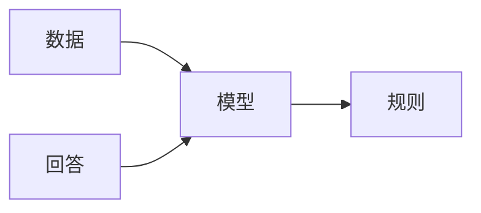
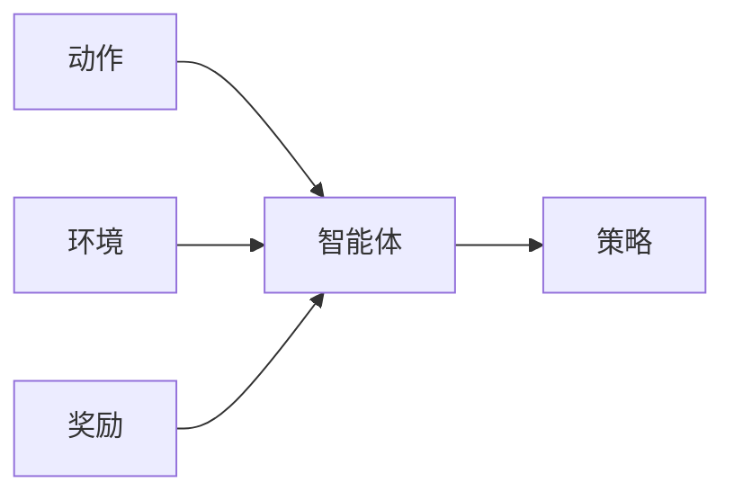
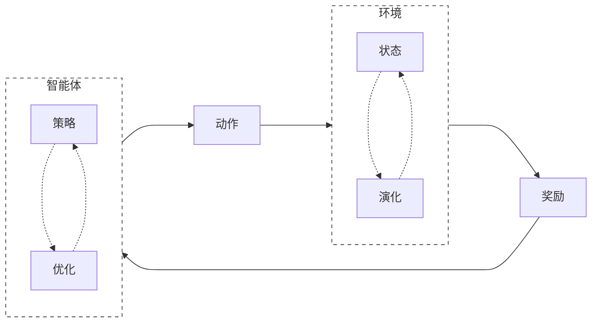
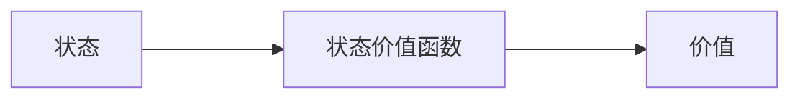

<script src="/assets/lib/board.js" /></script>
<style>
.board {
  display: block;
  margin: auto;
  margin-bottom: 20px;
}
</style>

<div class="theme-color-blue" markdown=1>
`#强化学习` `#强化学习流程` `#价值函数` `#选择策略`
</div>

# 书籍推荐

- **《Reinforcement Learning An Introduction》** - Richard S. Sutton ⭐⭐⭐
  - 适合有基础之后认真全面的学习
  - 强化学习的标准教科书，但比较难
- **《Grokking Deep Reinforcement Learning》** - Miguel Morales ⭐⭐⭐⭐⭐
  - 非常通俗易懂，容易上手的强化学习入门
  - 每个部分都会从通俗例子，形式化描述，示例代码，以及丰富的图例几个角度描述
- **《Deep Learning and the Game of Go》** - Max Pumperla et al. ⭐⭐⭐⭐⭐
  - 讲述 Alpha Go 背后原理及其实现
  - 深度学习与强化学习的应用

# 强化学习

**强化学习（Reinforcement Learning）** 是一种机器学习方法，它通过与环境的交互来学习如何采取行动，从而最大化预期的累积奖励。在强化学习中，**智能体（Agent）** 通过观察环境的 **状态（State）** 并采取 **行动（Action）** 来影响环境的状态转移和奖励。目标是让智能体在与环境的交互中逐渐学习到一个最优的策略，使得累积奖励最大化。

## 领域概念

机器学习方法分为三大类：

- **监督学习（Supervised Learning）**：通过给定的训练数据来学习一个模型，使得模型能够对新的数据进行预测或分类。
- **无监督学习（Unsupervised Learning）**：通过学习没标记的数据来发现数据的内在结构或规律，比如 LLM 的训练。
- **强化学习（Reinforcement Learning）**：通过试错来学习，智能体在环境中不断试错，获取最大奖励。

从领域视图来看



上述提到的几种机器学习方法，实际上是从“训练数据”的角度来进行分类的。而 **深度学习（Deep Learning）**，则是一套学习的工具集以及学习的方法。比如 **深度强化学习**，就是用深度学习的方法，来解决强化学习问题。

## 深度学习范式

回想一下深度学习的范式，是从数据和回答（有监督学习）出发，学习数据的内在模式，也就是输入是数据，输出是答案的模型。



```ts
// 数据格式为 [输入, 期望输出]
type data = [input: Tensor, output: Tensor]
// 深度学习得到一个模型
const model = deepLearning(data)
// 模型可以用来预测新输入
const predict = model(input)
```

## 强化学习范式

而强化学习的范式，也是非常类似的，只是术语发生了一些变化。



```ts
// 数据格式为 [动作, 环境, 奖励]
type data = [action: Tensor, environment: Tensor, reward: Tensor]
// 强化学习得到一个智能体
const agent = reinforcementLearning(data)
// 智能体可以对环境做出决策
const action = agent.makeDecision(environment)
```

传统机器学习大多数技巧还是使用“确定性”方法解决，比如通过数学方法求极值，或者通过一些决策树或者贝叶斯方法解决。而深度学习则是使用“概率”方法解决，所以使用深度学习解决最后得到的“模型”，具备一定的“智能”。使用深度学习方法解决强化学习问题最后得到的智能体，也具备一定底智能。

# 强化学习流程

强化学习的流程简单来说只有三个步骤：

1. 智能体与环境产生交互
2. 智能体衡量自己的行为（从环境中得到奖励信号，或者惩罚信号）
3. 智能体改进自己的策略



# 一个简单的例子

由于强化学习最初为人熟知的例子是 alpha go，所以这里就拿围棋作为例子。不过这里也不会过分采用围棋术语，这里用到的术语对其他棋类运动也适用，在强化学习语境里也很好理解。

> 问题：我们希望能训练出一个会下围棋的智能体

## 应用层

使用我们一贯的黑盒抽象方法，我们从顶层开始逐步解决这个问题。既然这个智能体是会下围棋的，那么它的应用层接口应该具备以下的能力。（为了避免复杂的表示，这里假设黑白双方都是由同一个智能体执行的）

```ts
const agent = new Agent()
const game = new Game()

while (game.isNotOver()) {
    const state = game.getState()
    const move = agent.makeDecision(state)
    game.takeAction(move)
}
```

由此可见，智能体最重要的一个作用是基于环境（当前的游戏状态）做出决策，如果我们希望得到这样一个智能体，我们需要一种方式对其进行训练，或者提供一种方式让它学习。

## 决策层

在决策层，智能体的输入是当前环境的状态，当然，在黑盒抽象中，我们暂时无需关心这个状态的表现形式。但对于熟悉暴力美学的大家来说，最直观能想到的一种方式，也是最朴素的一种方式是“随机选择”。

```ts
class Agent {
    makeDecision(state: State) {
        // 从当前状态中获取可以下棋的位置
        const possibleMoves = state.getPossibleMoves()
        // 随机选择一个位置
        return randomChoice(possibleMoves)
    }
}
```

很明显，大家虽然喜欢暴力美学，但是实际进行选择的时候一般不会这样鲁莽，而是会衡量一些“价值”，比如

- 在这几步棋里，哪一步会比较好呢？
- 我走了这一步之后，会让自己的情况更有利吗？

有了这些考虑之后，我们就需要一个衡量的过程了，而有了衡量结果之后，我们也可以通过一种策略对结果进行选择。

```ts
class Agent {
    makeDecision(state: State) {
        // 从当前状态中获取可以下棋的位置
        const possibleMoves = state.getPossibleMoves()
        // 衡量每一步的价值
        const values = this.evaluate(possibleMoves)
        // 根据价值进行选择
        return this.select(possibleMoves, values)
    }
}
```

这其中的“衡量过程”，其实是一个很复杂的过程，里面有很多可能的选择。

### 价值函数

**价值函数（value function）** 是一个将输入映射成价值的一个函数。这个输入可以是状态，可以是动作，甚至也可以是一个策略。

#### 动作价值函数

我们还是从最简单的例子开始，在上面的 `evaluate` 函数中，我们将可以下棋的位置转化为价值，假设我们有这样的一个万能的价值函数：


那么 `evaluate` 函数就可以通过如下的方式实现：


```ts
class Agent {
    evaluate(moves: Move[]) {
        // 价值函数将每一步转化为一个价值，价值越高意味着赢的概率越高，这样采取这个行动的概率就应该增大
        const values = moves.map(move => this.valueFunction(move))
        return values
    }
}
```

<div class="board" id="board-1" style="width: 500px; height: 500px;"></div>
<script>
const b1 = new Board(document.getElementById('board-1'));

b1.play([10, 10], 'white');
b1.play([10, 9], 'black');
b1.play([10, 11], 'black');
b1.play([9, 10], 'black');

b1.tryToPlay([11, 10], 'black', 9, { backgroundColor: 'black'});
b1.tryToPlay([12, 10], 'black', 8, { backgroundColor: '#666'});
b1.tryToPlay([13, 10], 'black', 7, { backgroundColor: '#999'});
b1.tryToPlay([12, 9], 'black', 7, { backgroundColor: '#999'});
b1.tryToPlay([12, 11], 'black', 7, { backgroundColor: '#999'});
b1.tryToPlay([12, 8], 'black', 2, { backgroundColor: '#bbb'});
b1.tryToPlay([13, 9], 'black', 1, { backgroundColor: '#ccc'});
b1.tryToPlay([14, 10], 'black', 1, { backgroundColor: '#ccc'});
</script>

如果我们知道了每一步的价值，那么我们可以实现一个朴素的贪心策略，那就是直接选择价值最高的一步。

```ts
class Agent {
    select(moves: Move[], values: number[]) {
        // 找到价值最高的一步
        const maxValue = Math.max(...values)
        // 找到所有价值最高的一步
        const maxValueMoves = moves.filter((move, index) => values[index] === maxValue)
        // 随机选择一个价值最高的一步
        return randomChoice(maxValueMoves)
    }
}
```

在这个例子里，这个价值函数称为 **动作价值函数（action value function）**。

#### 状态价值函数

但如前所述，在衡量过程中，我们其实可能会有更多思考，比如我们可以思考棋局状态的评分，假设你距离胜利只有一步之遥，那么当前棋局对于你来说评分是 100 分（因为再走一步就能赢，而且现在到你走）。那再前一步，你离胜利有两步之遥，当然对手可能会有一手超级逆转，但可能性不大，你可以先发制人，不过毕竟不是真正的胜利，所以此时的棋局可能是 98 分。假设我们有一个价值函数，能直接对棋盘进行评分：



那么我们的 `evaluate` 函数就可以通过如下的方式实现：

```ts
class Agent {
    evaluate(moves: Move[]) {
        const values = moves.map(move => {
            const nextState = game.takeAction(move)
            const value = this.valueFunction(nextState)
            return value
        })
        return values
    }
}
```

假设目前在下面这个状态，此时黑子和白子其实都只下了一步棋而已，并且两者成对称的状态，我们可以判断此时两者势均力敌（当然实际也不一定是，这里只是简化了棋盘，举一个简单例子而已）。

<div class="board" id="board-2" style="width: 200px; height: 200px;"></div>
<script>
const b2 = new Board(document.getElementById('board-2'), 8, { noBorder: true });

b2.play([2, 3], 'white');
b2.play([2, 4], 'black');
</script>

但如果到了下面这个状态，此时黑子已经占据了比较多的地方，并且形成了两个眼，那么这一个局部来看黑子是比较占优的。

<div class="board" id="board-3" style="width: 200px; height: 200px;"></div>
<script>
const b3 = new Board(document.getElementById('board-3'), 8, { noBorder: true });

b3.play([2, 4], 'black');
b3.play([2, 5], 'black');
b3.play([2, 6], 'black');
b3.play([3, 6], 'black');
b3.play([4, 6], 'black');
b3.play([4, 5], 'black');
b3.play([4, 4], 'black');
b3.play([4, 3], 'black');
b3.play([4, 2], 'black');
b3.play([5, 2], 'black');
b3.play([6, 2], 'black');
b3.play([6, 3], 'black');
b3.play([6, 4], 'black');
b3.play([5, 4], 'black');
b3.play([3, 4], 'black');

b3.play([1, 7], 'white');
b3.play([3, 1], 'white');
b3.play([3, 2], 'white');
b3.play([3, 3], 'white');
b3.play([2, 3], 'white');
b3.play([1, 3], 'white');
</script>

而状态价值函数，则可以将这样的状态转化为一个价值。

### 选择策略

在上面的例子中，我们都采用了“贪心”的策略，通过选择价值较高的动作或者状态，而期望得到一个较好的结果。当然这也是非常合理的策略，但是在不同的场景里，选择的策略是应该适当发生变化的。在某些游戏中，每一步得到的收益不一定是均等的。

比如有可能走了一条每一步都只有微小收益的路径，但最后因为一个错误功亏一篑。这其实就是前期一直使用贪心策略导致的恶果。所以实际选择的时候，需要兼顾 **exploration（探索）** 以及 **exploitation（利用）**。

- **利用** 是指基于当前已知信息选择最优的行动，以最大化短期回报。
- **探索** 是指通过尝试新的行动或者策略，以获取更多环境信息，从而增大发现潜在最大收益的可能。

#### 贪心策略

贪心策略就是上面的策略，非常简单直接，永远使用收益最高的短期选择，是绝对的 **利用**。

```ts
class Agent {
    exploit(moves: Move[], values: number[]) {
        const maxValue = Math.max(...values)
        const maxValueMoves = moves.filter((move, index) => values[index] === maxValue)
        return randomChoice(maxValueMoves)
    }
}
```

#### 随机策略

而随机策略，也非常简单直接，就是完全的随机，是绝对的 **探索**。

```ts
class Agent {
    explore(moves: Move[], values: number[]) {
        return randomChoice(moves)
    }
}
```

#### ε-贪心策略

ε-贪心策略是一种在探索和利用之间进行权衡的策略。它会以 ε 的概率进行探索，以 1 - ε 的概率进行利用。

```ts
class Agent {
    select(moves: Move[], values: number[]) {
        if (Math.random() < this.epsilon) {
            return this.explore(moves, values)
        } else {
            return this.exploit(moves, values)
        }
    }
}
```

# 小结

- **强化学习** 与 **监督学习** 以及 **无监督学习** 构成机器学习的三大方法。
- **强化学习** 是一种 **试错学习** 的方法，通过不断地尝试和学习，最终找到最优的策略。
- **强化学习四要素**
    - **智能体**：是强化学习的核心，它可以根据当前的环境状态，选择最优的行动。
    - **环境**：是智能体的外部世界，它可以提供奖励信号，也可以提供惩罚信号。
    - **状态**：是环境的一个快照，它可以用来描述当前的环境状态。
    - **动作**：是智能体的一个决策，它可以改变环境的状态。
- **价值函数**：可以将状态，或者动作映射为一个数值（价值）。
- **选择策略**：可以根据价值函数计算出来的价值，通过 **探索** 或者 **利用** 来选择一个动作。