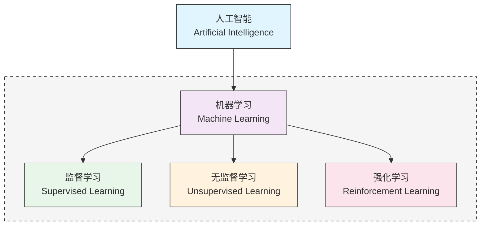
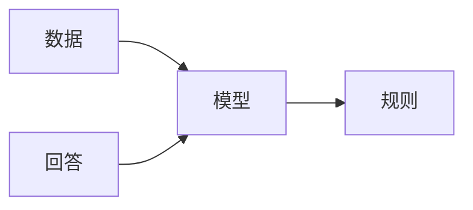
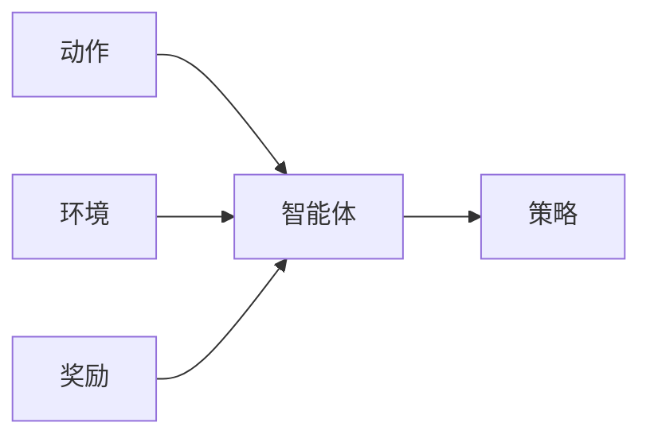
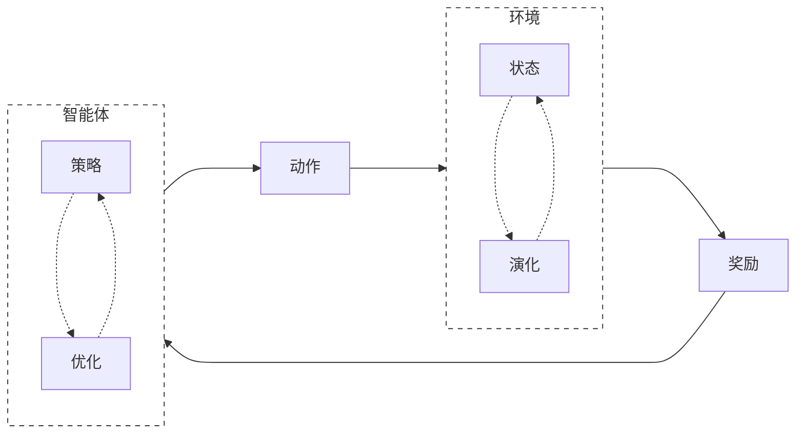

<div class="theme-color-blue" markdown=1>
`#强化学习`
</div>

# 书籍推荐

- **《Reinforcement Learning An Introduction》** - Richard S. Sutton ⭐⭐⭐
  - 适合有基础之后认真全面的学习
  - 强化学习的标准教科书，但比较难
- **《Grokking Deep Reinforcement Learning》** - Miguel Morales ⭐⭐⭐⭐⭐
  - 非常通俗易懂，容易上手的强化学习入门
  - 每个部分都会从通俗例子，形式化描述，示例代码，以及丰富的图例几个角度描述
- **《Deep Learning and the Game of Go》** - Max Pumperla et al. ⭐⭐⭐⭐⭐
  - 讲述 Alpha Go 背后原理及其实现
  - 深度学习与强化学习的应用

# 强化学习

**强化学习（Reinforcement Learning）** 是一种机器学习方法，它通过与环境的交互来学习如何采取行动，从而最大化预期的累积奖励。在强化学习中，**智能体（Agent）** 通过观察环境的 **状态（State）** 并采取 **行动（Action）** 来影响环境的状态转移和奖励。目标是让智能体在与环境的交互中逐渐学习到一个最优的策略，使得累积奖励最大化。

## 领域概念

机器学习方法分为三大类：

- **监督学习（Supervised Learning）**：通过给定的训练数据来学习一个模型，使得模型能够对新的数据进行预测或分类。
- **无监督学习（Unsupervised Learning）**：通过学习没标记的数据来发现数据的内在结构或规律，比如 LLM 的训练。
- **强化学习（Reinforcement Learning）**：通过试错来学习，智能体在环境中不断试错，获取最大奖励。

从领域视图来看



上述提到的几种机器学习方法，实际上是从“训练数据”的角度来进行分类的。而 **深度学习（Deep Learning）**，则是一套学习的工具集以及学习的方法。比如 **深度强化学习**，就是用深度学习的方法，来解决强化学习问题。

## 深度学习范式

回想一下深度学习的范式，是从数据和回答（有监督学习）出发，学习数据的内在模式，也就是输入是数据，输出是答案的模型。



```ts
// 数据格式为 [输入, 期望输出]
type data = [input: Tensor, output: Tensor]
// 深度学习得到一个模型
const model = deepLearning(data)
// 模型可以用来预测新输入
const predict = model(input)
```

## 强化学习范式

而强化学习的范式，也是非常类似的，只是术语发生了一些变化。



```ts
// 数据格式为 [动作, 环境, 奖励]
type data = [action: Tensor, environment: Tensor, reward: Tensor]
// 强化学习得到一个智能体
const agent = reinforcementLearning(data)
// 智能体可以对环境做出决策
const action = agent.makeDecision(environment)
```

传统机器学习大多数技巧还是使用“确定性”方法解决，比如通过数学方法求极值，或者通过一些决策树或者贝叶斯方法解决。而深度学习则是使用“概率”方法解决，所以使用深度学习解决最后得到的“模型”，具备一定的“智能”。使用深度学习方法解决强化学习问题最后得到的智能体，也具备一定底智能。

# 强化学习流程

强化学习的流程简单来说只有三个步骤：

1. 智能体与环境产生交互
2. 智能体衡量自己的行为（从环境中得到奖励信号，或者惩罚信号）
3. 智能体改进自己的策略


