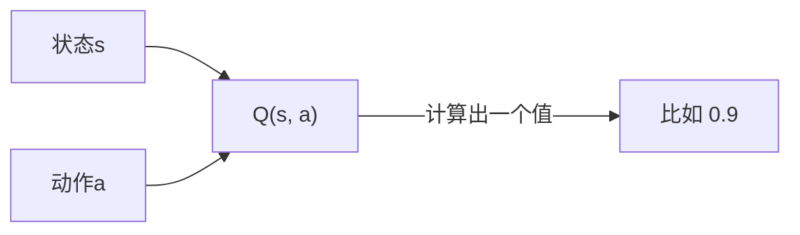
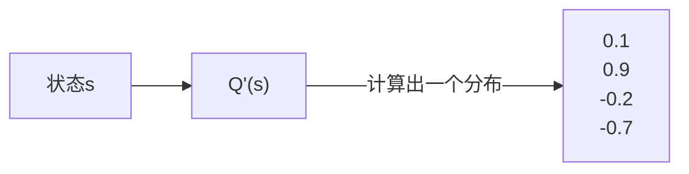
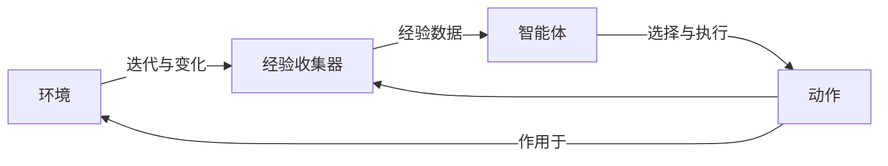
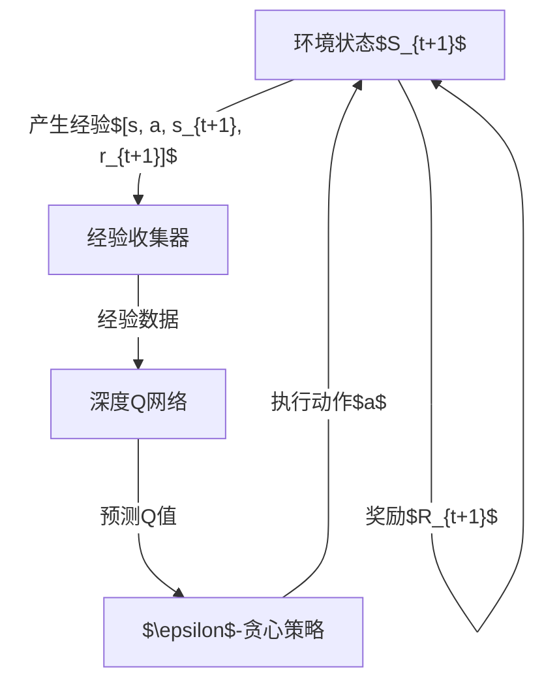

<script src="/assets/lib/gridworld.js"></script>
<script src="/assets/lib/plot.js" /></script>
<script src="/assets/lib/graph.js" /></script>

<style>
.gridworld {
  display: block;
  margin: auto;
  margin-bottom: 20px;
  font-family: sans-serif;
  color: black;
}
.button {
  font-family: sans-serif;
  border: solid 1px black;
  padding: 2px 10px;
  border-radius: 5px;
  cursor: pointer;
}
canvas {
  display: block;
  margin: auto;
  margin-bottom: 20px;
  border:1px solid #ddd;
  width:300px;
  height:300px;
}
</style>

<div class="theme-color-blue" markdown=1>
`#强化学习` `#灾难性遗忘` `#状态叠加编码` `#深度Q学习`
</div>

# 复习

- **Q 函数**：价值函数，计算状态或在在某个状态下的执行某个动作的价值。



- **改进的 Q 函数**：通过状态计算出动作的 Q 值分布。



- **Q 学习**：一种强化学习方法。在学习过程中，使用 Q 函数辅助决策，通过未来收益不断调整 Q 值，最终形成一个最优策略。

$$
\overbrace{Q(S_t, A_t)}^\text{更新的 Q 值} 
= 
\overbrace{Q(S_t, A_t)}^\text{当前的 Q 值} +
\alpha[
\underbrace{R_{t+1}}_\text{奖励} + 
\gamma \underbrace{\max Q(S_{t+1}, a)}_\text{所有动作里的最大 Q 值} -
Q(S_t, A_t)
]
$$

# GridWorld 的启示

在我们上次的例子里，GridWorld 是如下的一个格子世界。格子有三种类型，带惩罚的红色格子，带奖励的绿色格子，以及可以自由行走的普通白色格子。

<div id="g1" class="gridworld" style="width: 400px; height: 400px;"></div>

<script>
  const c1 = document.getElementById('g1');
  const g1 = new GridWorld('g1', c1, 6, {
    showTriangles: false,
  });
  
  // 设置奖励点和惩罚点
  g1.setRewards([[5, 5]], 1);  // 两个奖励点，值为1
  g1.setPenalties([[1, 1], [2, 2], [5, 0], [2, 4]], -1); // 两个惩罚点，值为-1
</script>

上次的问题是，训练出一个智能体，希望这个智能体在这个 GridWorld 里探索的时候能够尽可能拿到更好的奖励。再次回忆我们上次用到的方法。

1. 让智能体随便走
2. 当某一条路径走到终点（假如是奖励格子）
3. 我们反向改变智能体在每一个路径格子的动作权重

<div id="g23" class="gridworld" style="width: 400px; height: 400px;"></div>

<script>
  const c23 = document.getElementById('g23');
  const g23 = new GridWorld('g23', c23, 6, {
    showTriangles: false,
    pathColor: 'rgba(0, 0, 0, 0.3)',
    pathWidth: 8,
  });
  
  // 设置奖励点和惩罚点
  g23.setRewards([[5, 5]], 1);  // 两个奖励点，值为1
  g23.setPenalties([[1, 1], [2, 2], [5, 0], [2, 4]], -1); // 两个惩罚点，值为-1
  const p23 = [
    [0, 0],
    [1, 0],
    [2, 0],
    [3, 0],
    [3, 1],
    [3, 2],
    [3, 3],
    [4, 3],
    [5, 3],
    [5, 4],
    [5, 5],
  ];
  g23.showPath(p23);
  g23.showText([5, 4], `A = 右 \n R = ${1 * Math.pow(0.9, 1).toFixed(2)}`);
  g23.showText([5, 3], `A = 右 \n R = ${1 * Math.pow(0.9, 2).toFixed(2)}`);
  g23.showText([4, 3], `A = 下 \n R = ${1 * Math.pow(0.9, 3).toFixed(2)}`);
  g23.showText([3, 3], `A = 下 \n R = ${1 * Math.pow(0.9, 4).toFixed(2)}`);
  g23.showText([3, 2], `A = 右 \n R = ${1 * Math.pow(0.9, 5).toFixed(2)}`);
  g23.showText([3, 1], `A = 右 \n R = ${1 * Math.pow(0.9, 6).toFixed(2)}`);
  g23.showText([3, 0], `A = 右 \n R = ${1 * Math.pow(0.9, 7).toFixed(2)}`);
  g23.showText([2, 0], `A = 下 \n R = ${1 * Math.pow(0.9, 8).toFixed(2)}`);
  g23.showText([1, 0], `A = 下 \n R = ${1 * Math.pow(0.9, 9).toFixed(2)}`);
  g23.showText([0, 0], `A = 下 \n R = ${1 * Math.pow(0.9, 10).toFixed(2)}`);
</script>

通过这种方式，我们最终得到的策略可能是如下的样子。

<div style="width: 420px; margin: auto;">

</div>

这里需要留意的是，我们训练这个智能体的时候，使用的是一个固定的 GridWorld，也就是奖励点以及惩罚点每次都是固定的。这意味着，这个智能体只学到了“这个” GridWorld。要是我们换一个 GridWorld，奖励点和惩罚点的位置都发生变化之后，这个策略明显是行不通的，目前尝试去避免惩罚点的决策，很有可能在新的 GridWorld 里是走向惩罚点的。

换个角度说，智能体此时学到的是“走到 `[1, 1]` 这个格子不太好”（在这个例子里 `[1, 1]` 是惩罚点）。并不是学到“走到惩罚点不太好”。这个区别非常关键，考虑一个新的问题

> 训练一个智能体，使其能尽量远离惩罚点，并到达奖励点获得奖励。

这个新问题意味着，当我们把智能体放到任意随机的 GridWorld 的时候，我们都希望它能够避开惩罚点。

# 灾难性遗忘

**灾难性遗忘（Catastrophic Forgetting）**在这类问题里非常普遍，我们先看看这个问题。在上面的新问题中，我们喂给智能体的是各种随机 GridWorld，下面随便给出两个例子。

<div style="display:flex;flex-direction:row;">
<div id="g31" class="gridworld" style="width: 300px; height: 300px;"></div>
<div id="g32" class="gridworld" style="width: 300px; height: 300px;"></div>
</div>

<script>
  const c31 = document.getElementById('g31');
  const g31 = new GridWorld('g31', c31, 6, {
    showTriangles: true,
    pathColor: 'rgba(0, 0, 0, 0.3)',
    pathWidth: 8,
  });
  
  // 设置奖励点和惩罚点
  g31.setRewards([[2, 4]], 1);  // 奖励点，值为 1
  g31.setPenalties([[2, 2]], -1); // 惩罚点，值为 -1
  g31.setAgent([2, 3]);
  g31.showActionValues([2, 3], {
    up: 0.5,
    right: 0.8,
    down: 0.5,
    left: 0.1
  });

  const c32 = document.getElementById('g32');
  const g32 = new GridWorld('g32', c32, 6, {
    showTriangles: true,
    pathColor: 'rgba(0, 0, 0, 0.3)',
    pathWidth: 8,
  });
  
  // 设置奖励点和惩罚点
  g32.setRewards([[2, 2]], 1);  // 奖励点，值为 1
  g32.setPenalties([[2, 4]], -1); // 惩罚点，值为 -1
  g32.setAgent([2, 3]);
  g32.showActionValues([2, 3], {
    up: 0.5,
    right: 0.8,
    down: 0.5,
    left: 0.1
  });
</script>

上面两个 GridWorld 的奖励点与惩罚点是刚好相反的，如果智能体在左边的 GridWorld 里学到，在 `[3, 2]` 这个位置应该往右走，那么它带着这个策略走右边的 GridWorld，将会直接走到惩罚点。此时有人可能会问，当训练到右边的 GridWorld 的时候，智能体会不会就修正自己的权重呢？但你要想的是，按照之前提到的 Q 值更新方法，会导致智能体把 Q 值修正。那么如果再给智能体左边的图，它就要陷入这种死循环里了。

## 位置编码

之前一直没有提到的一个细节是，我们在训练智能体的时候，GridWorld 是如何被编码的，也就是强化学习的环境，究竟是如何编码的？

考虑到改进后的 Q 函数具有以下的形式：


最容易想到的一种编码方式就是坐标编码，这种编码方式表明智能体当前的位置。比如 `s = [2, 3]` 表明智能体当前在 `[2, 3]` 这个位置。这种编码方式也是非常直观的，在这种编码方式下，执行动作并且改变状态这个过程非常直观。比如这种方式可以通过下面的方式实现。

```ts
const up = (s: State): State => {
  const [row, col] = s
  return [row - 1, col]
}

const s1 = [2, 3] // 当前智能体在 [2, 3] 这个位置
const s2 = up(s1) // 当前智能体在 [1, 3] 这个位置
```

这种编码方式虽然很简单很直观，但是最致命的弱点是智能体没有学到世界的所有信息，它只知道在“当前这个世界下”，在某个位置是否安全，或者在这个位置向左走，或者向右走会大概有什么结果。它并不清楚世界里，有奖励点，有惩罚点。**但我们的目标是希望智能体能够辨别奖励点，惩罚点。**只有它能够辨别，才能在另一个随机世界里也能做出正确的决策，避开惩罚点，到达奖励点。

## 状态叠加编码

为了解决这个问题，我们需要将尽量多的环境信息编码到状态。这个涉及到训练设计的问题，不过一种很常规，并且很容易理解的办法是将各种信息分类分层，然后再叠加在一起。

比如在这个简单例子的 GridWorld 里，位置信息有三种

1. 惩罚点位置信息
2. 奖励点位置信息
3. 智能体位置信息

也就是对于最初是的 GridWorld，我们拆分出了三层信息。

<div style="display:flex;flex-direction:row;align-items:center;">
<div id="g41" class="gridworld" style="width: 150px; height: 150px;"></div>
<div style="margin-bottom: 20px"> = </div>
<div id="g42" class="gridworld" style="width: 150px; height: 150px;"></div>
<div style="margin-bottom: 20px"> &#x2b; </div>
<div id="g43" class="gridworld" style="width: 150px; height: 150px;"></div>
<div style="margin-bottom: 20px"> &#x2b; </div>
<div id="g44" class="gridworld" style="width: 150px; height: 150px;"></div>
</div>

<script>
  const c41 = document.getElementById('g41');
  const g41 = new GridWorld('g41', c41, 6, { showTriangles: false });
  
  g41.setRewards([[5, 5]], 1);  // 奖励点，值为1
  g41.setPenalties([[1, 1], [2, 2], [5, 0], [2, 4]], -1); // 两个惩罚点，值为-1

  const c42 = document.getElementById('g42');
  const g42 = new GridWorld('g42', c42, 6, { showTriangles: false });
  
  g42.setRewards([[5, 5]], 1);  // 奖励点，值为1
  g42.placeAgent(true);

  const c43 = document.getElementById('g43');
  const g43 = new GridWorld('g43', c43, 6, { showTriangles: false });
  
  g43.setPenalties([[1, 1], [2, 2], [5, 0], [2, 4]], -1); // 惩罚点，值为-1
  g43.placeAgent(true);

  const c44 = document.getElementById('g44');
  const g44 = new GridWorld('g44', c44, 6, { showTriangles: false });
</script>

这种信息转化为代码，天然是一个非常整齐的张量格式。

```ts
const state = [
  [ // 奖励点信息
    [0, 0, 0, 0, 0, 0],
    [0, 0, 0, 0, 0, 0],
    [0, 0, 0, 0, 0, 0],
    [0, 0, 0, 0, 0, 0],
    [0, 0, 0, 0, 0, 0],
    [0, 0, 0, 0, 0, 1],
  ],
  [ // 惩罚点信息
    [0, 0, 0, 0, 0, 0],
    [0, 1, 0, 0, 0, 0],
    [0, 0, 1, 0, 1, 0],
    [0, 0, 0, 0, 0, 0],
    [0, 0, 0, 0, 0, 0],
    [1, 0, 0, 0, 0, 0],
  ],
  [ // 智能体位置
    [1, 0, 0, 0, 0, 0],
    [0, 0, 0, 0, 0, 0],
    [0, 0, 0, 0, 0, 0],
    [0, 0, 0, 0, 0, 0],
    [0, 0, 0, 0, 0, 0],
    [0, 0, 0, 0, 0, 0],
  ],
]
```

注意到，这种实现其实也并不困难，在环境中会有 `getState` 方法，通过这个方法可以获取当前环境的状态。

```ts
class Env {
  getState(): State {
    return [
      this.rewards,
      this.penalties,
      this.getAgentState(),
    ]
  }
}
```

其中的 `getAgentState` 方法用于获取智能体当前位置，然后转化为这种张量格式，它所处位置的数组元素为 `1`，数组其余位置都是 `0`。这种编码方式可以让智能体在学习的过程中，“学会”这些信息之间的关联。

## 经验回放

回想之前讨论的训练过程，为了让学习过程更快收敛，学习的结果更为准确，其中一个技巧是**小批量学习**。

<div style="display: flex;flex-direction: row">
<canvas id="learn-by-one-point-y=2x"></canvas>
<canvas id="learn-by-few-points-y=2x"></canvas>
</div>

<script>
const p8 = new Plot('learn-by-one-point-y=2x');
p8.draw(x => 2*x);
p8.draw(x => -3*x + 5, { color: 'green' });
p8.draw(x => 3*x - 1, { color: 'blue' });
p8.drawPoints([[1, 2]], { color: 'black', radius: 3});

const p9 = new Plot('learn-by-few-points-y=2x');
const p9Points = [[-1, -2], [-0.8, -1.6], [0.2, 0.4]];
p9.draw(x => 2*x);
p9.drawPoints(p9Points, {
  color: 'black', radius: 3,
  func: x => -3*x + 5,
  showDistance: true,
  distanceColor: 'green',
});
p9.drawPoints(p9Points, {
  color: 'black', radius: 3,
  func: x => 3*x - 1,
  showDistance: true,
  distanceColor: 'blue',
});
p9.draw(x => -3*x + 5, { color: 'green' });
p9.draw(x => 3*x - 1, { color: 'blue' });
</script>

经验回放其实与小批量的思路是一致的，就是一次迭代过程中，传入批量的**经验数据**。有了上面的编码之后，在一次迭代中

1. 获取当前状态 `state`
2. 选择动作 `action`
3. 执行动作
4. 环境更新状态 `nextState`，同时反馈（奖励）`reward`
5. 一般环境更新状态的同时会给出此次探索是否终止 `done`

这样一条经验数据为 `[state, action, nextState, reward, done]`。当智能体在环境中自由探索，并且没有终结之前，就能持续获得经验数据。这样在一次探索中，最后获得一组经验数据。

```ts
// 一条经验数据
type Experience = [State, Action, State, Reward, Done]
// 一次探索里得到的一组经验数据
type Episode = Experience[]
```

经验回放在训练过程中起到收集经验数据，然后组织为批量数据作为训练的输入的作用。



# 深度 Q 学习

上次我们说到的 Q 学习，可以直接迁移到深度网络中。Q 学习的核心在于 Q 值的更新，而上次使用的是确定性的 Q 值更新方法，也就是

$$
\overbrace{Q(S_t, A_t)}^\text{更新的 Q 值} 
= 
\overbrace{Q(S_t, A_t)}^\text{当前的 Q 值} +
\alpha[
\underbrace{R_{t+1}}_\text{奖励} + 
\gamma \underbrace{\max Q(S_{t+1}, a)}_\text{所有动作里的最大 Q 值} -
Q(S_t, A_t)
]
$$

在代码中我们也是用确定性方法进行实现。

```ts
const updateQValue = (state, action, reward, nextState) => {
    // 当前状态的 Q 值
    const currentQ = this.qTable[state][action];

    // 计算下一个状态的最大Q值
    let maxNextQ = 0;
    if (!done) {
        maxNextQ = Math.max(...Object.values(this.qTable[nextState]));
    }
    
    // 更新公式: Q(s,a) = Q(s,a) + α * [r + γ * max(Q(s',a')) - Q(s,a)]
    const newQ = currentQ + learningRate * 
                (reward + discountFactor * maxNextQ - currentQ);
    
    // 更新 Q 表
    this.qTable[state][action] = newQ;
}
```

但经过这段时间的学习，我们应该慢慢能感受到非确定性方法所带来的魅力。在解决复杂问题的时候，非确定性方法可以不显式指定规则，通过学习的方式将“规则”内化到智能体内。**所以深度 Q 学习，实际上是将 Q 值的计算交给深度神经网络进行计算**，原来的 `updateQValue` 方法是用来存储一个巨大的 Q 值表，但现在通过神经网络计算的话，这个 Q 值表，实际上变成了网络内部的参数表示了。

结合经验回放，下面是整个深度 Q 学习的流程图。



下面是深度 Q 学习的循环伪代码，可以与之前的进行对比。

```ts
const step = () => {
    // 获取当前状态
    const state = this.getState()
    // 获取当前状态下的经验数据
    const experience = this.getExperience()
    // 追加到经验回放器
    this.experienceReplay.push(experience)
    // 获取小批量经验数据
    const experiences = this.experienceReplay.getBatch()
    // 使用深度 Q 网络计算 Q 值
    const qValues = this.deepQNetwork(state, experiences)
    // 使用 ε-贪心策略选择动作
    const action = this.selectAction(qValues)
    // 执行动作
    this.env.takeAction(action)
}
```