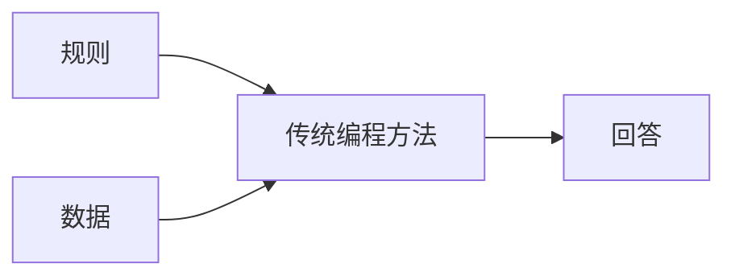
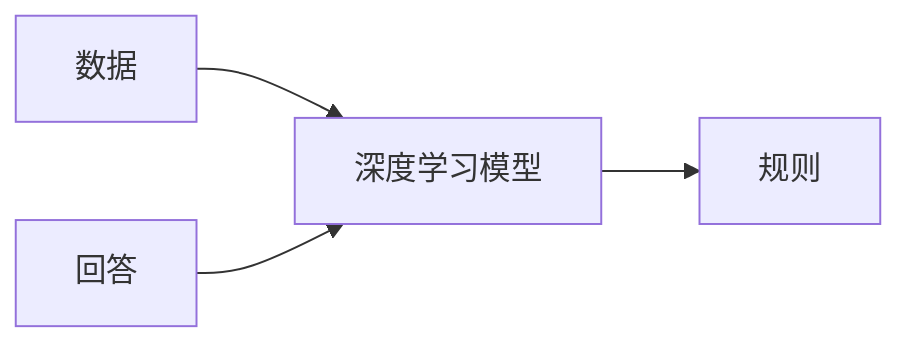
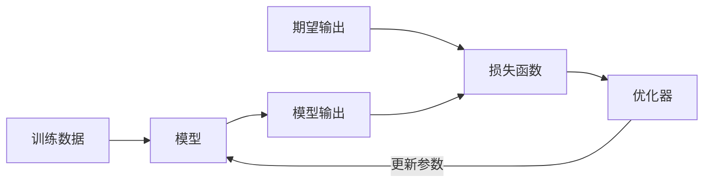

<div class="theme-color-blue" markdown=1>
`#深度学习` `#训练` `#数据集` `#损失函数` `#优化器`
</div>

# 复习

- **大模型**：一个将输入转换为输出的函数，本质是一系列向量变换的组合

    ```ts
    const output = Model(input)
    ```

- **层**：大模型的基本计算单元，包含权重矩阵（$\textbf{W}$）和偏置（$\textbf{b}$），然后通过激活函数处理输出

    ```ts
    const Layer = (X) => {
        const Y = activate(W * X + b)
        return Y
    }
    ```

- **参数**：大模型的参数就是权重矩阵（$\textbf{W}$）和偏置（$\textbf{b}$），参数量决定了模型的规模和能力

# 深度学习

深度学习是一种**建模方法**，里面有两个重要部分：

- **深度**：是指这个模型有很多层
- **学习**：是指这个模型可以通过数据来学习

# 建模方法

传统的建模方法



深度学习的建模方法



> 那这个规则是什么？

# 例子

之前提到大模型实际上是一个函数，而这个函数的输入是一个向量，输出也是一个向量。

- 假设有一张动物的图片，我们希望有一个模型来识别这个图片里的动物，那么对于这个模型来说，输入就是这张图片，输出就是这个图片里的动物的名称。
    ```ts
    const animal: String = ClassifierModel(image: Image)
    type String = Number[]
    type Image = Number[][][]
    ```

- 假设输入一个上文，我们希望大语言模型给出这个问题的回答，当然，大语言模型是一个字一个字回答的，所以对于大语言模型来说，输入是上文（一个句子），输出是一个字。
    ```ts
    const answer: String = LargeLanguageModel(context: String)
    type String = Number[]
    ```

- 假如我们希望有一个模型来帮我们下棋，它主要是为了帮我们寻找下一步棋的最佳位置，那么对于这个模型来说，输入是当前的棋盘状态，输出是下一步棋的最佳位置。
    ```ts
    const bestPosition: Position = PlayerModel(board: Board)
    type Position = Number[]
    type Board = Number[][][]
    ```

通过这三个例子我们可以看到，这个所谓的“规则”，实际上已经**隐含在了模型里面**，我们把问题抛给模型，模型就给我们答案。模型内部帮我们解决了问题。再深一层考虑，这个模型内化的规则，并不是一个显式的规则，而是一个隐式的规则，我们只能通过某些手段观测，但很难对其做出解释。

# 另一个例子

> 考虑一个场景：我们希望有一个模型来帮我们判断一个句子是否是一个疑问句

## 传统方法

按照常规思路来考虑，要判断一个句子是否为一个问句，我们实际上只需要判断句子末尾是不是问号就可以了，如果使用传统的编程方法，我们可以这样实现。

```ts
const Model = (sentence: String): Boolean => {
    return sentence[sentence.length - 1] === '？'
}
```

## 深度学习方法

但我们现在开始用深度学习的思路来建模。对于这个模型来说，输入是一个句子，输出是一个布尔值。而布尔值也可以看成是一个向量，我们按照下面的方式来定义输出。

```ts
type False = [0]
type True = [1]
```

而输入的句子，也是一个向量。我们先定一个单词表，这个单词表的 `key` 为中文字以及标点符号，`value` 为一个数字。然后我们把句子中的每个字都转换成数字，然后把这些数字拼接起来，就得到了一个向量。

```ts
DICTIONARY = {
    '你': 1,
    '好': 2,
    '吗': 3,
    '？': 4,
    '。': 5,
    '！': 6,
}
```

那么“你好。”这句话就是 `[1, 2, 5]`，而“你好吗？”这句话就是 `[1, 2, 3, 4]`。

这时候我们所希望模型的行为是这样的：

```ts
Model('你好。') = False
Model('你好吗？') = True
```

更进一步，我们实际上希望得到的是：

```ts
Model([1, 2, 5]) = [0]
Model([1, 2, 3, 4]) = [1]
```

所以从形状上来说，我们需要一个“运算”，将一个多个元素的数组，变成一个元素的数组。而矩阵乘法可以做到这一点，对于形状分别为 $a \times b$ 和 $b \times c$ 的矩阵，它们的矩阵乘法结果为 $a \times c$ 。所以在这个场景里，我们需要一个 $1 \times n$ 的矩阵，与 $n \times 1$ 的矩阵相乘，结果为 $1 \times 1$ 的矩阵。

我们先固定输入的维度上限，为了方便，我们就假设上限长度是 5，如果不足的话就补全 0，对于上面两个输入来说，会转化为

```ts
// Size(1 x n)
// '你好。'
const x1 = [0, 0, 1, 2, 5]
// '你好吗？'
const x2 = [0, 1, 2, 3, 4]
```

基于上述讨论，我们假设我们需要求的矩阵参数为

```ts
// Size(n x 1)
const W = [
  w1,
  w2,
  w3,
  w4,
  w5
]
```

用参数乘以输入，可以看到

```ts
// Size(1 x n) x Size(n x 1) = Size(1 x 1)

// '你好。'
const y1 = [
  w1,
  w2,
  w3,
  w4,
  w5
] * [0, 0, 1, 2, 5] = w3 + 2w4 + 5w5

// '你好吗？'
const y2 = [
  w1,
  w2,
  w3,
  w4,
  w5
] * [0, 1, 2, 3, 4] = w2 + 2w3 + 3w4 + 4w5
```

这时候，聪明的同学可能会发现，0 起到了“掩码”的作用，乘以一个 0 之后就忽略了对应元素了，在我们这个场景下，我们希望判断句子最后一位是不是问号，那么其实我们可以忽略前面所有的元素，也就是一个理想的参数应该是

```ts
const W = [0, 0, 0, 0, 1]
```

这样，每个输入乘上这个参数，就能得到最后一个字符对应的 id。

```ts
// '你好。'
const y1 = [0, 0, 0, 0, 1] * [0, 0, 1, 2, 5] = [5]
// '你好吗？'
const y2 = [0, 0, 0, 0, 1] * [0, 1, 2, 3, 4] = [4]
```

经过这步处理，我们便把最后一个元素取出来了，此时我们需要对其进行“判断”，如果是 4，那就是问号结尾，如果不是，就不是。但因为单词表里，问号对应的 id 是 4, 小于 4 的 id 和大于 4 的 id 我们都要判断为 `False`，**这样一个函数并不能是一个线性函数**（想想为什么）。

考虑下面这个二次函数，其特点是 $f(4) = 1$，当 $x \neq 4$ 的时候，$f(x) < 1$，更进一步，如果我们对这个函数值进行向下取整的话，有

$$
\begin{cases}
\lfloor f(x) \rfloor = 1, x = 4 \\
\lfloor f(x) \rfloor < 1, x \neq 4
\end{cases}
$$

下面是其函数图像，这个图像的具体方程为 $f(x) = -(x - 4)^2 + 1$。


这样做的好处是，这个函数是一个连续函数，我们可以很方便用这个函数来模拟“概率”，越趋近于 1，就表明得到该结果的概率越大，否则就越小。这里是为了方便，用了大家熟悉的二次函数，更好的模拟是采用高斯分布函数，可以通过调节高斯分布的方差和标准差来使得钟形曲线极值为 1，中轴线对应的 x 值为 4。

回到例子中，这样我们得到一个“完美的”模型，其定义如下。

```ts
class Model {
    W: Number[] = [0, 0, 0, 0, 1]
    activate: (x: Number) => Number = (x) => {
        return -(x - 4) ** 2 + 1
    }

    forward(x: Number[]): Number[] {
        const y = this.W * x
        return [this.activate(y)]
    }
}
```

这个例子的一个启示是，我们**好像把一个和数学没太大关系的问题，转化为矩阵运算了**，而事实上，很多问题都可以被抽象为矩阵运算来建模。这个例子想说明另的一个问题是，模型的规则被内化在 `W` 和 `activate` 函数中了，我们无法直接观察到这个模型的规则，只能通过模型的输出来观察到模型的规则。我们直接交给模型的是我们的数据，以及我们希望得到的结果，而模型自己学习这两个参数。在这个例子里，这两者还是通过我们**思考**出来的，而实际上，这两者是可以**学习**出来的。

# 训练

有了上面的认识基础，我们就可以将目光聚焦在以下问题：如何得到 `W` 和 `activate` 函数？**训练** 就是得到这两者的过程。

与人学习技能的“训练”进行类比，实际上这是一个“试错”的过程，我们在学习新技能的时候，会不断进行尝试，导师给我们反馈，我们根据反馈来调整自己的技能，直到我们达到我们的目标。而在深度学习中，我们也会不断进行尝试，我们根据尝试的结果来调整我们的模型，直到我们的模型达到我们的目标。

我们可以把这个过程分为以下几个步骤：

1. 我们需要一个**模型**，这个模型可以接受输入，然后输出一个结果
2. 我们需要一个**损失函数**，这个损失函数可以接受模型的输出和我们期望的输出，然后输出一个损失值
3. 我们需要一个**优化器**，这个优化器可以接受损失函数的输出，然后输出一个新的模型
4. 我们需要一个**数据集**，这个数据集包含了我们希望模型学习的样本



## 数据集

继续沿用上面的例子，我们的数据集就是一些句子，以及这些句子的期望输出（是否为问号结尾）。

```ts
const dataset = [
    ['你好。', False],
    ['你好吗？', True],
    ['你好吗。', False],
]
```

经过向量化预处理，真正输入模型的是这样的训练数对。

```ts
const preprocessedDataset = [
    [[0, 0, 1, 2, 5], [0]],
    [[0, 1, 2, 3, 4], [1]],
    [[0, 1, 2, 3, 5], [0]],
]
```

## 模型

从上面的例子出发，我们的模型可以是一个很简单的一层模型，其定义如下。

```ts
class Model {
    W: Number[]
    activate: (x: Number): Number
}
```

当然，模型还需要一些工具函数，比如把输入字符串转化为向量的函数，这个函数就是逐字进行字典查询，得到那个字对应的 id，然后组成一个向量，如果长度不够 5，则往前面补充 0。对于布尔值，也需要转化为 `[0]` 或者 `[1]`。

## 损失函数

损失函数指导优化器的优化方向，其思路其实很简单，假设目前模型的行为是

```ts
const model = new Model()
const output = model.forward('你好。')
```

那么我们希望模型的输出是 `[0]`，如果此时模型输出了 `[1]`，那就是误判了，我们希望损失函数有比较大的差值，如果模型确实输出 `[0]`，那么我们希望损失函数几乎没有差值。从这个角度来看，我们可以把损失函数定义为

```ts
const Loss = (output: Number, target: Number): Number => {
    return output - target
}
```

这种定义的直观理解就是，如果实际输出离期望输出越大，那么误差就越大。

## 优化器

优化器的作用是根据损失函数的输出，来更新模型的参数。优化器的思路也很简单，我们可以把模型的参数看成是一个向量，我们希望这个向量的每个元素都尽可能地接近期望的输出。

```ts
const Optimizer = (model: Model, loss: Number): Model => {
    const newModel = new Model()
    newModel.W = model.W - loss
}
```

实际情况下，只要不是线性关系的话（实际也不是），我们不太可能一步到位直接把参数调整正确，此时我们需要每次改一点点，而这个改动的比率就称为**学习率（learning rate）**。

```ts {3}
const Optimizer = (model: Model, loss: Number): Model => {
    const newModel = new Model()
    newModel.W = model.W - learningRate * loss
}
```

## 训练过程

训练过程就是不断地进行尝试，直到模型的输出接近期望输出。当然，这里需要一个终止条件，那就是误差在我们允许的范围内，我们就可以不继续进行优化了。

```ts
const train = (dataset: [String, Boolean][]): Model => {
    let model = new Model()
    for (const [input, target] of dataset) {
        // 使用当前模型计算输出
        const output = model.forward(input)
        // 计算损失
        const loss = Loss(output, target)

        // 如果误差已经很小，就可以结束训练了
        if (loss < LOSS_THRESHOLD) {
            break
        }

        // 根据损失优化模型
        const newModel = Optimizer(model, loss)
        // 下一个循环使用新的模型
        model = newModel
    }

    return model
}
```

# 小结

- **深度学习**：一种建模方式，通过多层网络来表征模型，然后每层网络的参数都是可以通过学习得到的。
- **训练**：通过不断地尝试，来得到模型的参数。
- **数据集**：包含了我们希望模型学习的样本。
- **损失函数**：接受模型的输出和我们期望的输出，然后输出一个损失值。
- **优化器**：接受损失函数的输出，然后输出一个新的模型。

# 实践时刻

- 思考一下如何建模布尔运算
- 思考如何训练出一个能做布尔运算的模型