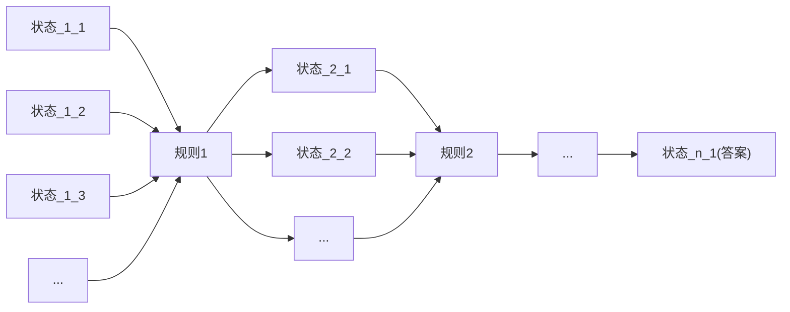
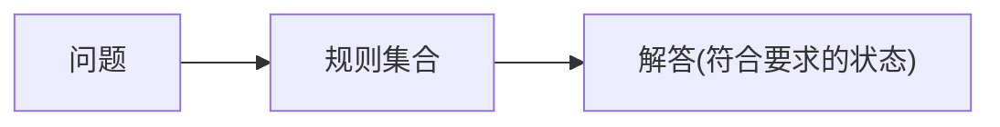
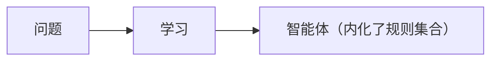
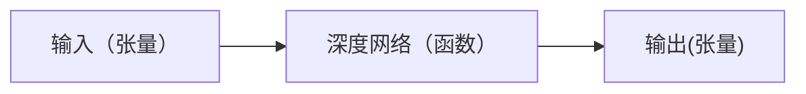
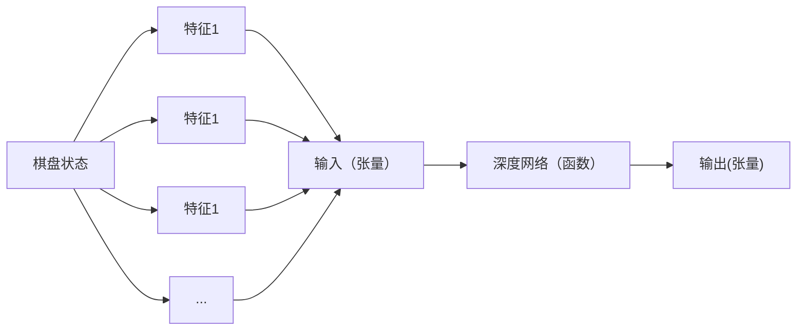
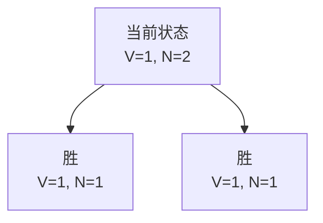
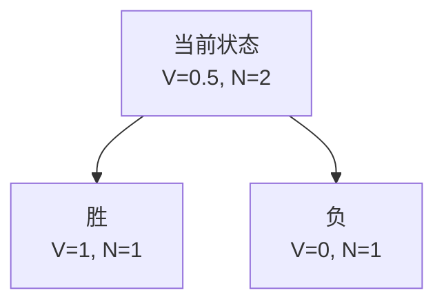

# 围棋与AlphaGo的一些背景

围棋作为一种古老的运动，已经被人们深爱了几千年，其规则简单，变化复杂的特点让一代又一代的棋士所着迷，前赴后继地希望能领悟到神之一手。计算机面世之后，科学家们就希望通过科学的手段攻克各种棋类运动。相比于围棋，状态数量较为少的国际象棋，五子棋等相继被攻克，而围棋好像一直苦苦地支撑着这涉及到人类尊严的最后领地。

2015年AlphaGo横空出世，在2016年与李世石的对弈成为了全球的焦点，无论是否是围棋爱好者，都会或多或少看到相关的新闻。我记得当时我在摸鱼看直播，那个时候我对人工智能一无所知，只是出于一种盲目的对人类生物性智力的崇拜，真心希望李世石能守住这最后的一丁点阵地。可惜，最后的结果令人失望，AlphaGo以4-1大比分获得胜利。李世石赢的这一局，恐怕是人类能赢AI的最后一局了。

后面事情的发展当然还是不错的。我以为在AI大获胜利之后，人类会对这些东西失去兴趣，毕竟它让围棋从一个不确定性的竞技（人与人的对弈）变为一个确定性的竞技（人与顶尖AI），然而人类还是能善于从这些事情中寻找乐趣，顶尖棋手开始使用AI研究新战术，向AI学习。

很难想象AlphaGo已经是十年前的东西了，当时让人惊奇的技术到现在已经成了非常基础日常的东西，在内部论坛搜了一下，还能发现不少当时研究，复现AlphaGo的文章，公司内部貌似也自己训练了一个。现在回头看这些技术，其背后的原理，发展历程，依然让人惊叹，是AI领域非常重要的一环，本篇将试图系统阐述一下AlphaGo背后的原理。

# 围棋基础

在阐述AlphaGo之前，适当说明围棋规则是有必要的，毕竟不是一项非常普及的大众运动，其规则还是需要稍作说明。

## 基本要素

围棋的基本要素只有两个

- 棋盘：围棋的棋盘为纵横各19路，算上边缘，总共有19x19=361个交点。
- 棋子：围棋分黑白双方，交替下子，棋子下在交点上。


## 基本规则

- 黑白双方交替下子。
- 每个棋子上下左右相邻的交点是这个棋子的“气”，如果“气”被对方棋子占了，那这个棋子就失去了一口气，如果这个棋子没有气，那这个棋子就要被提走。

<div style="width: 200px; margin: auto">

</div>

上图表明了黑子的“气”，如果这四口气都消失了，那么这些黑子就要被提走。

## 胜利目标

每种竞技都有一个胜利目标，也就是整个竞技过程的终止条件，围棋竞技目标是占领尽量多的地盘，而地盘是通过交点数量来衡量的。当一个区域被己方的棋子围着，并且对方无法提走这部分棋子，那么这个区域就属于自己。

最后胜负的判断条件就是谁占领的地盘较大（也就是看谁围着的交点数量更大）。

这些基本信息足够了解围棋的大体规则，细致的规则，比如“打劫”，或者细致的地结算统计，让子等规则不影响本文阐述的内容，在此暂不详述。

# 基本问题与思路

AlphaGo 要解决的问题是：训练一个会下围棋的智能体。

当然，从深蓝计算机击败国际象棋冠军之后开始，人们便开始希望能通过计算机方法实现一个智能围棋高手，希望能击败围棋的世界冠军。在深度学习横空出世之前，人们解决问题的办法都是相对确定的办法。

抽象来看，解决问题实际上是“一个在有很多状态的空间里寻找一个符合要求的状态的过程”。比如

- 用一个天平找出20个小球里的残次品（重量与正常的小球不同），这实际上是在很多次称量（状态）的过程中，找出合适的那个状态（某一次称量最后确认到残次品小球）。
- 寻路问题中，也是从很多的路径（状态）里，寻找我们希望能从起点到终点的那条路径（某个状态）。

这个过程可以用下图表示。



由此可见，解决问题的过程就被抽象为



而对于巨大搜索空间，需要编写非常有效的规则，并且能一步一步编写规则，才有可能解决问题，对于围棋来说，状态实在太多，并且下棋的方式很灵活，不容易通过这种方式解决问题。稍微想象一下，在这个19x19路的棋盘上，第一步就有361种下棋的可能性，第二步有360种可能性，虽然一局棋的结束并不需要把棋盘填满，但事实上这些可能性的乘积已经是一个巨大的天文数字了。

所以要解决围棋这个问题，我们需要两个改变：

1. 不通过显式规则来解决问题
2. 寻找一种效率更高的“规则”来对筛选胜率高的状态

# 蒙地卡罗搜索树（MCT）

为了解决第一个问题，我们需要先了解整个棋局的进行规律。对于下棋来说，取得胜利其实是可以分解为一系列子问题的。因为棋是一步一步下的，如果我们做好每一步的抉择，是更有可能将我们引领到胜利的结果。（当然不排除前期下了一步看着很好的棋，到最后这步棋成了导致败局的昏招）

蒙地卡罗树是一种状态树，从某一个状态开始，这个状态即为树的根节点，然后下一步棋，此时会产生一个新状态，这个新状态正是根节点的子节点，然后重复这个步骤，便能得到一个蒙地卡罗树。但蒙地卡罗树还会记录一个统计数据，那就是从这个节点开始进行下去，双方赢的次数。如果整个过程重复的次数足够多，那么我们有理由相信，此时选择赢得多的那个位置是非常有利的。


## 蒙地卡罗算法

所以蒙地卡罗算法在每一个状态只有如下三个步骤：

1. 下一步棋，把新状态添加到蒙地卡罗树
2. 从这个新状态开始继续下
3. 在过程中持续更新统计数据

重复进行这个过程，这样树的第一层的统计结果将会给出最有优势的下法。下面给出这个方法的伪代码。

```ts
class Agent {
    play() {
        const state = game.getCurrentState()
        // 进行蒙地卡罗模拟
        const mct = MCTSimulation(state)
        // 对统计数据进行排序，排序依据为下一步下棋的一方
        _.sortBy(mct.root.children, { player: game.getNextPlayer() })
        // 选择胜利次数最高的子节点对应的那一步作为下一步
        const bestChild = mct.root.children[0]
        return bestChild.getMove()
    }
}
```

而上面最关键的函数是蒙地卡罗模拟`MCTSimulation`，这个函数的作用是从给定状态开始，进行随机下棋模拟的过程。

```ts
const MCTSimulation = (state) => {
    // 以给定状态为根节点构建 MCT
    const tree = new MCT(state)
    // 克隆当前棋局，因为 MCT 是模拟后面的进程
    const game = game.clone()

    const iter = (node) => {
        game.randomPlay(state)
        const nextState = game.nextState()
        // 把新状态添加到当前节点的子节点里
        const newNode = node.children.add(nextState)

        // 如果棋局没结束，基于新状态继续下棋
        if (!game.isOver()) return iter(newNode)

        // 棋局结束，完整模拟了一次
        counter += 1
        // 从这个结束节点反向更新整个路径的统计数据
        // 如果是黑子赢了，整个路径的黑子胜利数加一，白子亦然
        tree.updateResult(newNode, game.getWinner())
    }

    let counter = 0
    // 从当前状态开始尝试预先设定的模拟次数
    while (counter < MAX_SIMULATION_COUNT) {
        iter(tree.root)
    }
}
```

## MCT的利用与探索

**利用（exploitation）**与**探索（exploration）**是强化学习里两个很重要的概念，一句话简单解释，“利用是深度搜索，探索是广度搜索”。

从上面的算法来看，在每一个状态下，我们都需要进行很多次后续棋局的模拟，才能得到一个比较合理的选择。但每一步棋如果有无限时间，那么理论上我们可以无穷地枚举所有状态，这样得到的统计数据就是精确值，但显然，我们必须对此问题做一个限制，不然对于第一步来说，所需要的时间将是天文数字。

从当前状态出发，进行几次模拟之后，MCT就已经有一些节点，有一些统计数据，此时在MCT的某一层，我们面临下面两个选择：

1. 利用：从当前层的子节点里选择胜算最高的节点进行下去
2. 探索：采取一个新的下法，创建一个新的子节点

下面展示了利用与探索的MCT扩展方式。

<div style="width: 75%; margin: auto">

</div>


由此，通过蒙地卡罗树的抽象，下棋问题变成一般化了，与具体规则无关，就是探索一条到胜利概率更高的路径。通过利用与探索，搜索问题的速度加快了，不需要真的枚举所有状态。

## MCT的不足

从上面的MCT算法描述可以看出，MCT算法是一种随机算法，它虽然通用，并且有一定程度的准确性，但是它本质是一个试错随机算法，不含有任何学习过程。也就是说，它并不是真正理解局面，识别模式，而只是单纯枚举，试错，然后得到局部答案。下一次遇到相似，甚至相同场景的时候，它依然要进行同样的过程。

所以MCT有如下的不足：

- 计算量大
- 没有学习过程

而AlphaGo，甚至后面的AlphaGo Zero，正是为了解决这些问题而诞生。

# AlphaGo

为了解决上面的问题，深度学习网络是一个很好的工具。深度学习范式将传统问题解决方式转变为“学习”过程，深度学习网络是一个内化了规则的黑盒，范式从


变为了



MCT的计算量大是因为对局面毫无认识，需要通过随机的方式推演，然后通过统计信息选择优势下法，如果我们能直接通过一个网络计算这个“优势”，那就省去了一个随机推演的过程，也就省去了庞大的计算量。


```ts
class Agent {
    play() {
        const state = game.getCurrentState()

        // 获取可以下棋的地方
        const actions = game.getActions(state)
        // 计算当前状态下，执行每一个动作的价值
        const actionValues = _.map(actions, action => {
            return {
                action,
                value: AlphaGo.getValue(state, action)
            }
        })

        // 选取价值最高的那一步作为下一步
        _.sortBy(actionValues, 'value')
        return actionValues[0].action
    }
}
```

同时深度学习网络本身能累积经验，经过训练之后的结果都会内化到网络参数中，由此可以解决上面提到的两个主要问题。

## 棋盘状态编码

深度学习网络本质是一个函数。其输入输出都是张量（多维数组）形式。



所以我们首先要对棋盘进行编码。一种最直观的棋盘编码方式，无异是使用一个二维数组进行编码，比如使用`0`表示空位，`1`表示黑子，`2`表示白子。但这样编码存在一些问题：

- 没有表明下一步是谁来下，下一步谁来下对决策至关重要
- 没有表明一些棋局的关键信息
  - 哪些棋子将要被提走，如果某些子将要被提走，那在下一步就必须要保护这些棋子
  - 有多少个棋子将要被提走，这个涉及到“打劫”的规则
  - 一些没有气的空位置是不能下的
- ...

为了增加更多的状态信息，我们可以使用状态叠加的方法，将尽可能多的重要状态编码到输入。通过将不同类型的状态叠加在一起，形成一个总的输入状态。这些不同类型的状态一般被称为**特征**。



在真实的AlphaGo实现中，使用如下一些特征：

| 特征 | 描述 |
| --- | --- |
| 棋子颜色 | 当前玩家棋子颜色·对手棋子颜色·空白 |
| 经过步数 | 表明每个棋子下了之后经过了多少轮 |
| 气的数量 | 表明每个棋子有多少个气 |
| 提子数量 | 表明有多少个敌方棋子要被提走 |
| ... | ... |

## AlphaGo 架构总览

下面在进一步描述 AlphaGo 原理之前，先简述一下 AlphaGo 的架构。

<div style="width: 70%; margin: auto">

</div>

从上图可以看出 AlphaGo 包含三个深度学习网络，分别为**快速策略网络**，**增强策略网络**，**价值网络**。

- 快速策略网络：网络规模相对较小，计算速度快，进行快速决策，用于MCT树搜索。
- 增强策略网络：网络规模相对更大，用于更准确的下子判断。
- 价值网络：用于评估当前棋局的状态价值。

## 有监督的策略网络训练

有监督的网络训练阶段主要是训练快速策略网络与增强策略网络。有监督训练使用的是人类有史以来有记录的棋局，这些棋局大约有 160000 局，而每一个棋局都能按照分步拆分为不同状态，实际上 AlphaGo 用来训练的状态有 3 亿左右。


这个训练过程可以与大语言模型的预训练进行类比，大语言模型的预训练任务是“预测下一个词”，而策略网络的有监督训练，是“预测下一步棋”。而预测下一个词的时候使用的损失函数是目标词与预测词的向量差，对于下一步棋来说，误差则是人类下的“正确的位置”与“预测位置”之间的差。

## 自我对弈

但人类棋局是有限的，并且不会快速增长。为了让智能体有更大规模的训练量，最好的办法是自我对弈。在有监督训练之后，可以获得一个“会下棋”的智能体，AlphaGo 训练的后半阶段是通过不断自我对弈来增强能力。

刚才提到，使用MCT算法的时候，我们是随机选择扩展的，现在有了第一阶段训练的策略网络，我们可以使用策略网络进行选择了。

```ts
const policyRollout = () => {
    const nextPlayer = game.getNextPlayer()
    while (game.isNotOver()) {
        const state = game.getState()
        // 使用快速策略网络进行棋局演进模拟
        const moveProbabilities = AlphaGo.fastPolicy.predict(state)
        const move = max(moveProbabilities)
        const nextState = game.apply(move)
    }
    return game.getResult()
}
```

自我对弈最关键的一个环节在于价值网络的学习，这个网络的作用在于直接估算某个棋局状态的分数。


所以大家目前看围棋直播的时候，通常会看到一个当前状态的胜率条，用于展示哪一方的胜率较大，这个实际上是直接将状态输入给价值网络计算出来的。（当然大家也不会去看围棋直播）

## AlphaGo 的 MCT 搜索

下面是整个 AlphaGo 的 MCT 搜索过程。


1. **选择**: 选择最大化价值的节点进行推演。
2. **扩展**: 需要扩展一个节点的时候，通过增强策略网络给出一些候选项，并记录下它们的先验概率。
3. **价值估算**: 叶子节点的价值通过对快速网络推演结果以及价值网络的估值进行加权平均得到。
4. **更新**: 针对推演结果更新遍历到的子节点的价值。

这里举一个简单的理解方式。观察以下子树，状态 $s$ 是当前状态，其子状态都是胜利的状态，胜利叶节点会被赋值为 1，表明胜率是 100%（毕竟棋局结束在胜利状态）。



图中的 N 表示经过的次数，V 表示价值。由于当前状态到达了两个胜利点，所以平均价值是 1，表明只要到达了这个状态，那就能必胜了。

再看下面的情况。



由于当前状态可能会发展为两个子状态，一胜一负，这就导致当前状态依然处于一个比较焦灼的状态，下一步的选择会左右最终棋局的发展。所以其价值的加权平均是 0.5，表示 50% 的输赢概率。

而 AlphaGo 使用深度网络之所以更快，是因为这个价值是通过网络直接估算出来，而不是通过大量随机的 MCT 扩展统计出来。

# 小结

- **MCT**：蒙地卡罗树是一种随机状态树，可以通用地表征一个问题随着时间不断发展所产生的各种状态及其关系。
- **MCT搜索**：MCT搜索涉及两个选择的平衡，**利用**与**探索**。
  - **利用**：选择分数最高的节点深入扩展。
  - **探索**：在同一层进行展开，选择没走过的路进行扩展。
- **棋盘编码**：采用各种围棋特征组成一个多维张量。
- **AlphaGo架构**：AlphaGo 主要由三个网络构成
  - **快速策略网络**：用于基于当前状态往后进行推演。
  - **增强策略网络**：在当前状态下给出下一步的先验概率估算。
  - **价值网络**：给出下一步的价值估算。