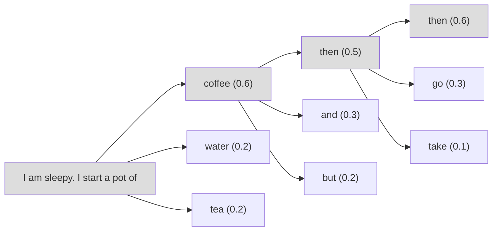
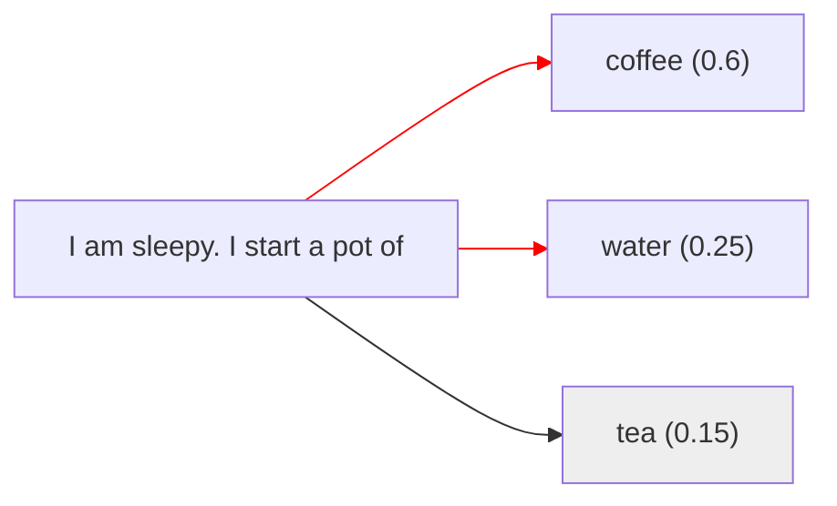
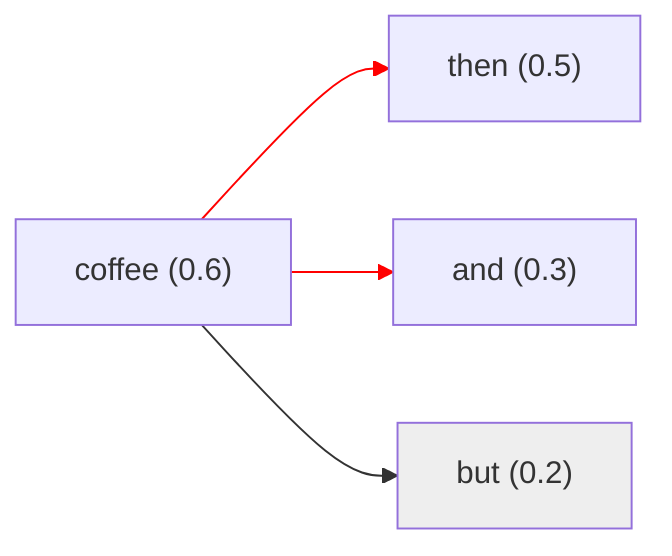
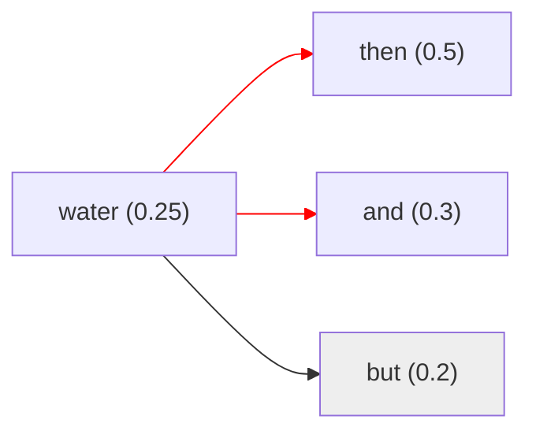
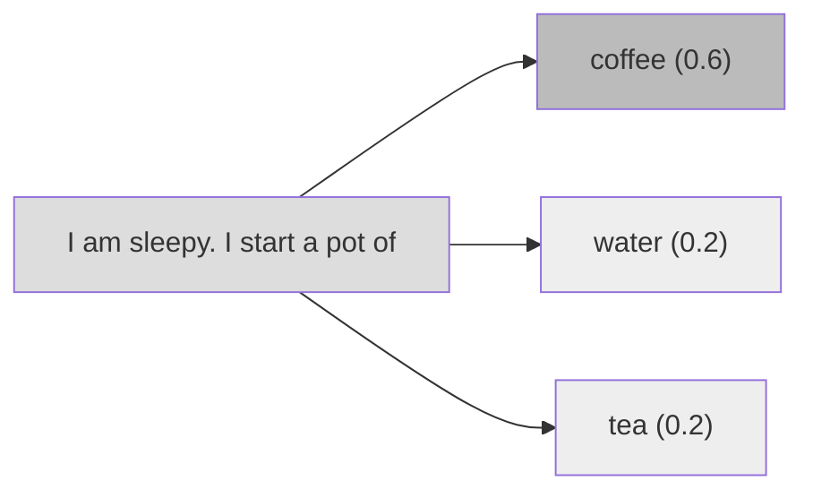
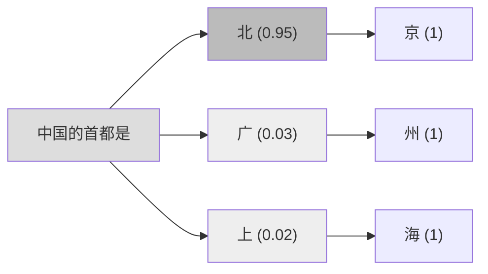

<div class="theme-color-blue" markdown=1>
`#解码` `#解码策略` `#推理` `#上下文学习` `#思维链`
</div>

<style>
canvas {
  display: block;
  margin: auto;
  margin-bottom: 20px;
  border:1px solid #ddd;
  width:400px;
  height:400px;
}
</style>

# 复习

- **大模型**：一个将输入转换为输出的函数，本质是一系列向量变换的组合，输入输出都是向量（张量）。

    ```ts
    const output: Tensor = Model(input: Tensor)
    ```

- **概率分布**：大语言模型的输出，实际上是基于给定上文的下一个词的概率分布，不是直接给出一个词。

## 解码

当完成训练后，我们就可以将大语言模型部署到真实场景中进行使用。大语言模型是通过文本生成的方式进行工作的。在自回归架构中，模型针对输入内容逐个单词生成输出内容的文本。这个过程一般被称为**解码**。

> 训练是学习的过程，解码是推理的过程。

一种朴素的自回归解码流程是，模型 $\mathcal{M}$ 每次根据当前上下文词元序列 $\textbf{u} = [u_1, u_2, \dots, u_t]$ 建模下一个词的概率分布 $P$，然后根据**解码策略**选择下一个词 $u'$，之后再将 $ \textbf{u} \oplus u'$ 作为新的上下文重复上述步骤，直到结束或者达到最大长度为止。

```ts
const decode = (input: string) => {
    let output = ''
    while (_.last(output !== 'END')) {
        // 大语言模型计算下一个次的概率分布
        const logits = Model(input)
        // 根据概率分布采样下一个单词
        const next_token = sample(logits)
        // 将下一个单词添加到输入中作为新的上下文
        input += next_token
        // 将下一个单词添加到输出中
        output += next_token
    }
    return output
}
```

## 解码策略

### 贪心搜索

大语言模型主要是通过语言建模任务进行训练的，也就是通过预训练学习，大语言模型预测给定上文的下文的概率分布，所以最直观的策略无疑是贪心策略，直接选取最大概率的那个词作为下文。

$$
u_i = \arg \max_u P(u | \textbf{u}_{<i})
$$

下面是一个简单的贪心搜索的例子。上文是"I am sleepy. I start a pot of"，下图给出了后面三个次元的推理过程，使用朴素的贪心搜索策略，每次取概率最大的词作为下文。



可以看到这样的缺点是

- 句子可能不通顺
- 每次生成的结果一样，没有多样性
- 关注与局部最优，生成重复句子

### 贪心搜索的改进

贪心搜索在每个生成步骤中均选择最高概率的词元，这可能会由于忽略在某些步骤中概率不是最高、但是整体生成概率更高的句子而造成局部最优。

**束搜索（Beam Search）**保留前 $n$ 个具有最高概率的句子，并最终选取整体概率最高的生成回复。这里的 $n$ 被成为**束大小（Beam Size）**，如果 $n = 1$，那束搜索就退化为朴素贪心搜索。下面展示 $n = 2$ 的束搜索。



第一步选择了概率最高的 `cofffee` 和 `water`。

<div style="display: flex; flex-direction: row; justify-content: center">



</div>

这一步对 `coffee` 和 `water` 进行了扩展，然后计算联合概率，计算结果为

| predition | probability |
| --------- | ----------- |
| coffee then | 0.6 * 0.5 = 0.3 |
| coffee and | 0.6 * 0.3 = 0.18 |
| water then | 0.25 * 0.5 = 0.125 |
| water and | 0.25 * 0.3 = 0.075 |

然后继续从联合概率中选取最大概率的两个句子（这个例子里是 `coffee then` 和 `coffee and`），继续往后进行推理。由此也可以看出，随着 $n$ 增大，计算成本会增加，所以实践中束大小一般在 $[3, 6]$ 这个范围内。

### 概率采样

**概率采样**直接采用大语言模型预测的概率分布进行采样。

$$
u_i \sim P(u | \textbf{u}_{<i})
$$

还是上面的例子，下文会在 `coffee`，`water`，`tea` 中进行采样。只是 `coffee` 的概率大一点，被选中的概率就大一点。但是同样保留了选择 `tea` 和 `water` 的可能性。这样做稍微弥补了朴素贪心算法的缺点。



### 概率采样的改进

概率采样也有几种改进方式。**温度采样**，**Top-k 采样** 以及 **Top-p 采样**。

前面提到完全基于模型的预测进行随机采样，有可能导致很低概率的词被采样到，从而导致生成的文本质量不高。温度采样可以使得模型输出的概率分布更加平滑，从而使得生成的文本更加合理。简单来说就是增大概率大的词的概率，减少概率小的词的概率。

当温度为 $1$ 时，退化为普通的随机采样，当温度接近 $0$ 的时候，实际上约等于贪心搜索，因为它将概率最大的词的概率无线接近放大到 $1$，其他词概率无限拉低到 $0$。

Top-k 采样，则直接剔除概率最低的那些词，只保留概率最高的 $k$ 个词。但这样做也会有一个问题，比如上文是“中国的首都是”，当 $k > 1$ 是，总会引入错误，因为中国的首都就只有北京一个可能。Top-p 采样可以一定程度缓解这个问题，它采用累计概率达到一定数值的词。比如在这个问题下



假如设定 $p = 0.9$，那么看到 `北` 已经满足了这个概率要求 $P(北) = 0.95 > 0.9$，就不会选择其他选项了。

## 实际使用设置

实际使用上，模型提供的配置接口可以对这些参数进行配置。


- 当我们需要生成更为确定性答案的时候，比如代码生成，可以将温度设置为 $0$，当我们需要做文本生成，文本创作的时候，可以根据需要把温度调到 $> 1$ 的合适数字。
- 当我们需要生成更加多样的回答的时候，可以将 $k$ 和 $p$ 都设置的比较大，比如 $k = 100, p = 0.95$。

对于模型接口的参数，可以调整的还有更多参数，具体可以参考模型的文档，这些参数都是能影响解码策略以及最后生成效果的。

## 推理

为什么大语言模型看起来好像很聪明的样子？我们训练大模型的时候，只是对上下文进行了挖空，然后让大模型进行猜测，试错，然后优化，往我们期望的输出靠近而已。从简单的角度来看，语言模型好像就是一个填词器，为什么会有这么神奇的效果呢？

| data ID | $x$ | $y$ |
| ------- |-----|-----|
| d0 | BEGIN | 今 |
| d1 | 今 | 天 |
| d2 | 今天 | 天 |
| d3 | 今天天 | 气 |
| d4 | 今天天气 | 很 |
| d5 | 今天天气很 | 好 |
| d6 | 今天天气很好 | END |

（上一课提到的大语言模型预训练数据集，训练出来的难道不是一个填词器吗？）

### 内在逻辑的沉思

从本质上看，基于语言建模的预训练实际上是一种多任务学习过程。例如：

- 在预测句子前缀“这部电影剧情饱满，演员表演得也很棒，非常**好看**”中的“好看”时，模型实际上在进行情感分析任务的语义学习。
- 在预测句子前缀“小明有三块糖，给了小红两块糖，还剩下**一块糖**”中的“一块糖”时，则是在进行数学算术任务的语义学习。
 
由于用于预训练的大语言模型的数据量非常庞大，语料非常丰富，涵盖我们生活中的各种内容，所以可以列举出来更多类似的例子，覆盖更广的任务范围。因此，基于大规模文本语料的预训练任务能够潜在地学习到解决众多任务的相关知识与能力。

更深层次地看这个问题，人类沟通的方式正是通过语言进行，而语言把我们脑海中抽象的逻辑具象化了，并且语言可以看成是逻辑具象化的一个万能载体，我们会有很多内在逻辑，比如感情的逻辑，理解世界的逻辑，作为社会人的行为逻辑等，这些逻辑完全是通过语言进行传递的，所以大语言模型通过学习语言，实际上也“约等于”在学习我们的内在逻辑。

所以看上去十分“机械”的**预训练过程**，实际上是在学习世界知识的内在逻辑。而看上去同样十分机械的**解码过程**，则是基于一个巨大概率模型的支撑而将逻辑具象化。

> 这意味着我们如果希望大语言模型具备某些能力的话，我们可以在提示里构造对应的逻辑结构。

### 上下文学习

上下文学习使用由任务描述和（或）示例所组成的自然语言文本作为提示。形式化可以表述为

$$
\underbrace{LLM}_{\text{大语言模型}}
[
\underbrace{I}_{\text{任务描述}},
\underbrace{
    f(x_1, y_1), \dots, f(x_k, y_k)
}_{\text{示例}},
f(\underbrace{x_{k+1}}_{\text{输入}}, \underbrace{\text{?}}_{\text{输出}})
] \to \hat{y}_{k + 1}
$$

这样假设的一个前提其实是，大语言模型在预训练过程已经学习了这些逻辑，我们只是通过提示语，将其对应部分的能力激发出来。

### 思维链

思维链提示是一种高级提示策略，旨在增强大语言模型在各类复杂推理任务上的表现。常见的推理任务包括算术推理、常识推理以及符号推理等多种任务。

思维链的基本思路是，将原来非常简单的 `[输入, 输出]` 关系进一步扩展为 `[输入, 思维链, 输出]` 三元组。


思维链可以通过“让我们一步步进行思考”，“尽量将问题拆分为细致的步骤，然后一步步解决”等提示词激活。而这个过程在 deepseek 等模型在指令微调的过程中，已经让模型具备了，所以我们可以直接使用。

# 小结

- **解码**：大语言模型生成下文的过程。
- **贪心策略**：解码的一种策略，每次选取概率最高的词元，可以通过 Beam Search 优化。
- **随机采样**：解码的一种策略，使用大语言模型生成的概率分布来采样，可以根据需要调节温度，Top-k，Top-p 等参数。
- **推理**：语言是逻辑的具象化，大语言模型预训练的时候通过语料学习了逻辑。
- **上下文学习·思维链**：通过提示的手段激发大语言模型的逻辑能力。