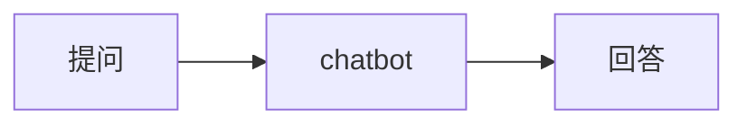
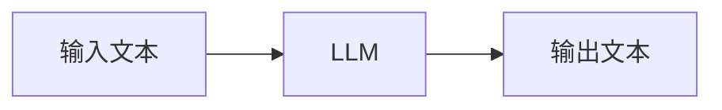

回顾一下，大部分人最初接触大语言模型是通过 chatGPT，表象是一个对话聊天，聊天过程可以抽象为

而 chatbot 底层，实际上是一个大语言模型（LLM）或者其他模型，而大语言模型的输入输出本质都是字符串，或者说文本。

这就 AI 时代最初带给我们的体验。

人们很快意识到这个流程上的各种不足，于是从各种可能的方面去优化这个流程。从上面的流程来看，可以很简单想到这三个环节都可以被优化。

## 输入

- 增加输入的形式，除了文本，还可以是音频，视频，图片等
- 增加输入的质量，prompt 工程，MCP，skills
- 增加输入的长度
- ...

这些输入优化手段，其实都是为了让输入的质量更高，更贴近模型的“思考方式”。

## 输出

- 增加输出的形式，除了文本，可以是markdown，以及各种形式的组件
- 增加输出的长度
- ...

这些输出的优化手段，基本上是为了让输出更为用户友好，互联网时代人机交互的方式种类很多，虽然最开始 LLM 的返回只能是文本，但未来估计会逐步满足各种各样的人机交互。

## 模型

- 模型参数增加
- 模型上下文长度增加
- 模型的架构优化
- ...

模型的优化必然是 AI 浪潮的核心，对于研究人员来说，他们会想方设法得提升模型性能，增强模型能力。与此对比，输入与输出的优化，更多是工程上的考虑。

未完待续...