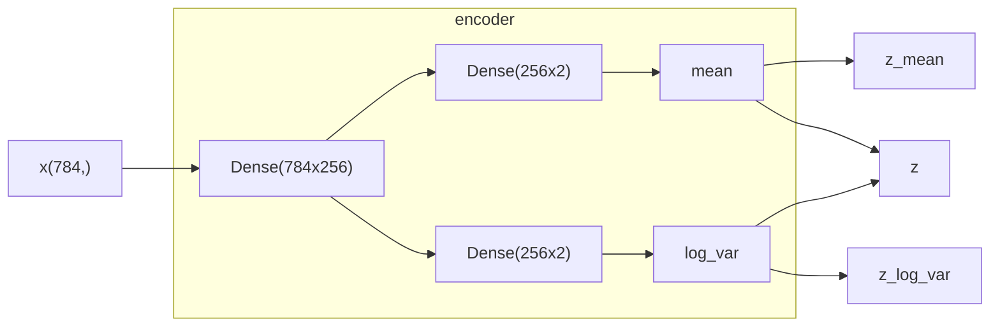
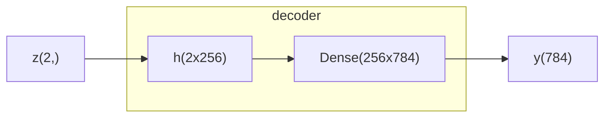

# VAE 简介

本文以一个简单的例子讲述 VAE 相关概念，以及使用 VAE 架构生成数字的基本代码。

## VAE 架构定义

### 自编码器

**自编码器（Autoencoder）** 就是使用“编码器-解码器”架构对数据进行学习，从而得到可以将数据进行压缩表达的编码器。


在学习之后，`data`与`data*`误差很小，隐藏层`hidden space`的维度也比`data`要小，这样编码器就起到了自编码的效果，对数据自身进行编码，得到一个更小的表达，而这个更小的表达是可以通过解码器解码回来的。

### 变分自编码器

在自编码器中，隐藏层是一个张量，也就是一组数字，这些数字并不包含任何显式含义，这意味着我们无法控制生成结果。如果我们希望控制生成结果，那就意味着我们需要了解隐藏层的结构。

最简单的 **变分自编码器（Variational Autoencoder）** 的隐藏层不是一个张量，而是 **一组控制某个分布的参数**，这个分布一般会采用高斯分布。拿最简单的高斯分布作为例子，高斯分布由两个参数控制，均值 $\mu$ 以及方差 $\delta$，也就是通过这两个值可以直接控制一个分布。由此 VAE 的基本架构如下。


中间的部分实际上是使用“参数控制分布，然后从分布中进行采样，得到输出”这条链路来对输出进行“适当”的控制。其优点在于使得生成过程可以在一个连续的空间上进行。

# 基于 VAE 生成数字

## 准备工作

首先引入基础库。数字库依然采用习以为常的`mnist`，这里需要注意的是`keras`的`backend`有些方法是无法使用的，所以同时直接引入`tensorflow`。

```python
import tensorflow as tf
from keras.layers import Input, Dense, Lambda
from keras.models import Model
from keras import backend as K
from keras import losses 
from keras.datasets import mnist
import numpy as np
```

定义全局变量。

```python
batch_size = 100       # 批大小
original_dim = 28 * 28 # mnist图像是28x28，输入时候转为以为数组
latent_dim = 2         # 潜空间维度
intermediate_dim = 256 # 中间层维度
nb_epoch = 20          # 训练轮数
```

定义采样函数。在这个基础架构中，VAE的潜空间被建模为基础的高斯分布，高斯分布由两个参数定义，一个是均值，一个是标准差。

```python
def sampling(args):
    z_mean, z_log_var = args
    epsilon = tf.random.normal(
        shape=(batch_size, latent_dim),
        mean=0.
        stddev=1.0)
    return z_mean + tf.exp(z_log_var / 2) * epsilon
```

采样函数在基础高斯分布上进行采样。

## 定义编码器

下面是编码器的定义。

```python
# creating the encoder
x = Input(shape=(original_dim,), name='input')
h = Dense(intermediate_dim, activation='relu', name='encoding')(x)
z_mean = Dense(latent_dim, name='mean')(h)
z_log_var = Dense(latent_dim, name='log_var')(h)
z = Lambda(sampling, output_shape=(latent_dim,), name='z')([z_mean, z_log_var])
encoder = Model(x, [z_mean, z_log_var, z], name='encoder')
```

输入先经过一个隐藏层`h`，然后经过两个线性层直接得到潜空间高斯分布的两个参数`z_mean`与`z_log_var`，通过`Lambda`层得到`z`。编码器是一个一进三出的模型，下面是带张量尺寸的示意图。



## 定义解码器

下面是解码器的定义。

```python
# creating the decoder
input_decoder = Input(shape=(latent_dim, ), name="decoder_input")
decoder_h = Dense(intermediate_dim, activation="relu", name="decoder_h")(input_decoder)
x_decoded = Dense(original_dim, activation="sigmoid", name="flat_decoder")(decoder_h)
decoder = Model(input_decoder, x_decoded, name="decoded")
```

解码器是编码器的反向过程，将潜空间维度扩展为原始维度，中间每一步都是编码器的反向过程。



## 整体架构

将编码器和解码器结合可得到整体架构。

```python
output_combined = decoder(encoder(x)[2])
vae = Model(x, output_combined)
vae.summary()
```

下面是这个简单的 VAE 架构的参数。

| Layer(type) | Output Shape | Param # |
|-------------|--------------|---------|
| input (`InputLayer`) | (None, 784) | 0 |
| encoder (`Functional`) | [(None, 2), (None, 2), (None, 2)] | 201,988 |
| decoder (`Functional`) | (None, 784) | 202,256 |

```
Total params: 404,244 (1.54 MB)
Trainable params: 404,244 (1.54 MB)
Non-trainable params: 0 (0.00 B)
```

## 损失定义

下面是损失定义。其中使用到 KL 散度，KL 散度是用于衡量两个分布差异的数学概念。

```python
def vae_loss(y_true, y_pred):
    # 从模型中获取z_mean和z_log_var
    z_mean, z_log_var, _ = encoder(y_true)
    
    # 计算损失
    xent_loss = original_dim * losses.binary_crossentropy(y_true, y_pred)
    kl_loss = -0.5 * tf.reduce_sum(1 + z_log_var - tf.square(z_mean) - tf.exp(z_log_var), axis=-1)
    return xent_loss + kl_loss
```

## 训练

编译一下模型。

```python
vae.compile(optimizer='rmsprop', loss=vae_loss)
```

对数据进行初步处理。从 mnist 数据集取出数据，全部转化为 $[0, 1]$ 之间的浮点数。然后将数据修改为 `(60000, 784)` 的形状。第一维是逐条数据，第二维是平铺图片后得到的一维数组。

```python
(x_train, y_train), (x_test, y_test) = mnist.load_data()

x_train = x_train.astype('float32') / 255.
x_test = x_test.astype('float32') / 255.
x_train = x_train.reshape((len(x_train), np.prod(x_train.shape[1:])))
x_test = x_test.reshape((len(x_test), np.prod(x_test.shape[1:])))
```

开始训练。

```python
vae.fit(x_train, x_train,
        shuffle=True,
        epochs=nb_epoch,
        batch_size=batch_size,
        validation_data=(x_test, x_test), verbose=1)
```

```
Epoch 1/20
600/600 ━━━━━━━━━━━━━━━━━━━━ 2s 3ms/step - loss: 224.2419 - val_loss: 173.2919
Epoch 2/20
600/600 ━━━━━━━━━━━━━━━━━━━━ 2s 3ms/step - loss: 172.8654 - val_loss: 168.8551
...
Epoch 19/20
600/600 ━━━━━━━━━━━━━━━━━━━━ 2s 3ms/step - loss: 154.4506 - val_loss: 155.2631
Epoch 20/20
600/600 ━━━━━━━━━━━━━━━━━━━━ 2s 3ms/step - loss: 154.5143 - val_loss: 155.0309
```

从训练过程的输出可以监测损失是否逐步递减。

## 可视化

### 潜空间可视化

由于在这个简单的 VAE 模型中，潜空间只是一个二维高斯分布，所以可以比较简单地可视化出来。

```python
import matplotlib.pyplot as plt

# display a 2D plot of the digit classes in the latent space
x_test_encoded = encoder.predict(x_test, batch_size=batch_size)[0]
plt.figure(figsize=(6, 6))
plt.scatter(x_test_encoded[:,0], x_test_encoded[:,1], c=y_test, cmap='viridis')
plt.colorbar()
plt.show()
```

上面的代码取出数据集的测试数据`x_test`，将这些数据输入编码器`encoder`，由于编码器一进三出，其中的前两个输出是高斯分布的均值以及方差，由这两者作为散点图的两个维度，同时使用这些测试数据对应的结果`y_test`作为颜色。由此得到下图。


从上图可以看到，同样的数字（同样颜色的点）分布在比较集中的区域，这意味着高斯分布模拟的比较好，相同的类别聚集在一起，并且不同类别之间有柔和的过渡。

### 基于潜空间生成数字

下面使用潜空间生成数字。

- 定义一个 15x15 的网格
- 每个网格显示一个 28x28 的数字图片
- 两层循环，逐行逐列生成
  - 采样点就是对应格点的 `x` 和 `y`
  - 将采样点作为输入传入解码器，得到一个数字图片的输出
  - 将其渲染在整个网格中具体的位置

下面是对应的代码。

```python
from scipy.stats import norm

# display a 2D manifold of the digits
n = 15  # figure with 15x15 digits
digit_size = 28
figure = np.zeros((digit_size * n, digit_size * n))
# linearly spaced coordinates on the unit square were transformed through the inverse CDF (ppf) of the Gaussian
# to produce values of the latent variables z, since the prior of the latent space is Gaussian
grid_x = norm.ppf(np.linspace(0.05, 0.95, n))
grid_y = norm.ppf(np.linspace(0.05, 0.95, n))

for i, yi in enumerate(grid_x):
    for j, xi in enumerate(grid_y):
        z_sample = np.array([[xi, yi]])
        x_decoded = decoder.predict(z_sample)
        digit = x_decoded[0].reshape(digit_size, digit_size)
        figure[i * digit_size: (i + 1) * digit_size,
               j * digit_size: (j + 1) * digit_size] = digit

plt.figure(figsize=(10, 10))
plt.imshow(figure, cmap='Greys_r')
plt.show()
```


从上图可以看出几个特点

- 相同的数字基本集中于同样的区域。
- 数字之间的变化是比较模糊并连续的，这得益于 VAE 架构是由一个连续高斯分布来控制输出。

# VAE 的一些考虑与挑战

上面的建模有比较关键的一个考虑，那就是潜空间用了单峰的高斯分布。这其实只是一个 **假设**，如果真实的分布并不是如此，那最后生成的效果不一定好，因为编码器学习的时候，就等于在一个不正确的模型上进行学习。


上面展示了一个例子。横坐标上面的黑色十字是样本，假设其真实分布是一个双峰的高斯分布，但我们事实上并不知道。如果我们用单峰的高斯分布去学习以及模拟，那无疑是不对的。更麻烦的一点在于，从图上来看，用单峰高斯分布生成的话会有大概率生成在中间区域，而中间区域甚至连一个样本都没有，这意味着生成出来的结果质量会很差。

再次看上面的数字分布图，因为我们使用了单峰高斯分布，所以样本数字都比较集中于原点位置。想象一下如果我们的数据不是手写数字，而是人脸，人脸的特点千差万别，用单峰高斯分布就不会得到什么好结果了。

在现实生活的诸多例子里，背后的潜空间肯定是一个更为复杂的分布，在建模的时候不太可能得到与实际一样的分布，这就会产生模型误差，而这也是 VAE 建模的挑战与局限。