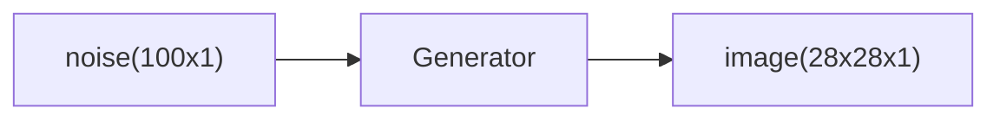
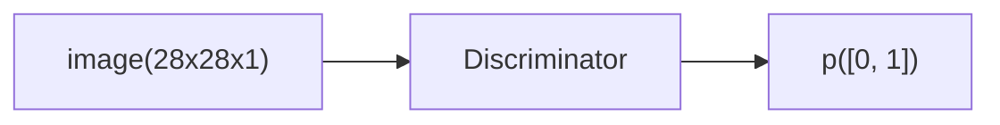

# GAN

前文提到 VAE 及其局限性，面对现实问题，背后的模型肯定是一个复杂的多维模型，我们无法简单通过“建模”的方式猜中实际的模型，既然有这种“必然”的模型误差，那我们就没有这个建模的必要性。

GAN 背后的原理实际上非常直观，也可以说比较天才。其中包含两个主要角色：

- **生成器（Generator）**：基于随机数生成输出，目标是尽量让鉴别器把生成的输出判别为真。
- **鉴别器（Discriminator）**：判断输入为真的概率，目标是尽量将生成器的输出鉴别为假。

下面是整个 GAN 的流程图。


下面是 GAN 的训练算法流程，对比上面的图来看一目了然。

```
for 每个训练循环 do:
  1. 训练鉴别器:
      1.1. 在真实数据集里随机取出一个小批量 x
      1.2. 取出一个小批量随机数 z 并生成一个小批量假数据 G(z) = x*
      1.3. 计算 D(x) 和 D(x*) 的分类错误，反向传播训练鉴别器，让错误最小化
  2. 训练生成器:
      1. 取出一个小批量随机数 z 并生成一个小批量假数据 G(z) = x*
      2. 计算鉴别器的分类错误 D(x*)，反向传播训练生成器，让错误最大化
end for
```

# 基于 GAN 生成数字

大体流程与上面流程图一致，训练使用 keras 实现。

## 准备工作

首先引入基础库。

```python
import matplotlib.pyplot as plt
import numpy as np

from keras.datasets import mnist
from keras.layers import Input, Dense, Reshape, Flatten, LeakyReLU
from keras.models import Sequential
from keras.optimizers import Adam
```

定义全局变量。

```python
img_rows = 28
img_cols = 28
channels = 1

img_shape = (img_rows, img_cols, channels)
# 随机噪声的维度是 100x1，这是生成器输入的张量
z_dim = 100
```

## 定义生成器

下面是生成器实现，其接收一个 `z` 作为输入，输出 `28x28x1` 的图片。



```python
def build_generator(img_shape, z_dim):
    model = Sequential()

    model.add(Dense(128, input_dim=z_dim))
    model.add(LeakyReLU(negative_slope=0.01))
    model.add(Dense(img_rows * img_cols * channels, activation='tanh'))
    model.add(Reshape(img_shape))

    return model
```

## 定义鉴别器

鉴别器接收一张图片，给出这张图片是真的概率。



下面是鉴别器的定义。

```python
def build_discriminator(img_shape):
    model = Sequential()
    
    model.add(Flatten(input_shape=img_shape))
    model.add(Dense(128))
    model.add(LeakyReLU(negative_slope=0.01))
    model.add(Dense(1, activation='sigmoid'))

    return model
```

## 定义 GAN

将编码器和解码器结合可得到 GAN。

```python
def build_gan(generator, discriminator):
    model = Sequential()

    model.add(generator)
    model.add(discriminator)

    return model
```

下面初始化训练网络各部分的实例。

```python
discriminator = build_discriminator(img_shape)
discriminator.compile(loss='binary_crossentropy',
                      optimizer=Adam(),
                      metrics=['accuracy'])

generator = build_generator(img_shape, z_dim)

gan = build_gan(generator, discriminator)
gan.compile(loss='binary_crossentropy', optimizer=Adam())
gan.summary()
```

下面是这个简单的 GAN 架构的参数。

| Layer(type) | Output Shape | Param # |
|-------------|--------------|---------|
| generator | (None, 28, 28, 1) | 114,064 |
| discriminator | (None, 1) | 100,609 |

```
Total params: 214,673 (838.57 KB)
Trainable params: 214,673 (838.57 KB)
Non-trainable params: 0 (0.00 B)
```

上面的模型采用 `binary_crossentropy` 作为误差，原因是 GAN 最后的输出是鉴别器的输出，也就是“真假概率”，这是一个二元判断，所以采用这个误差。另外优化器使用 `Adam` 动量策略，这个也是 GAN 常用的优化策略，对于一个新问题的训练新阶段，可以先直接选择这个策略。

## 训练

下面是训练主流程代码。

```python
losses = []
accuracies = []
iteration_checkpoints = []

def train(iterations, batch_size, sample_interval):
    # 加载 MNIST 数据集
    (X_train, _), (_, _) = mnist.load_data()

    # 将图片的灰度值置为 [-1, 1]，原本是 [0, 255]
    X_train = X_train / 127.5 - 1.0
    X_train = np.expand_dims(X_train, axis=3)

    real = np.ones((batch_size, 1))
    fake = np.zeros((batch_size, 1))

    for iteration in range(iterations):
        # --------
        # 训练鉴别器
        # --------

        # 取一个小批量真图
        idx = np.random.randint(0, X_train.shape[0], batch_size)
        imgs = X_train[idx]

        # 生成一批假图
        z = np.random.normal(0, 1, (batch_size, 100))
        gen_imgs = generator.predict(z, verbose=0)

        # 开启鉴别器的反向传播
        discriminator.trainable = True

        # 用一个小批次训练鉴别器
        d_loss_real = discriminator.train_on_batch(imgs, real)
        d_loss_fake = discriminator.train_on_batch(gen_imgs, fake)
        d_loss, accuracy = 0.5 * np.add(d_loss_real, d_loss_fake)

        # --------
        # 训练生成器
        # --------
        # 生成一批假图
        z = np.random.normal(0, 1, (batch_size, 100))
        gen_imgs = generator.predict(z, verbose=0)

        # 关闭鉴别器的反向传播
        discriminator.trainable = False

        g_loss = gan.train_on_batch(z, real)

        # 周期性保存学习中间结果以及展示生成效果
        if (iteration + 1) % sample_interval == 0:
            losses.append((d_loss, g_loss))
            accuracies.append(100.0 * accuracy)
            iteration_checkpoints.append(iteration + 1)

            print("%d [D loss: %f, acc.: %.2f%%] [G loss: %f]" %
                  (iteration + 1, d_loss, 100.0 * accuracy, g_loss))

            sample_images(generator)
```

上面的代码基本上是对 GAN 算法的基础实现，里面有一个关键问题需要注意。在训练鉴别器的时候，需要将鉴别器的 `trainable` 打开，而当到了训练 GAN 的时候，需要将鉴别器的 `trainable` 关闭。从实际逻辑上看，生成器和鉴别器应该是两个网络，但从实现角度，我们将生成器和鉴别器统一连接成 GAN，所以我们在使用 GAN 的时候，实际上是需要训练生成器，所以此时需要把鉴别器的 `trainable` 关闭。

另外，在检查点，使用当前的生成器生成一批图，可以从中看到生成器的进化过程。

开始训练。

```python
iterations = 20000
batch_size = 128
sample_interval = 1000

train(iterations, batch_size, sample_interval)
```

```
1000 [D loss: 0.032495, acc.: 99.09%] [G loss: 4.764819]
1/1 ━━━━━━━━━━━━━━━━━━━━ 0s 18ms/step
2000 [D loss: 0.046790, acc.: 98.66%] [G loss: 5.103865]
1/1 ━━━━━━━━━━━━━━━━━━━━ 0s 10ms/step
3000 [D loss: 0.063818, acc.: 97.97%] [G loss: 5.507373]
1/1 ━━━━━━━━━━━━━━━━━━━━ 0s 12ms/step
4000 [D loss: 0.077605, acc.: 97.37%] [G loss: 5.583810]
1/1 ━━━━━━━━━━━━━━━━━━━━ 0s 10ms/step
5000 [D loss: 0.103135, acc.: 96.31%] [G loss: 5.521878]
1/1 ━━━━━━━━━━━━━━━━━━━━ 0s 10ms/step
6000 [D loss: 0.130106, acc.: 95.19%] [G loss: 5.384779]
1/1 ━━━━━━━━━━━━━━━━━━━━ 0s 9ms/step
7000 [D loss: 0.154531, acc.: 94.18%] [G loss: 5.217308]
1/1 ━━━━━━━━━━━━━━━━━━━━ 0s 10ms/step
8000 [D loss: 0.172533, acc.: 93.40%] [G loss: 5.082361]
1/1 ━━━━━━━━━━━━━━━━━━━━ 0s 10ms/step
9000 [D loss: 0.189438, acc.: 92.67%] [G loss: 4.970886]
1/1 ━━━━━━━━━━━━━━━━━━━━ 0s 10ms/step
10000 [D loss: 0.207242, acc.: 91.91%] [G loss: 4.853372]
1/1 ━━━━━━━━━━━━━━━━━━━━ 0s 9ms/step
11000 [D loss: 0.224148, acc.: 91.17%] [G loss: 4.732558]
1/1 ━━━━━━━━━━━━━━━━━━━━ 0s 9ms/step
12000 [D loss: 0.239915, acc.: 90.45%] [G loss: 4.611139]
1/1 ━━━━━━━━━━━━━━━━━━━━ 0s 10ms/step
13000 [D loss: 0.253116, acc.: 89.83%] [G loss: 4.503053]
1/1 ━━━━━━━━━━━━━━━━━━━━ 0s 10ms/step
14000 [D loss: 0.264800, acc.: 89.27%] [G loss: 4.399367]
1/1 ━━━━━━━━━━━━━━━━━━━━ 0s 10ms/step
15000 [D loss: 0.273353, acc.: 88.85%] [G loss: 4.304996]
1/1 ━━━━━━━━━━━━━━━━━━━━ 0s 10ms/step
16000 [D loss: 0.280571, acc.: 88.48%] [G loss: 4.219489]
1/1 ━━━━━━━━━━━━━━━━━━━━ 0s 12ms/step
17000 [D loss: 0.286978, acc.: 88.14%] [G loss: 4.139498]
1/1 ━━━━━━━━━━━━━━━━━━━━ 0s 10ms/step
18000 [D loss: 0.292156, acc.: 87.87%] [G loss: 4.065353]
1/1 ━━━━━━━━━━━━━━━━━━━━ 0s 8ms/step
19000 [D loss: 0.297137, acc.: 87.60%] [G loss: 3.995753]
1/1 ━━━━━━━━━━━━━━━━━━━━ 0s 10ms/step
20000 [D loss: 0.301584, acc.: 87.36%] [G loss: 3.930545]
1/1 ━━━━━━━━━━━━━━━━━━━━ 0s 9ms/step
```

上面展示了整个训练过程的一些数据。从数据库可以看出，生成器的误差是在逐步减少的，这意味着生成器生成的图片越来越真，从鉴别器的准确率下降也能看到这点。

## 可视化

下面截取了一些训练过程中的截图。

<div style="display: flex;width: 50%; margin: auto;">


</div>

从上面的图可以看到生成效果逐渐变好的过程。